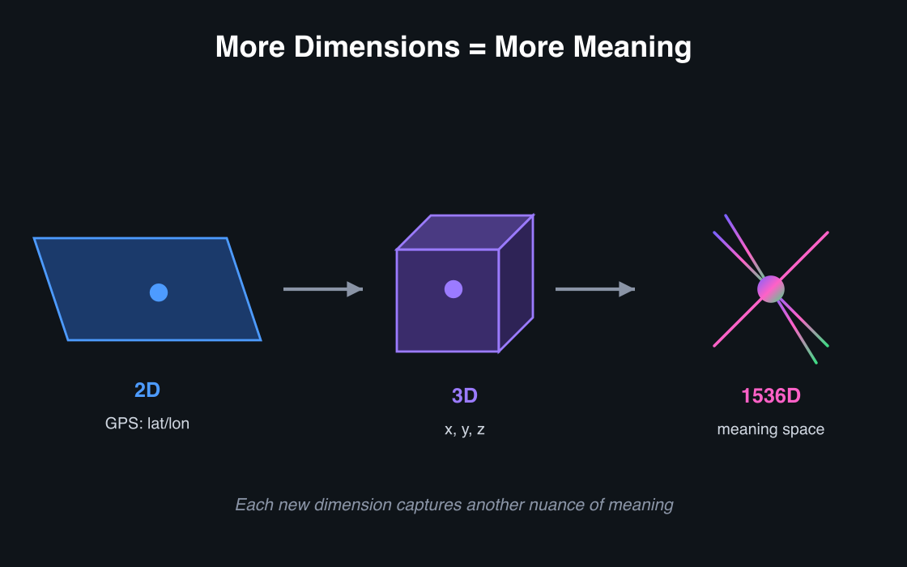
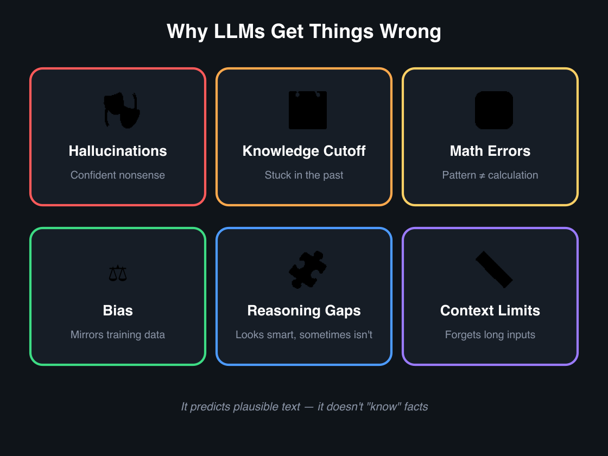
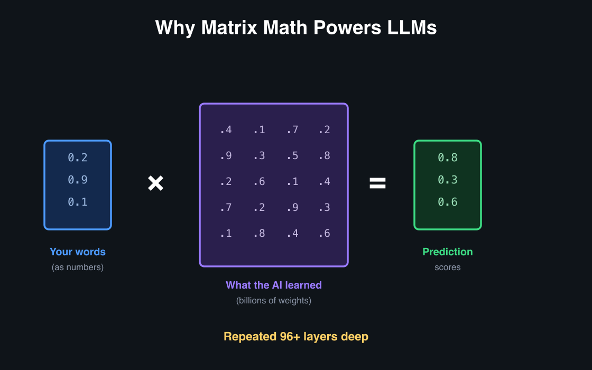
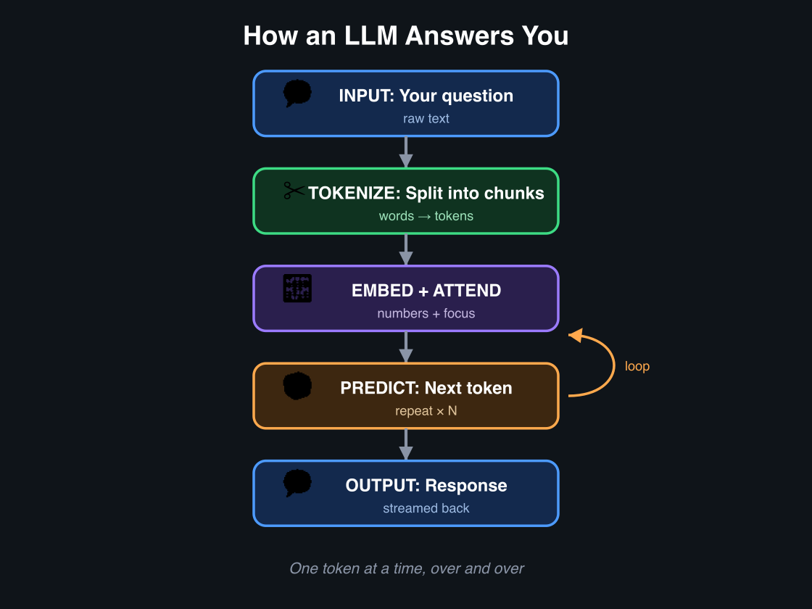
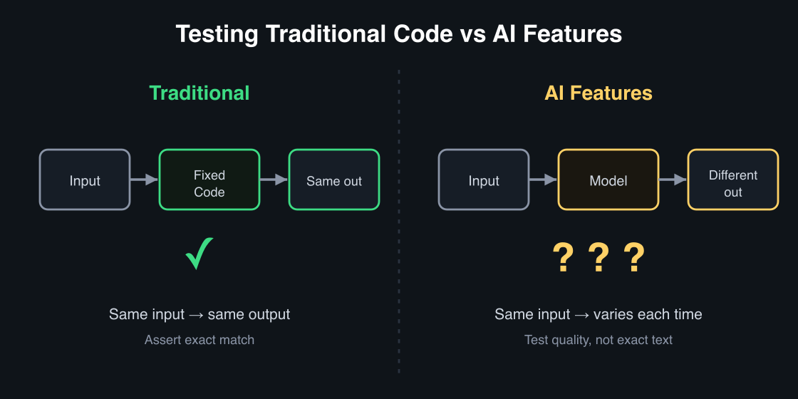

---
options:
  implicit_slide_ends: true
theme:
  override:
    footer:
      style: template
      left: "Jeevan | Jun 2025"
      right: "{current_slide} / {total_slides}"
---

# Demystifying AI
## What's Actually Happening When You Talk to an LLM

<!-- pause -->

**Goal:** Unbox the magic — mental models that help work smarter with AI every day.

<!-- end_slide -->

# Why This Talk?

<!-- column_layout: [2, 1] -->

<!-- column: 0 -->

AI tools are everywhere — Copilot, ChatGPT, Kiro, internal bots.

Most of us use them like a **black box:**

- Type something in → get something out
- Sometimes brilliant ✨ sometimes confidently wrong 🤦
- No idea why either happens

<!-- pause -->

**After this talk:**

- Mental model of *what's happening* inside
- Write better prompts by understanding *why* they work
- Know when to trust and when to verify
- Use AI tools more effectively daily

<!-- column: 1 -->


<!-- end_slide -->

# Our Journey Today

<!-- column_layout: [1, 1] -->

<!-- column: 0 -->

## Part 1: Unboxing the Magic
*Under the hood*

1. Predicting, not thinking
2. The meaning map & dimensions
3. Distance & cosine similarity
4. Tokenization
5. Text → numbers & context
6. Semantic search
7. Generation — one word at a time
8. Attention & temperature
9. Why it gets things wrong
10. Matrix math & cost

<!-- column: 1 -->

## Part 2: Day-to-Day Skills
*Practical application*

11. Prompt engineering = writing a good brief
12. Context management
13. RAG — how AI uses internal docs

## Part 3: Working Smarter
14. Skills, agents & system prompts
15. Testing AI features
16. Better inputs → better outputs

<!-- end_slide -->

# Part 1: Unboxing the Magic


<!-- end_slide -->

# It's Not Thinking. It's Predicting.

**The biggest misconception:** "AI understands my question."

<!-- pause -->

**🗺️ The Meaning Map (Embeddings)**

- Words → coordinates on a map
- Similar meanings → nearby coordinates

```
"I love fries"     → 📍 (location A)
"Fries are great"  → 📍 (nearby!)
"The stock market" → 📍 (across town)
```

<!-- pause -->

**🎲 The Word Predictor (Generation)**

- Constructs answers one word at a time
- "What's the most likely next word?"

<!-- pause -->

**These two ideas power everything.**

<!-- end_slide -->

# The Meaning Map

```
    ┌─────────────────────────────────────────────┐
    │   🍟 "fries"    🍔 "burgers"               │
    │      🥔 "potato snacks"                     │
    │                          FOOD DISTRICT      │
    │─────────────────────────────────────────────│
    │   💻 "machine learning"   🤖 "neural nets" │
    │      📊 "data science"                      │
    │                          TECH DISTRICT      │
    │─────────────────────────────────────────────│
    │   📈 "stock market"   💰 "trading"          │
    │      🏦 "investments"                       │
    │                        FINANCE DISTRICT     │
    └─────────────────────────────────────────────┘
```

- Same neighborhood = similar meaning
- Different district = different meaning

<!-- end_slide -->

# How Many Coordinates?

**GPS:** 2 numbers → locate a place
**Embeddings:** 384–3072 numbers → locate a *meaning*

<!-- pause -->



<!-- pause -->

- More dimensions = more precise = better matching
- Like describing a person: height+weight (2) vs full profile (hundreds)

<!-- end_slide -->

# Measuring "Nearby" — Distance

```
         Y
     5 ──┤          ● "fries are great"
         │        ╱
     4 ──┤      ╱  close! (similar)
         │    ╱
     3 ──┤  ● "I love fries"
         │
     1 ──┤                          ● "stock market" (far!)
         └──┬──┬──┬──┬──┬──┬──┬──── X
            1  2  3  4  5  6  7
```

<!-- pause -->

- Close on the map = similar meaning
- Far apart = different meaning
- Same idea in 2D or 1536D — **closer = more similar**

<!-- end_slide -->

# The Problem With Raw Distance

```
    📄 10-page report on "customer churn" → long vector
    💬 1-line Slack message: "users are churning" → short vector
```

<!-- pause -->

Raw distance says **far apart** — one is just "bigger."
But they mean the **same thing!**

<!-- pause -->

*Like two people pointing at the same star — one arm is longer.*

→ Need a measure that ignores length, only cares about **direction**...

<!-- end_slide -->

# Cosine Similarity — The Angle Between Meanings


<!-- pause -->

| Angle | Cosine | Meaning |
|-------|--------|---------|
| 0° | 1.0 | Identical |
| 30° | 0.87 | Very similar |
| 60° | 0.50 | Somewhat related |
| 90° | 0.0 | Unrelated |

<!-- pause -->

- Cancels out size → 10-page doc and 1-line message score the same
- Matches *direction* (meaning), not length

<!-- end_slide -->

# 🧪 Live Demo: Cosine Similarity

```bash
python scripts/similarity_demo.py
```

<!-- pause -->

```
╔══════════════════════════════════════════════════════╗
║  COSINE SIMILARITY — meaning direction, not length  ║
╠══════════════════════════════════════════════════════╣
║                                                      ║
║  "customer churn" vs "users cancelling"   → 0.91 ✅ ║
║  "customer churn" vs "french fries recipe" → 0.12 ❌ ║
║                                                      ║
║  Same meaning = high score (close to 1.0)           ║
║  Different meaning = low score (close to 0.0)       ║
╚══════════════════════════════════════════════════════╝
```

<!-- end_slide -->

# How Text Becomes Numbers — The 5-Year-Old Version

🎮 **"What Goes Together?" game:**

```
"cat" → meow, furry, pet, whiskers
"dog" → bark, furry, pet, tail
"car" → drive, road, fast, wheels
```

<!-- pause -->

- cat & dog share context (furry, pet) → **similar** numbers
- cat & car share nothing → **different** numbers

<!-- pause -->

**Word2Vec (2013):** Words in similar contexts get similar coordinates.

`"King" - "Man" + "Woman" ≈ "Queen"` ← the math actually works!

<!-- pause -->

**Modern models add context on top:**
- Same word "love" gets different numbers in "love fries" vs "love letter"

<!-- end_slide -->

# Context Changes the Numbers

Same word → *different* numbers depending on surroundings:

<!-- pause -->

```
"I love fries"     → "love" = food/enjoyment
"I love coding"    → "love" = passion/tech
"love letter"      → "love" = romance
```

<!-- pause -->

**Same spelling, completely different meanings:**

```
"The bank was steep"           → riverbank
"The bank was closed"          → financial institution

"She saw a bat"                → animal or sports equipment?

"Apple released a new product" → tech company
"Apple released a sweet aroma" → fruit
```

**This is why AI handles ambiguity well** — context refines the numbers.

<!-- end_slide -->

# Tokenization — How AI Reads Text

**LLMs don't read words. They read tokens — chunks of text.**

<!-- pause -->

| What it seems like | What actually happens |
|---|---|
| "Summarize this 10-page doc" | ~4,000 tokens of input |
| "Context window: 128K tokens" | ≈ 96,000 words ≈ 300-page book |
| "Why did it cut off mid-sentence?" | Hit the max output token limit |
| "Why does it cost more for long prompts?" | Billed per token (input AND output) |

<!-- pause -->

**Rule of thumb:** 1 token ≈ ¾ of a word.

This is why AI has a memory limit — measured in tokens, not words.

<!-- end_slide -->

# 🧪 Live Demo: Tokenization

```bash
python scripts/tokenization_demo.py
```

<!-- pause -->

```
╔═══════════════════════════════════════════════╗
║  TOKENIZATION — How AI reads text            ║
╠═══════════════════════════════════════════════╣
║                                               ║
║  "I love french fries"                       ║
║   → [I] [love] [french] [fries] = 4 tokens  ║
║                                               ║
║  "Unbelievable!"                             ║
║   → [Un][believ][able][!] = 4 tokens         ║
║                                               ║
║  Rule of thumb: 100 words ≈ 133 tokens       ║
╚═══════════════════════════════════════════════╝
```

<!-- end_slide -->

# How Semantic Search Works

**Keyword search:** "fries" → only finds docs containing "fries"
**Semantic search:** "fries" → also finds "crispy potato snacks"

<!-- pause -->

```
Query: "Why are users dropping off during checkout?"
         ↓ (drop a pin on the meaning map)

    ✅ "Cart abandonment analysis Q4"        (nearby!)
    ✅ "Reducing friction in purchase flow"  (nearby!)
    ❌ "How to fry an egg"                   (across town)
```

<!-- pause -->

Found "cart abandonment" without saying those words. **Meaning > keywords.**

<!-- end_slide -->

# Why It Sometimes Gets It Wrong



<!-- pause -->

| Failure Mode | Why It Happens |
|---|---|
| Hallucinations | Most *probable* next word ≠ most *correct* |
| Knowledge cutoff | Trained data has an end date |
| Math errors | Predicts text patterns, doesn't calculate |
| Bias | Reflects training data distributions |
| Reasoning gaps | Pattern matching ≠ genuine deduction |
| Context limits | Forgets info beyond the window |

<!-- pause -->

⚠️ **Rule of thumb:** Trust the *structure*, verify the *facts*.

<!-- end_slide -->

# How LLMs Generate Text

**One word at a time — a probability game:**

```
Input: "The capital of France is"

    Paris   → 94.2%  ████████████████████████████████████░
    a       →  1.8%  █░
    located →  1.1%  █░
    banana  →  0.0%

    Picks: "Paris"
```

<!-- pause -->

Then feeds it back and predicts the *next* word. And the next. And the next.

**That "typing" effect isn't flair — it's literally generating one token at a time.**

<!-- end_slide -->

# 🧪 Live Demo: Next-Word Prediction

```bash
python scripts/next_word_demo.py
```

<!-- pause -->

Shows:
- Probability distribution as ASCII bar chart
- Temperature = 0 → always picks "Paris" (deterministic)
- Temperature = 0.7 → usually "Paris", sometimes "Lyon"
- Temperature = 1.5 → creative/chaotic picks

<!-- end_slide -->

# Attention — How AI Decides What Matters

```
"As a QA engineer, write test cases for the LOGIN page
 focusing on SECURITY edge cases"

    As  a  QA  engineer  write  test  cases  for  the  LOGIN  page
    ▁   ▁  ██  ███      ██     ███   ███    ▁    ▁    █████  ██

    focusing  on  SECURITY  edge  cases
    ███       ▁   ██████    ████  ███

    █ = high attention     ▁ = low attention
```

<!-- pause -->

**Specific, keyword-rich prompts → higher attention on what matters.**

<!-- end_slide -->

# 🧪 Live Demo: Attention Visualization

```bash
python scripts/attention_demo.py
```

<!-- pause -->

Shows each word colored by attention weight:
- 🟢 Green = high focus (SECURITY, LOGIN, test, QA)
- ⬜ Dim = low focus (a, the, for, on)

<!-- end_slide -->

# Under the Hood — Matrix Multiplication



<!-- pause -->

| Concept | Matrix Operation |
|---|---|
| Embedding | Lookup in a learned matrix |
| Attention | Query × Key matrix |
| Prediction | Multiply through 96+ layers |

<!-- pause -->

One prompt = **trillions** of multiply-and-add ops. That's why GPUs exist.

<!-- end_slide -->

# Why LLMs Cost So Much

```
    Feed sentence with missing word → Model predicts → Compare →
    Adjust weights → Repeat TRILLIONS of times ↺
```

<!-- pause -->

| What | Scale (estimated) |
|------|-------|
| Parameters | ~1.8 trillion |
| GPUs | ~25,000 in parallel |
| Time | ~3-4 months non-stop |
| Cost | $50-100 million per run |

<!-- pause -->

- API calls cost money → renting GPU time
- Bigger = slower and more expensive
- Fine-tuning cheaper than from-scratch
- 7B runs on a laptop; 400B+ needs a data center

<!-- end_slide -->

# Temperature — The Creativity Dial

| Temperature | Behavior | Use for |
|---|---|---|
| 0 - 0.3 | Predictable | Test cases, extraction |
| 0.5 - 0.8 | Balanced | General writing |
| 0.9 - 1.5 | Creative | Brainstorming, ideas |

<!-- pause -->

- Same prompt → different answers each time (temperature adds randomness)
- Lower for facts, higher for creativity

<!-- end_slide -->

# Putting It All Together



<!-- pause -->

- Typing effect = generating one token at a time
- Each step is independent → errors compound over long outputs

<!-- end_slide -->

# Part 2: Day-to-Day Skills

<!-- column_layout: [1, 1, 1] -->

<!-- column: 0 -->

&nbsp;

<!-- column: 1 -->

## Practical application of what was just covered

*From mental models to daily workflow*

<!-- column: 2 -->

&nbsp;

<!-- end_slide -->

# Prompt Engineering = Writing a Good Brief

**Bad brief to a designer:** "Make it look nice."
**Good brief:** "Hero banner, blue tones, mobile-first, CTA button."

<!-- pause -->

<!-- column_layout: [1, 1] -->

<!-- column: 0 -->

**❌ Vague:**
```
Write test cases for login.
```

<!-- column: 1 -->

**✅ Structured:**
```
Role: QA engineer
Context: OAuth2 + email/password,
  2FA enabled, 3-strike lockout
Task: 10 test cases covering
  happy path, edge cases, security
Format: table [ID, Scenario,
  Steps, Expected Result]
```

<!-- reset_layout -->

<!-- pause -->

**The four levers:**

| Lever | What it does |
|-------|-------------|
| **Role** | Sets perspective — "senior QA engineer" |
| **Context** | Relevant info — paste the spec, API contract |
| **Task** | Exactly what's needed — "write edge case tests" |
| **Format** | Output shape — "markdown table" |

<!-- end_slide -->

# Context Management — The Hidden Skill

**AI memory = a desk. Only sees what's on it right now.**

```
┌──────────────────────────────────────────┐
│              THE AI's DESK               │
│  📄 Current message                      │
│  📄 Previous messages in this chat       │
│  📄 Documents pasted in                  │
│  ─ ─ ─ ─ ─ ─ ─ ─ ─ ─ ─ ─ ─ ─ ─ ─ ─ ─ │
│  🗑️ Older stuff falls off               │
└──────────────────────────────────────────┘
```

<!-- pause -->

- Start fresh for new topics
- Paste context explicitly — it doesn't "remember"
- Be selective — relevant file, not entire codebase
- Summarize long chats → start new thread

<!-- end_slide -->

# RAG: How AI Uses Internal Docs

**Problem:** AI doesn't know internal docs.
**Solution:** Fetch first, then ask. (**R**etrieval **A**ugmented **G**eneration)

<!-- pause -->

```
"What's our refund policy for enterprise?"
         ↓
  ┌────────────────────────────┐
  │ 1. RETRIEVE — search docs  │
  │    using the meaning map   │
  └──────────────┬─────────────┘
                 ↓
  ┌────────────────────────────┐
  │ 2. AUGMENT — put docs on   │
  │    the desk with question  │
  └──────────────┬─────────────┘
                 ↓
  ┌────────────────────────────┐
  │ 3. GENERATE — answer using │
  │    the docs as truth       │
  └────────────────────────────┘
```

<!-- pause -->

**Garbage docs in → garbage answers out.**

<!-- end_slide -->

# Part 3: Working Smarter with AI

<!-- column_layout: [1, 1, 1] -->

<!-- column: 0 -->

&nbsp;

<!-- column: 1 -->

## Practical patterns for teams

*Skills, testing, and getting better outputs*

<!-- column: 2 -->

&nbsp;

<!-- end_slide -->

# Skills, Agents & System Prompts


<!-- pause -->

| Concept | Analogy |
|---|---|
| **Skills** | Recipes — pre-built task instructions |
| **Agents** | Assistants — role + tools + boundaries |
| **System Prompt** | Job description — shapes behavior |

<!-- pause -->

Better job description → better assistant.

<!-- end_slide -->

# Testing AI Features



<!-- pause -->

| Traditional | AI Features |
|---|---|
| Same input → same output | Same input → different output |
| Exact-match assertions | "Good enough" evaluation |
| Code change = behavior change | Model update = silent shift |

<!-- pause -->

- 🔄 Regression without code changes — keep golden test sets
- ⚖️ Bias — test diverse inputs
- 🎭 Confidence ≠ correctness — verify with known answers

<!-- end_slide -->

# Better Inputs → Better Outputs

```
❌ "As a user, I want to log in"

✅ "Enterprise user, SSO via SAML 2.0,
    fallback to email/password if IdP down,
    30 min session timeout on inactivity"
```

<!-- pause -->

```
❌ "Login doesn't work sometimes"

✅ "Login 401 when SSO token expires during 2FA.
    5 min idle. Chrome 124. Staging.
    SSO → wait 5 min → enter code → 401"
```

<!-- pause -->

**AI output quality ∝ input quality.**

<!-- end_slide -->

# Security — What NOT to Paste

| Don't paste | Why |
|---|---|
| Passwords, API keys, tokens | Could be logged or leaked |
| Customer PII | Privacy & compliance risk |
| Internal credentials | Data residency concerns |
| Proprietary algorithms | IP protection |

<!-- pause -->

**Key question:** *Where does the prompt go?*

- Cloud AI (ChatGPT, Claude) → external servers
- Enterprise AI (internal tools) → within the org
- Local models → never leaves the machine

Know the org policy before pasting anything sensitive.

<!-- end_slide -->

# When to Trust AI Output

| Scenario | Trust | Action |
|---|---|---|
| Brainstorming | ✅ High | Use freely |
| Drafting docs/emails | ✅ High | Light review |
| Generating test cases | 🟡 Medium | Check completeness |
| Summarizing docs | 🟡 Medium | Spot-check facts |
| Factual claims/numbers | 🔴 Low | Always verify |
| Security/compliance | 🔴 Low | Expert review |
| Legal/medical/financial | ⛔ Don't | Human experts only |

<!-- pause -->

**AI is a draft generator, not a decision maker.**

<!-- end_slide -->

# Key Takeaways

<!-- pause -->

**1. It's a meaning map, not magic.**
Text → coordinates. Search finds neighbors.

<!-- pause -->

**2. Context is everything.**
What's on the "desk" determines answer quality.

<!-- pause -->

**3. Prompt engineering = good brief.**
Role + context + task + format. Specificity wins.

<!-- pause -->

**4. RAG = fetch first, then ask.**
Good docs → good answers.

<!-- pause -->

**5. Better inputs = better outputs.**
Structured specs and clear context make AI dramatically more useful.

<!-- end_slide -->

# The End

<!-- column_layout: [2, 1] -->

<!-- column: 0 -->

**AI isn't magic. Understanding it is a superpower.** 🚀

**Questions?**

📬 jeevan.dc24@alumni.iimb.ac.in

🌐 noobj.me

<!-- column: 1 -->


<!-- end_slide -->

# Appendix: The Transformer Architecture

```
    ┌─────────────────────────────────────────┐
    │           YOUR PROMPT                    │
    └──────────────────┬──────────────────────┘
                       ↓
    ┌──────────────────────────────────────────┐
    │  TOKENIZER — split into chunks           │
    └──────────────────┬───────────────────────┘
                       ↓
    ┌──────────────────────────────────────────┐
    │  EMBEDDING — each token → meaning map    │
    └──────────────────┬───────────────────────┘
                       ↓
    ┌──────────────────────────────────────────┐
    │  ATTENTION LAYERS  (× 32 to 128)         │
    │  Layer 1:  basic grammar                 │
    │  Layer 12: relationships                 │
    │  Layer 40: abstract reasoning            │
    │  Layer 96: task-specific patterns        │
    └──────────────────┬───────────────────────┘
                       ↓
    ┌──────────────────────────────────────────┐
    │  OUTPUT — probabilities for next token   │
    └──────────────────────────────────────────┘
```

More layers = deeper understanding. GPT-4 has ~120 layers.

<!-- end_slide -->

# Appendix: Model Sizes

**B = Billions of parameters (learned "knobs")**

```
    Small  (7B)     → well-read college student
    Medium (30B)    → subject matter expert
    Large  (70B)    → senior consultant
    Frontier (400B+)→ team of senior consultants
```

| More parameters | Trade-off |
|---|---|
| Better nuance & reasoning | Slower responses |
| Fewer hallucinations | More expensive per token |
| Better at complex instructions | Needs more hardware |

**Match the model to the job** — quick tasks → small model, complex tasks → large model.

<!-- end_slide -->

# Appendix: Prompt Patterns Cheat Sheet

**The Reviewer:**
```
Role: [role]. Review [artifact] for [criteria].
Flag as [Critical/Major/Minor]. Format: table.
```

**The Generator:**
```
Given [context], generate [N] [things] covering [categories].
Include edge cases. Format: [structure].
Example: [one example]
```

**The Analyzer:**
```
Analyze [data]. Summarize findings.
Top 3 issues. Next steps.
Reference specifics.
```

<!-- end_slide -->

# Appendix: Glossary

| Term | Plain English |
|------|-------------|
| **LLM** | Large Language Model — the AI brain |
| **Embedding** | Text → point on the meaning map |
| **Cosine similarity** | Closeness by direction, not distance |
| **Token** | A chunk of text (~¾ of a word) |
| **Attention** | How AI decides which words matter |
| **Temperature** | Creativity dial (low=safe, high=creative) |
| **Parameters** | The "knobs" a model learned |
| **Semantic search** | Finding by meaning, not keywords |
| **RAG** | Fetch docs, then ask |
| **Context window** | How much AI can see at once |
| **Hallucination** | Confidently making something up |
| **System prompt** | The job description for an AI |
| **Agent** | AI with a role, tools, and boundaries |
