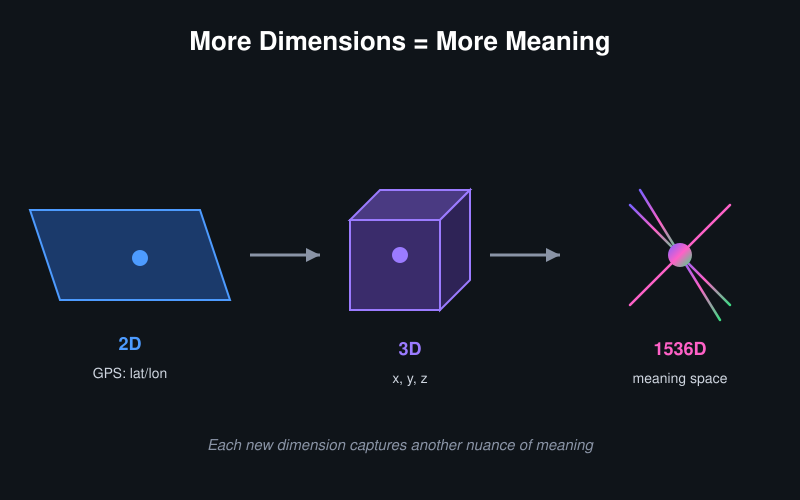
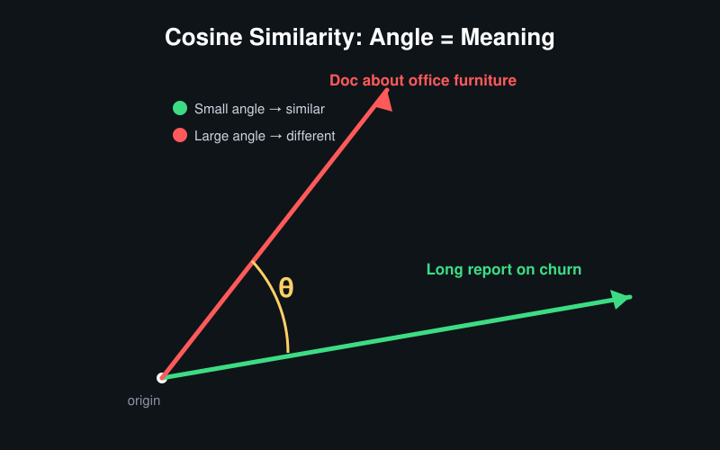
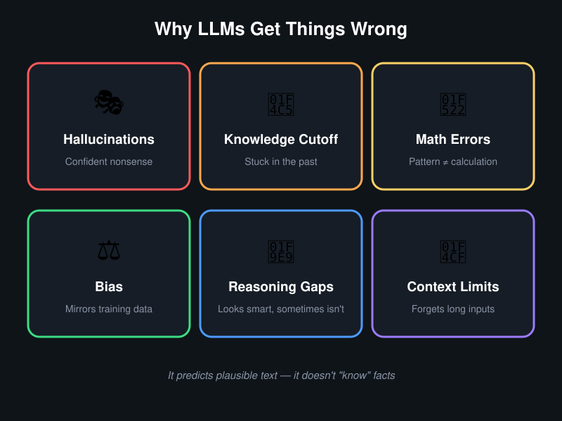
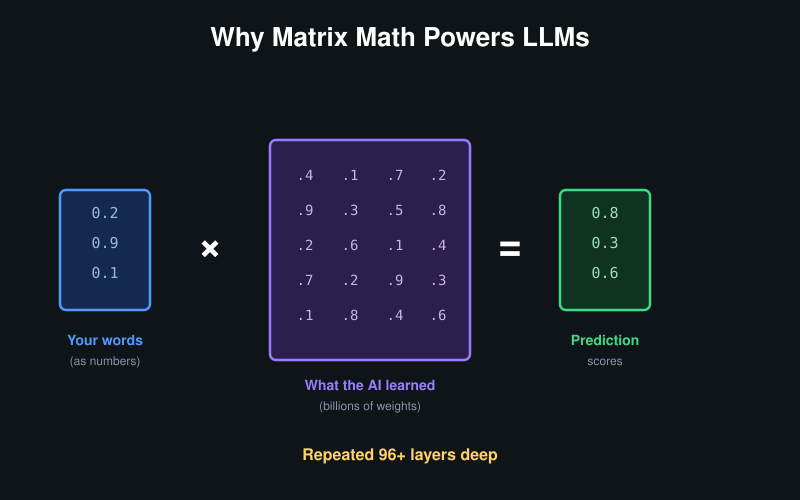
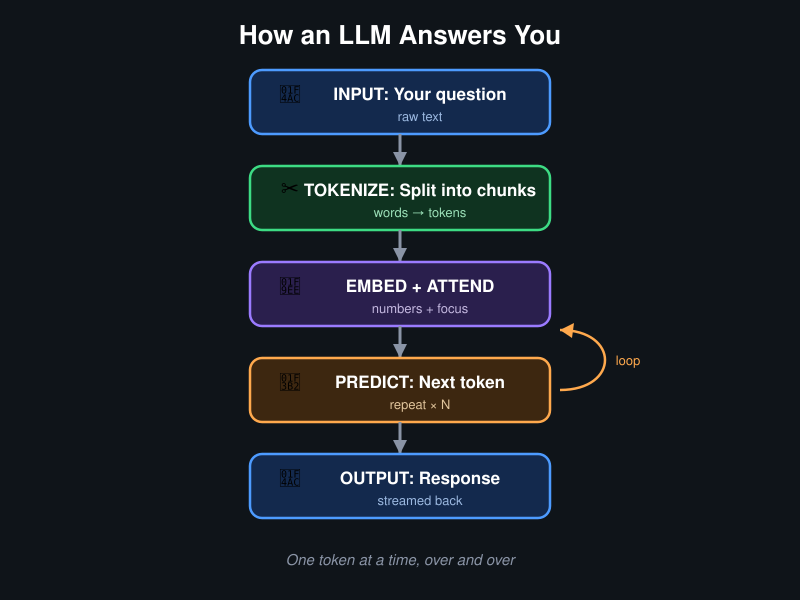
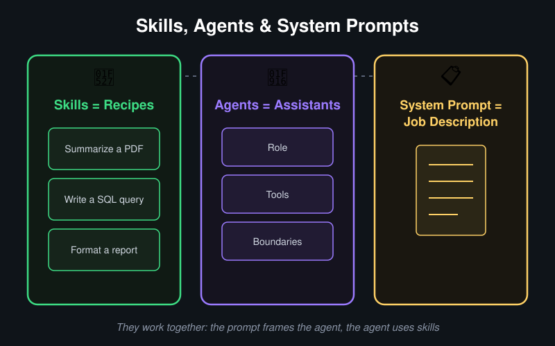
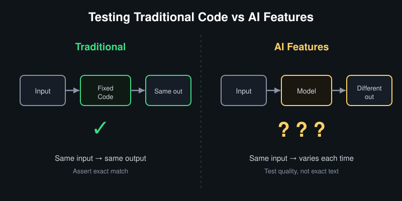

---
options:
  implicit_slide_ends: true
theme:
  override:
    footer:
      style: template
      left: "Jeevan | Jun 2025"
      right: "{current_slide} / {total_slides}"
---

# Demystifying AI
## What's Actually Happening When You Talk to an LLM

<!-- pause -->

**Goal:** Unbox the magic — mental models that help work smarter with AI every day.

<!-- end_slide -->

# Why This Talk?

<!-- column_layout: [2, 1] -->

<!-- column: 0 -->

AI tools are everywhere — Copilot, ChatGPT, Kiro, internal bots.

Most of us use them like a **black box:**

- Type something in → get something out
- Sometimes brilliant ✨ sometimes confidently wrong 🤦
- No idea why either happens

<!-- pause -->

**After this talk:**

- Mental model of *what's happening* inside
- Write better prompts by understanding *why* they work
- Know when to trust and when to verify
- Use AI tools more effectively daily

<!-- column: 1 -->


<!-- end_slide -->

# Our Journey Today

<!-- column_layout: [1, 1] -->

<!-- column: 0 -->

## Part 1: Unboxing the Magic
*Under the hood*

1. Predicting, not thinking
2. The meaning map & dimensions
3. Distance & cosine similarity
4. Text → numbers (with 5-year-old mental model)
5. Context changes everything
6. Semantic search
7. Why it gets things wrong
8. One word at a time — generation
9. Tokenization, attention & temperature
10. Matrix math & why it's expensive

<!-- column: 1 -->

## Part 2: Day-to-Day Skills
*Practical application*

11. Prompt engineering = writing a good brief
12. Context management
13. RAG — how AI uses internal docs

## Part 3: Working Smarter
14. Skills, agents & system prompts
15. Testing AI features
16. Better inputs → better outputs

<!-- end_slide -->

# Part 1: Unboxing the Magic


<!-- end_slide -->

# It's Not Thinking. It's Predicting.

**The biggest misconception:** "AI understands my question."

<!-- pause -->

Two separate mechanisms at work:

<!-- pause -->

**🗺️ The Meaning Map (Embeddings)**

- Words → coordinates on a "meaning map"
- Similar meanings → same neighborhood

```
"I love fries"        → 📍 (some location)
"Fries are great"     → 📍 (very nearby — similar meaning!)
"The stock market"    → 📍 (across town — different meaning)
```

<!-- pause -->

**🎲 The Word Predictor (Generation)**

- Doesn't look up answers — *constructs* them one word at a time
- Each word: "Given everything so far, what's most likely next?"
- Not retrieving. Generating.

<!-- pause -->

**These two ideas power everything in this talk.**

<!-- end_slide -->

# The Meaning Map

**A city map organized by meaning, not streets.**

```
    ┌─────────────────────────────────────────────┐
    │   🍟 "fries"    🍔 "burgers"               │
    │      🥔 "potato snacks"                     │
    │                          FOOD DISTRICT      │
    │─────────────────────────────────────────────│
    │   💻 "machine learning"   🤖 "neural nets" │
    │      📊 "data science"                      │
    │                          TECH DISTRICT      │
    │─────────────────────────────────────────────│
    │   📈 "stock market"   💰 "trading"          │
    │      🏦 "investments"                       │
    │                        FINANCE DISTRICT     │
    └─────────────────────────────────────────────┘
```

<!-- pause -->

- **Same neighborhood** = similar meaning
- **Different part of town** = different meaning
- Ask a question → drop a pin → look at what's nearby

<!-- end_slide -->

# How Many Coordinates?

**GPS:** 2 numbers (latitude, longitude) → locate a place

**Embeddings:** 384 to 3072 numbers → locate a *meaning*

<!-- pause -->



<!-- pause -->

**Why so many?** Meaning is complex.

- Describing a person with just height + weight (2 numbers) → imprecise
- Full profile: age, interests, location, profession... → precise matching
- More dimensions = more precise description = better semantic matching

<!-- end_slide -->

# Measuring "Nearby" — Distance

**Same formula from school, just more numbers:**

```
         Y
     5 ──┤          ● B (5, 5)
         │        ╱
     4 ──┤      ╱
         │    ╱
     3 ──┤  ● A (2, 3)
         │
     1 ──┤
         └──┬──┬──┬──┬──┬──── X
            1  2  3  4  5
```

<!-- pause -->

**Euclidean Distance Formula:**

```
    d(A,B) = √( Σᵢ (aᵢ - bᵢ)² )

    2D:    √( (5-2)² + (5-3)² ) = √(9 + 4) = √13 ≈ 3.6

    1536D: √( (a₁-b₁)² + (a₂-b₂)² + ... + (a₁₅₃₆-b₁₅₃₆)² )
```

Same idea — subtract, square, sum, root. Just repeated 1536 times.

<!-- end_slide -->

# The Problem With Raw Distance

```
    📄 A 10-page report on "customer churn"
       → long vector, big numbers

    💬 A 1-line Slack message: "users are churning"
       → short vector, small numbers
```

<!-- pause -->

Raw distance says they're **far apart** — because one is "bigger."

But they mean the **same thing!**

*Like saying two people pointing at the same star are "far apart"
because one has a longer arm.*

<!-- pause -->

**Need a measure that ignores length, only cares about direction...**

<!-- end_slide -->

# Cosine Similarity — The Angle Between Meanings

**Measure the angle between two arrows, not the distance:**



<!-- pause -->

| Angle | Cosine | Meaning |
|-------|--------|---------|
| 0° (same direction) | 1.0 | Identical |
| 30° | 0.87 | Very similar |
| 60° | 0.50 | Somewhat related |
| 90° (perpendicular) | 0.0 | Unrelated |

<!-- pause -->

The division by lengths **cancels out size** — a 10-page doc and a 1-line message about the same topic score ~1.0.

**This is why semantic search works** — matches *meaning direction*, not document length.

<!-- end_slide -->

# 🧪 Live Demo: Cosine Similarity

```bash
python scripts/similarity_demo.py
```

<!-- pause -->

```
╔══════════════════════════════════════════════════════╗
║  COSINE SIMILARITY — meaning direction, not length  ║
╠══════════════════════════════════════════════════════╣
║                                                      ║
║  "customer churn" vs "users cancelling"   → 0.91 ✅ ║
║  "customer churn" vs "french fries recipe" → 0.12 ❌ ║
║                                                      ║
║  Same meaning = high score (close to 1.0)           ║
║  Different meaning = low score (close to 0.0)       ║
╚══════════════════════════════════════════════════════╝
```

<!-- end_slide -->

# How Text Becomes Numbers — The 5-Year-Old Version

**Imagine teaching a child what words mean by playing a game:**

<!-- pause -->

🎮 **The "What Goes Together?" game:**

```
"cat" goes with: meow, furry, pet, whiskers, sleep
"dog" goes with: bark, furry, pet, tail, fetch
"car" goes with: drive, road, fast, wheels, engine
```

<!-- pause -->

- "cat" and "dog" share words (furry, pet) → they get **similar** numbers
- "cat" and "car" share almost nothing → they get **different** numbers

<!-- pause -->

**That's essentially Word2Vec (2013):**

- Look at which words appear near each other in billions of sentences
- Words that appear in similar company get similar number-coordinates
- "King" - "Man" + "Woman" ≈ "Queen" (the numbers actually do this!)

<!-- pause -->

**Modern models (transformers) do the same thing but with context:**

```
Step 1: Every word gets an ID → "love" = Token #2981
Step 2: ID → starter numbers   → [0.41, 0.08, -0.22, ... × 1536]
Step 3: Context adjusts them   → numbers change based on surrounding words
```

<!-- end_slide -->

# Context Changes the Numbers

The same word gets *different* numbers depending on surroundings:

<!-- pause -->

```
"I love fries"     → "love" adjusted toward food/enjoyment
"I love coding"    → "love" adjusted toward passion/tech
"love letter"      → "love" adjusted toward romance/emotion
```

<!-- pause -->

**Why this matters — same words, completely different meanings:**

```
"The bank was steep"           → riverbank (geography)
"The bank was closed"          → financial institution

"I need to book a flight"      → reserve a ticket
"I need to book a flight of stairs" → ???  (no such thing!)

"Apple released a new product" → tech company
"Apple released a sweet aroma" → fruit
```

The attention layers (32-128 passes) keep refining each word's numbers
based on context. **This is why AI handles ambiguity well.**

<!-- end_slide -->

# 🧪 Live Demo: Tokenization

```bash
python scripts/tokenization_demo.py
```

<!-- pause -->

```
╔═══════════════════════════════════════════════╗
║  TOKENIZATION — How AI reads text            ║
╠═══════════════════════════════════════════════╣
║                                               ║
║  "I love french fries"                       ║
║   → [I] [love] [french] [fries] = 4 tokens  ║
║                                               ║
║  "Unbelievable!"                             ║
║   → [Un][believ][able][!] = 4 tokens         ║
║                                               ║
║  Rule of thumb: 100 words ≈ 133 tokens       ║
╚═══════════════════════════════════════════════╝
```

<!-- end_slide -->

# How Semantic Search Works

**Keyword search:** "fries" only finds documents containing "fries"

**Semantic search:** "fries" also finds "crispy potato snacks"

<!-- pause -->

```
Ask: "Why are users dropping off during checkout?"
              ↓
    📍 Drop a pin on the meaning map
              ↓
    📚 Find nearest neighbors:
              ↓
    ✅ "Cart abandonment analysis Q4 2025"       (nearby!)
    ✅ "Reducing friction in the purchase flow"  (nearby!)
    ❌ "How to fry an egg"                       (across town)
```

<!-- pause -->

Found "cart abandonment" without ever saying those words.
**Meaning-based search > keyword search.**

<!-- end_slide -->

# Why It Sometimes Gets It Wrong



<!-- pause -->

| Failure Mode | Why It Happens |
|---|---|
| Hallucinations | Most *probable* next word ≠ most *correct* |
| Knowledge cutoff | Trained data has an end date |
| Math errors | Predicts text patterns, doesn't calculate |
| Bias | Reflects training data distributions |
| Reasoning gaps | Pattern matching ≠ genuine deduction |
| Context limits | Forgets info beyond the window |

<!-- pause -->

⚠️ **Rule of thumb:** Trust the *structure*, verify the *facts*.

<!-- end_slide -->

# How LLMs Generate Text

**A probability game, one word at a time:**

<!-- pause -->

```
Input: "The capital of France is"

    Paris       → 94.2%  ████████████████████████████████████████░
    a           →  1.8%  █░
    located     →  1.1%  █░
    known       →  0.7%  ░
    banana      →  0.0001%

    Picks: "Paris"
```

<!-- pause -->

Then feeds the whole thing back and predicts the *next* word:

```
"The capital of France is"       → Paris
"The capital of France is Paris" → ,
"The capital of France is Paris," → known
...
```

**Every word is a separate prediction.** That "typing" effect isn't flair —
it's literally generating one token at a time.

<!-- end_slide -->

# 🧪 Live Demo: Next-Word Prediction

```bash
python scripts/next_word_demo.py
```

<!-- pause -->

Shows:
- Probability distribution as ASCII bar chart
- Temperature = 0 → always picks "Paris" (deterministic)
- Temperature = 0.7 → usually "Paris", sometimes "Lyon"
- Temperature = 1.5 → creative/chaotic picks

<!-- end_slide -->

# Tokenization — How AI Reads Text

**LLMs don't read words. They read tokens — chunks of text.**

<!-- pause -->

| What it seems like | What actually happens |
|---|---|
| "Summarize this 10-page doc" | ~4,000 tokens of input |
| "Context window: 128K tokens" | ≈ 96,000 words ≈ 300-page book |
| "Why did it cut off mid-sentence?" | Hit the max output token limit |
| "Why does it cost more for long prompts?" | Billed per token (input AND output) |

<!-- pause -->

**Rule of thumb:** 1 token ≈ ¾ of a word.

This is why AI has a memory limit — measured in tokens, not words.

<!-- end_slide -->

# Attention — How AI Decides What Matters

**Not every word gets equal weight. Like reading a contract — eyes jump to key clauses.**

<!-- pause -->

```
"As a QA engineer, write test cases for the LOGIN page
 focusing on SECURITY edge cases"

    As  a  QA  engineer  write  test  cases  for  the  LOGIN  page
    ▁   ▁  ██  ███      ██     ███   ███    ▁    ▁    █████  ██

    focusing  on  SECURITY  edge  cases
    ███       ▁   ██████    ████  ███

    █ = high attention     ▁ = low attention (filler)
```

<!-- pause -->

**Specific, keyword-rich prompts work better** because the AI literally
pays more *attention* to meaningful words.

<!-- end_slide -->

# 🧪 Live Demo: Attention Visualization

```bash
python scripts/attention_demo.py
```

<!-- pause -->

Shows each word colored by attention weight:
- 🟢 Green = high focus (SECURITY, LOGIN, test, QA)
- ⬜ Dim = low focus (a, the, for, on)

<!-- end_slide -->

# Under the Hood — Matrix Multiplication

**Why does matrix multiplication matter for AI?**

<!-- pause -->



<!-- pause -->

**Think of it like this:**

- Input = a spreadsheet of numbers representing the prompt
- Weights = a massive lookup table of patterns the AI learned
- Multiplying them = "looking up" what patterns match the input

<!-- pause -->

| Concept | The Matrix Operation |
|---|---|
| Embedding (text → numbers) | Lookup in a learned matrix |
| Attention (which words matter) | Query matrix × Key matrix |
| Predicting next word | Multiply through 96+ layers |

<!-- pause -->

One prompt through GPT-4: **trillions** of multiply-and-add operations.
That's why GPUs exist — they do matrix math in parallel.

<!-- end_slide -->

# Why LLMs Cost So Much

**Training = adjusting billions of numbers until predictions improve.**

<!-- pause -->


<!-- pause -->

| What | Scale |
|------|-------|
| Parameters to tune | ~1.8 trillion |
| Training examples | Trillions of tokens |
| GPUs needed | ~25,000 in parallel |
| Training time | ~3-4 months non-stop |
| Cost | $50-100 million per run |

<!-- pause -->

**Why this matters:**
- API calls cost money → renting GPU time
- Bigger models = slower → more matrices to traverse
- Fine-tuning cheaper than from-scratch → adjusting vs. building
- Small models (7B) run on a laptop; frontier (400B+) need data centers

<!-- end_slide -->

# Temperature — The Creativity Dial

```
Next word probabilities: Paris (94%), Lyon (3%), a (2%), the (1%)
```

<!-- pause -->

| Temperature | Behavior | Good for |
|---|---|---|
| 0 - 0.3 | Predictable, factual | Test cases, data extraction |
| 0.5 - 0.8 | Balanced | General writing, brainstorming |
| 0.9 - 1.5 | Creative, surprising | Diverse ideas, creative writing |

<!-- pause -->

- **Same prompt, different answers each time** → temperature adds randomness
- Lower it for factual tasks, raise it for creative ones
- Other dials exist (Top-K, Top-P) but temperature is most common

<!-- end_slide -->

# Putting It All Together

**From typing to response:**



<!-- pause -->

- The "typing" effect = literally generating one token at a time
- Each step is a separate prediction
- The further it goes, the more small errors can compound

<!-- end_slide -->

# Part 2: Day-to-Day Skills

<!-- column_layout: [1, 1, 1] -->

<!-- column: 0 -->

&nbsp;

<!-- column: 1 -->

## Practical application of what was just covered

*From mental models to daily workflow*

<!-- column: 2 -->

&nbsp;

<!-- end_slide -->

# Prompt Engineering = Writing a Good Brief

**Bad brief to a designer:** "Make it look nice."
**Good brief:** "Hero banner, blue tones, mobile-first, CTA button."

<!-- pause -->

<!-- column_layout: [1, 1] -->

<!-- column: 0 -->

**❌ Vague:**
```
Write test cases for login.
```

<!-- column: 1 -->

**✅ Structured:**
```
Role: QA engineer
Context: OAuth2 + email/password,
  2FA enabled, 3-strike lockout
Task: 10 test cases covering
  happy path, edge cases, security
Format: table [ID, Scenario,
  Steps, Expected Result]
```

<!-- reset_layout -->

<!-- pause -->

**The four levers:**

| Lever | What it does |
|-------|-------------|
| **Role** | Sets perspective — "senior QA engineer" |
| **Context** | Relevant info — paste the spec, API contract |
| **Task** | Exactly what's needed — "write edge case tests" |
| **Format** | Output shape — "markdown table" |

<!-- end_slide -->

# Context Management — The Hidden Skill

**The AI's memory = a desk. It can ONLY see what's on the desk right now.**

```
┌──────────────────────────────────────────┐
│              THE AI's DESK               │
│                                          │
│  📄 Current message                      │
│  📄 Previous messages in this chat       │
│  📄 Any documents pasted in              │
│  ─ ─ ─ ─ ─ ─ ─ ─ ─ ─ ─ ─ ─ ─ ─ ─ ─ ─ │
│  🗑️ Older stuff falls off the desk       │
└──────────────────────────────────────────┘
```

<!-- pause -->

**Rules:**

- **Start fresh** for new topics — don't continue cluttered conversations
- **Paste context explicitly** — it doesn't "remember" from 20 messages ago
- **Be selective** — paste the relevant file, not the entire codebase
- **Summarize long chats** — distill key decisions, start new thread

<!-- end_slide -->

# RAG: How AI Uses Internal Docs

**Problem:** ChatGPT doesn't know internal docs, specs, or Confluence pages.
**Solution:** Fetch relevant documents first, *then* ask.

<!-- pause -->

**RAG = Retrieval Augmented Generation**

```
Question: "What's our refund policy for enterprise?"
              ↓
  ┌──────────────────────────────┐
  │ 1. RETRIEVE                  │
  │    Search internal docs      │
  │    using the meaning map     │
  └──────────────┬───────────────┘
                 ↓
  ┌──────────────────────────────┐
  │ 2. AUGMENT                   │
  │    Put docs on the desk      │
  │    alongside the question    │
  └──────────────┬───────────────┘
                 ↓
  ┌──────────────────────────────┐
  │ 3. GENERATE                  │
  │    AI answers using the docs │
  │    as source of truth        │
  └──────────────────────────────┘
```

<!-- pause -->

**Garbage docs in → garbage answers out.** Good documentation pays off double now.

<!-- end_slide -->

# Part 3: Working Smarter with AI

<!-- column_layout: [1, 1, 1] -->

<!-- column: 0 -->

&nbsp;

<!-- column: 1 -->

## Practical patterns for teams

*Skills, testing, and getting better outputs*

<!-- column: 2 -->

&nbsp;

<!-- end_slide -->

# Skills, Agents & System Prompts



<!-- pause -->

| Concept | Analogy | What it is |
|---|---|---|
| **Skills** | Recipes | Pre-defined instructions for common tasks |
| **Agents** | Assistants with a JD | Role + tools + boundaries |
| **System Prompt** | The job description | Instructions that shape AI behavior |

<!-- pause -->

When configuring a custom GPT, a Kiro agent, or any AI assistant —
that's writing the job description. Better JD → better assistant.

<!-- end_slide -->

# Testing AI Features



<!-- pause -->

| Traditional Testing | AI Feature Testing |
|---|---|
| Same input → same output | Same input → *different* output |
| Exact-match assertions | "Good enough" evaluation |
| Code changes = behavior changes | Model update = silent behavior shift |
| Edge cases are predictable | Edge cases are surprising |

<!-- pause -->

**What to watch for:**
- 🔄 **Regression without code changes** — model updates shift behavior silently
- ⚖️ **Bias** — test with diverse inputs (names, languages, demographics)
- 🎭 **Confidence ≠ correctness** — test for hallucinations on known-answer questions

<!-- end_slide -->

# Better Inputs → Better Outputs

**The single biggest takeaway from this talk.**

<!-- pause -->

- Well-structured acceptance criteria → better AI-generated solutions
- Clear user stories with context → AI generates edge cases automatically
- Explicit constraints → AI respects them

<!-- pause -->

```
❌ "As a user, I want to log in"

✅ "As an enterprise user with SSO enabled,
    I want to log in via SAML 2.0,
    with fallback to email/password if IdP is down,
    session timeout at 30 min of inactivity"
```

<!-- pause -->

**Before / After for bug reports:**

```
❌ "Login doesn't work sometimes"

✅ "Login fails 401 when SSO token expires during 2FA step.
    After 5 min idle. Chrome 124. Staging.
    Steps: Start SSO → wait 5 min at 2FA → enter code → 401"
```

AI output quality is *directly proportional* to input quality.

<!-- end_slide -->

# Security — What NOT to Paste

| Don't paste | Why |
|---|---|
| Passwords, API keys, tokens | Could be logged or leaked |
| Customer PII | Privacy & compliance risk |
| Internal credentials | Data residency concerns |
| Proprietary algorithms | IP protection |

<!-- pause -->

**Key question:** *Where does the prompt go?*

- Cloud AI (ChatGPT, Claude) → external servers
- Enterprise AI (internal tools) → within the org
- Local models → never leaves the machine

Know the org policy before pasting anything sensitive.

<!-- end_slide -->

# When to Trust AI Output

| Scenario | Trust | Action |
|---|---|---|
| Brainstorming | ✅ High | Use freely |
| Drafting docs/emails | ✅ High | Light review |
| Generating test cases | 🟡 Medium | Check completeness |
| Summarizing docs | 🟡 Medium | Spot-check facts |
| Factual claims/numbers | 🔴 Low | Always verify |
| Security/compliance | 🔴 Low | Expert review |
| Legal/medical/financial | ⛔ Don't | Human experts only |

<!-- pause -->

**AI is a draft generator, not a decision maker.**

<!-- end_slide -->

# Key Takeaways

<!-- pause -->

**1. It's a meaning map, not magic.**
Text → coordinates. Search finds neighbors.

<!-- pause -->

**2. Context is everything.**
What's on the "desk" determines answer quality.

<!-- pause -->

**3. Prompt engineering = good brief.**
Role + context + task + format. Specificity wins.

<!-- pause -->

**4. RAG = fetch first, then ask.**
Good docs → good answers.

<!-- pause -->

**5. Better inputs = better outputs.**
Structured specs and clear context make AI dramatically more useful.

<!-- end_slide -->

# The End

<!-- column_layout: [2, 1] -->

<!-- column: 0 -->

**AI isn't magic. Understanding it is a superpower.** 🚀

**Questions?**

📬 jeevan.dc24@alumni.iimb.ac.in

🌐 noobj.me

<!-- column: 1 -->


<!-- end_slide -->

# Appendix: The Transformer Architecture

```
    ┌─────────────────────────────────────────┐
    │           YOUR PROMPT                    │
    └──────────────────┬──────────────────────┘
                       ↓
    ┌──────────────────────────────────────────┐
    │  TOKENIZER — split into chunks           │
    └──────────────────┬───────────────────────┘
                       ↓
    ┌──────────────────────────────────────────┐
    │  EMBEDDING — each token → meaning map    │
    └──────────────────┬───────────────────────┘
                       ↓
    ┌──────────────────────────────────────────┐
    │  ATTENTION LAYERS  (× 32 to 128)         │
    │  Layer 1:  basic grammar                 │
    │  Layer 12: relationships                 │
    │  Layer 40: abstract reasoning            │
    │  Layer 96: task-specific patterns        │
    └──────────────────┬───────────────────────┘
                       ↓
    ┌──────────────────────────────────────────┐
    │  OUTPUT — probabilities for next token   │
    └──────────────────────────────────────────┘
```

More layers = deeper understanding. GPT-4 has ~120 layers.

<!-- end_slide -->

# Appendix: Model Sizes

**B = Billions of parameters (learned "knobs")**

```
    Small  (7B)     → well-read college student
    Medium (30B)    → subject matter expert
    Large  (70B)    → senior consultant
    Frontier (400B+)→ team of senior consultants
```

| More parameters | Trade-off |
|---|---|
| Better nuance & reasoning | Slower responses |
| Fewer hallucinations | More expensive per token |
| Better at complex instructions | Needs more hardware |

**Match the model to the job** — quick tasks → small model, complex tasks → large model.

<!-- end_slide -->

# Appendix: Prompt Patterns Cheat Sheet

**The Reviewer:**
```
Role: [role]. Review [artifact] for [criteria].
Flag as [Critical/Major/Minor]. Format: table.
```

**The Generator:**
```
Given [context], generate [N] [things] covering [categories].
Include edge cases. Format: [structure].
Example: [one example]
```

**The Analyzer:**
```
Analyze [data]. Summarize findings.
Top 3 issues. Next steps.
Reference specifics.
```

<!-- end_slide -->

# Appendix: Glossary

| Term | Plain English |
|------|-------------|
| **LLM** | Large Language Model — the AI brain |
| **Embedding** | Text → point on the meaning map |
| **Cosine similarity** | Closeness by direction, not distance |
| **Token** | A chunk of text (~¾ of a word) |
| **Attention** | How AI decides which words matter |
| **Temperature** | Creativity dial (low=safe, high=creative) |
| **Parameters** | The "knobs" a model learned |
| **Semantic search** | Finding by meaning, not keywords |
| **RAG** | Fetch docs, then ask |
| **Context window** | How much AI can see at once |
| **Hallucination** | Confidently making something up |
| **System prompt** | The job description for an AI |
| **Agent** | AI with a role, tools, and boundaries |
