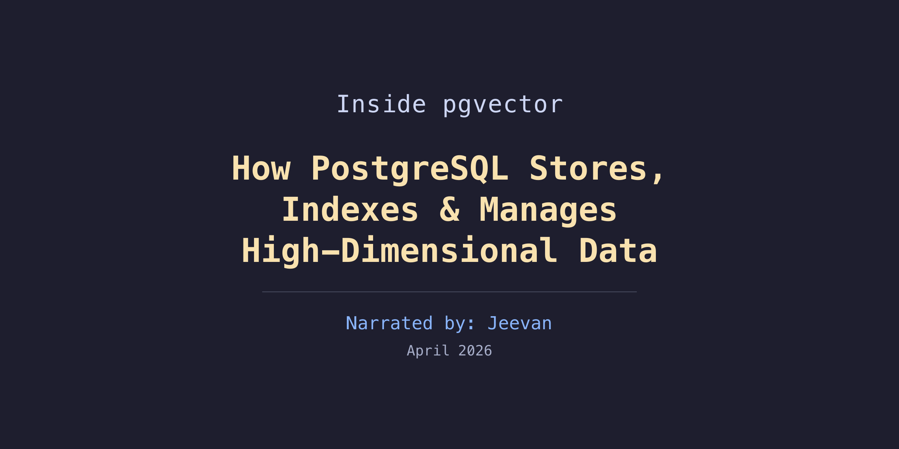
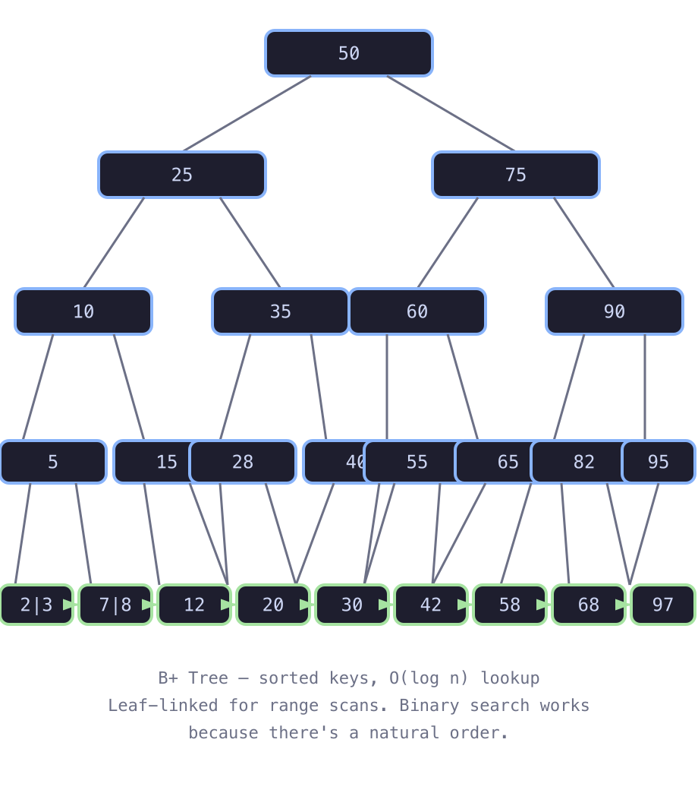
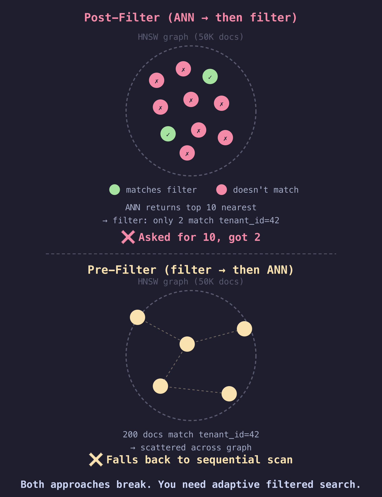
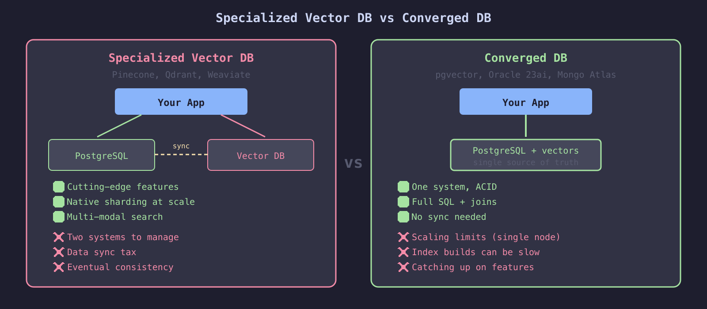
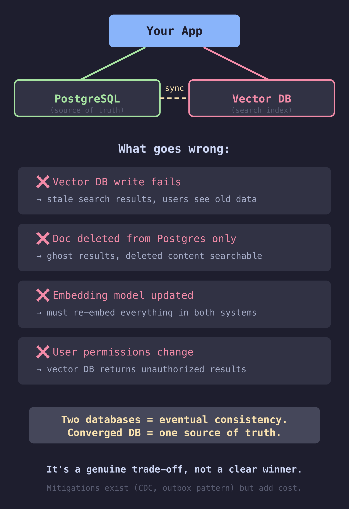
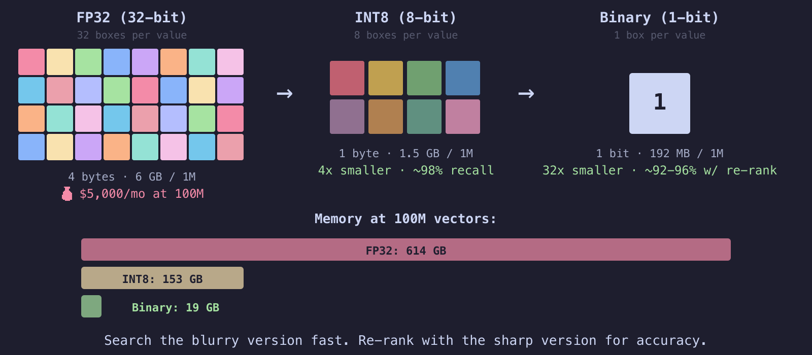

<!-- end_slide -->

# Why This Talk

<!-- column_layout: [2, 1] -->

<!-- column: 0 -->

Every team is adding vector search. Few plan for what happens next.

```
Month 1:  "Let's add semantic search!"
          → pgvector, 100K vectors, works great ✅

Month 4:  "Scale to all our docs"
          → 10M vectors, still fine ✅

Month 8:  "Enterprise rollout"
          → 100M vectors, RAM bill explodes 💸

Month 10: "Maybe we need a vector DB?"
          → now syncing two databases forever 🔄
```

<!-- column: 1 -->


<!-- reset_layout -->

<!-- pause -->

**This talk:** What happens inside Postgres when you store and search vectors — so you decide *before* month 8.

<!-- end_slide -->

# Chapter 1: What's an Embedding?

**Text → Numbers that capture meaning**

```
"I love pizza"     → [0.2, 0.8, 0.1, ... 384 numbers]
"Pizza is great"   → [0.3, 0.7, 0.2, ... 384 numbers]
"The sky is blue"  → [0.9, 0.1, 0.8, ... 384 numbers]
```

<!-- pause -->

**Key insight:** Similar meanings → Similar numbers!

*Like GPS coordinates for meaning — similar text ends up nearby in 384-dimensional space.*

<!-- pause -->


<!-- end_slide -->

# 💻 Quick Demo: Semantic Search

**Pre-seeded:** 12 PostgreSQL docs in `docs_demo` (384d embeddings)

```sql
SELECT id, content FROM docs_demo;
```

<!-- pause -->

**Now search by meaning, not keywords:**

```bash
python scripts/embed_query.py "how to find and fix slow queries"
```

```sql
SELECT content,
       embedding <=> '<paste_vector>'::vector AS distance
FROM docs_demo
ORDER BY distance
LIMIT 3;
```

<!-- pause -->

*Zero keyword overlap — pure semantic match* ✨

<!-- end_slide -->

# Chapter 2: Distance Operators

**How do we find similar vectors? Distance functions.**

| Operator | Name | Use When |
|----------|------|----------|
| `<->` | L2 (Euclidean) | Absolute distance matters (images, spatial) |
| `<=>` | Cosine | Direction matters (text — most common) |
| `<#>` | Inner Product | MaxIP retrieval (recommendations) |

**Most common for text:** Cosine `<=>` — normalizes for you, so vector magnitude doesn't matter.


<!-- end_slide -->

# Chapter 3: Where Do Vectors Live in Postgres?

```sql
CREATE EXTENSION IF NOT EXISTS vector;
CREATE TABLE docs (
    id serial PRIMARY KEY, content text, embedding vector(1024)
);
-- 50,000 docs with 1024d embeddings preloaded
```

<!-- pause -->

```sql
SELECT pg_size_pretty(pg_relation_size('docs')) AS heap_size;
```

**The math:** 50,000 × 1024 dims × 4 bytes = **~200 MB of raw embeddings**

<!-- pause -->

**But heap is only ~27 MB.** Where's the other ~173 MB? 🤔


<!-- end_slide -->

# The Mystery Revealed: TOAST!

```sql
SELECT c.relname,
    pg_size_pretty(pg_relation_size(c.oid)) AS heap_size,
    pg_size_pretty(pg_relation_size(c.reltoastrelid)) AS toast_size,
    pg_size_pretty(pg_total_relation_size(c.oid)) AS total_size
FROM pg_class c WHERE c.relname = 'docs';
```

<!-- pause -->

**Aha! 💡 TOAST** = The Oversized-Attribute Storage Technique

Large columns → moved to a separate table automatically.
- Each embedding: ~4,100 bytes
- Heap: ~27 MB (row headers + content text)
- TOAST: ~260 MB (70% of data!)
- Total: ~371 MB

1024d vectors (~4KB) > 2KB tuple threshold → out-of-line
Every vector read = extra TOAST I/O

<!-- pause -->

- **384d** (~1.5 KB) → stays inline ✅
- **1024d** (~4 KB) → TOASTed, slower ❌

*Bigger isn't always better* 🦥


<!-- end_slide -->

# Chapter 4: Search Without Indexes

```sql
EXPLAIN ANALYZE
SELECT id, content,
       embedding <=> (SELECT embedding FROM docs WHERE id = 75) AS distance
FROM docs ORDER BY distance LIMIT 5;
```

<!-- pause -->

**Observe:** Seq Scan — reads all 50,000 rows, ~500-2000ms, ~300,000 buffer reads (TOAST!).

O(N × dimensions) for every single query.


<!-- end_slide -->

# Why B-Trees Can't Help

<!-- column_layout: [1, 1] -->

<!-- column: 0 -->

**Regular queries:**
```sql
SELECT * FROM users WHERE id = 42;
```
B-tree → binary search → O(log n).



<!-- column: 1 -->

**Vector queries:**
```sql
SELECT * FROM docs
ORDER BY embedding <=> query LIMIT 10;
```
B-trees need a linear ordering.
Vectors don't have one.

```
[0.23, -0.89, 0.45, ...]
[0.91, 0.03, -0.44, ...]
Sort these? By which number? 🤷
```

<!-- pause -->

**We need Approximate Nearest Neighbor (ANN) indexes.**

*Finding 9 out of 10 true best matches is good enough.*


<!-- reset_layout -->

<!-- end_slide -->

# IVFFlat: Cluster & Search

**IVFFlat** = Inverted File Index with Flat Storage

<!-- column_layout: [1, 1] -->

<!-- column: 0 -->

**Build:** Divide vectors into clusters (k-means)

*"Supermarket aisles — dairy, snacks, spices"* 🛒


<!-- column: 1 -->

**Query:** Search only the nearest cluster(s)

*"Need butter? Go to dairy aisle, skip the rest"* 🧈


<!-- reset_layout -->

<!-- end_slide -->

# IVFFlat in Action

```sql
SET maintenance_work_mem = '512MB';
CREATE INDEX docs_ivfflat_idx 
ON docs USING ivfflat (embedding vector_cosine_ops)
WITH (lists = 200);
ANALYZE docs;
```

- `lists = 200` (≈ √50k) — number of clusters
- `vector_cosine_ops` — matches the `<=>` operator

<!-- pause -->

```sql
-- Forcing index for demo clarity.
-- In production, planner picks this with LIMIT + ANALYZE.
SET enable_seqscan = off;

EXPLAIN (ANALYZE, BUFFERS)
SELECT id, content,
       embedding <=> (SELECT embedding FROM docs WHERE id = 1) AS distance
FROM docs ORDER BY distance LIMIT 5;
```

<!-- pause -->

**Result:** Index Scan — ~10-20ms, ~1,000 buffers. **50-100x faster.**

<!-- end_slide -->

# HNSW: Multi-Layer Graph Search

**HNSW** = Hierarchical Navigable Small World — higher recall than IVFFlat.


<!-- pause -->

*Like GPS — highways first, then local roads to the exact address.*

<!-- end_slide -->

# HNSW in Action

```sql
DROP INDEX docs_ivfflat_idx;
CREATE INDEX docs_hnsw_idx 
ON docs USING hnsw (embedding vector_cosine_ops)
WITH (m = 16, ef_construction = 200);
```

- `m = 16`: connections per node — `ef_construction = 200`: build-time search depth

<!-- pause -->

```sql
SET hnsw.ef_search = 40;
EXPLAIN (ANALYZE, BUFFERS)
SELECT id, content,
    embedding <=> (SELECT embedding FROM docs WHERE id = 1) AS distance
FROM docs ORDER BY distance LIMIT 5;
```

<!-- pause -->

| Method   | Time  | Speedup | Buffers | Recall |
|----------|-------|---------|---------|--------|
| Seq Scan | 500-2000ms | 1x  | ~300,000 | 100% |
| IVFFlat  | 10-20ms | 50-100x | ~1,000 | ~95% |
| HNSW     | 5-15ms | 70-150x | ~500   | ~99% |

<span style="color: #f9e2af">**Build:**</span> IVFFlat <span style="color: #a6e3a1">**~3s**</span> vs HNSW <span style="color: #f38ba8">**~77s**</span> ⏱️ (50k rows, 1024d)

<!-- end_slide -->

# ⚠️ Always Use LIMIT!

**Without LIMIT, Postgres won't use ANN indexes!**

```sql
-- BAD: Sequential scan even with indexes!
SELECT id, content FROM docs 
ORDER BY embedding <=> (SELECT embedding FROM docs WHERE id = 1);

-- GOOD: ANN index kicks in
SELECT id, content FROM docs 
ORDER BY embedding <=> (SELECT embedding FROM docs WHERE id = 1) 
LIMIT 10;
```

<!-- pause -->

**Why?** ANN indexes find *top K nearest* — no K = no early stopping = full scan.

*Forgetting LIMIT is like ordering everything on the menu just to pick one dish* 🍟


<!-- end_slide -->

# Chapter 5: Production Reality

**MVCC Bloat:** UPDATE copies the entire row (including 4KB embedding!). 5000 metadata updates = 20 MB dead TOAST data.

<!-- pause -->

**Fix: Separate embedding table**

```sql
CREATE TABLE documents (
  id serial, title text, content text, metadata jsonb
);
CREATE TABLE embeddings (
  doc_id int REFERENCES documents(id),
  embedding vector(1024), content_hash text
);
-- Metadata updates no longer duplicate embeddings
UPDATE documents SET metadata = '{"views": 100}' WHERE id = 1;
```

<!-- pause -->

**More tips:**
- Use smaller models (384d stays inline, 1024d gets TOASTed)
- Increase `maintenance_work_mem` for index builds
- `ANALYZE` after bulk inserts (IVFFlat needs statistics)
- Create indexes AFTER bulk loading, not during

<!-- end_slide -->

# Key Takeaways

pgvector handles 1k-10M vectors in production. No specialized DB needed.

<!-- pause -->

**Storage:** 1024d vectors get TOASTed (~4KB > tuple threshold). Smaller models = less I/O.

<!-- pause -->

**Indexes:** HNSW for production reads (~99% recall), IVFFlat for batch/writes (~95%). Always use LIMIT.

<!-- pause -->

**Production:** Separate embedding tables. Watch MVCC bloat. Test filtered search early.

<!-- pause -->

**When to look beyond pgvector:** Multi-node sharding at 100M+, sub-ms latency requirements, or zero-downtime streaming updates.

<!-- pause -->

*Postgres can do semantic search.* 🎉


<!-- end_slide -->

# The End

<!-- column_layout: [2, 1] -->

<!-- column: 0 -->

*Now go forth and vector!* 🚀

**Questions?**

📎 **Advanced topics** in the same repo: quantization, DiskANN, hybrid search, architecture trade-offs
→ `vector_search_fundamentals.md` & `vector_storage_at_scale.md`

📬 <span style="color: #89b4fa">jeevan.dc24@alumni.iimb.ac.in</span>

🌐 <span style="color: #89b4fa">noobj.me</span>

<!-- column: 1 -->


<!-- reset_layout -->

<!-- column_layout: [1, 2, 1] -->

<!-- column: 0 -->

<!-- column: 1 -->

**Slides & Code:**

```
█████████████████████████████████████
████ ▄▄▄▄▄ █▀ ▄ ▀█▄ ▀█▄▄▀█ ▄▄▄▄▄ ████
████ █   █ █▄█  ▄█ ▀█▄ ▄▄█ █   █ ████
████ █▄▄▄█ █ ▄█▄█ █  ▀ ▀██ █▄▄▄█ ████
████▄▄▄▄▄▄▄█ ▀▄▀ █▄▀▄▀ ▀ █▄▄▄▄▄▄▄████
████ ▄▀ █▀▄ ▀█▄▄▀ ▄▄▄▀ ▄▀█ ▄▄▀▄▄▀████
████  █▀▄ ▄██▄▄█▀ ▄███ ▄▄▄██ ▄  █████
█████▀▀▄█▄▄▀▄█▀▄▄ ▄██▄▄   ▄██▄█▄▄████
████▀██   ▄▄▀ ▄ ▀▀ █▀▀▀█ ▀ ▄▄ ▄ ▄████
████▄█▀ █ ▄ ▀  █▀▄ ▀▄▀▄█▀ █  ██  ████
████ ▄▄▄▄▄ █▄▀▄██ ▀█▄▄▀█ █▄█ ▀▀ █████
████ █   █ █▀▀▄█  ██▄ ▀▀ ▄   ▀▀▄▄████
████ █▄▄▄█ █▀ ▀▄▄  ▀▀▀█  ▀██ ▄▄▀▄████
████▄▄▄▄▄▄▄█▄▄███████▄██▄▄▄▄▄▄█▄█████
█████████████████████████████████████
```

<!-- column: 2 -->

<!-- end_slide -->

# Appendix

Backup slides — if we have time

<!-- end_slide -->

# The Filtered Search Trap

<!-- column_layout: [1, 1] -->

<!-- column: 0 -->

**In production, you rarely search the entire table:**

```sql
SELECT * FROM docs
WHERE tenant_id = 42
  AND category = 'electronics'
ORDER BY embedding <=> query_embedding
LIMIT 10;
```

<!-- pause -->

**Problem:** Vector indexes are blind to metadata filters.

**Fixes:**
- **`iterative_scan`** — keep scanning until enough filtered results
- **Partial indexes** — separate HNSW per category
- **Table partitioning** — one partition per tenant

*#1 gotcha in production vector search.*

<!-- column: 1 -->



<!-- reset_layout -->

<!-- end_slide -->

# When to Use What — Decision Matrix



<span style="color: #f9e2af">**Start with the existing database.**</span> Migrate only when it's outgrown.

<!-- end_slide -->

# The Data Sync Tax



<!-- end_slide -->

# The RAM Wall

```
Per vector:  1536 dims × 4 bytes = 6 KB
```

| Scale | Raw Vectors | + HNSW (~50%) | Approx. RAM Cost |
|-------|------------|--------------|-----------------|
| 1M | 6 GB | ~9 GB | ~$50/mo |
| 10M | 61 GB | ~92 GB | ~$500/mo |
| 100M | 614 GB | ~920 GB | ~$5,000+/mo |
| 1B | 6.1 TB | ~9.2 TB | 💀 |

<!-- pause -->

<span style="color: #f38ba8">64 GB → 920 GB isn't 15x cost — it's 30-50x operational complexity.</span>

<!-- end_slide -->

# Quantization: Compress Smartly

**Full precision isn't needed for *searching*. Only for final *ranking*.**



<!-- column_layout: [1, 1] -->

<!-- column: 0 -->

<span style="color: #4EC9B0">**Scalar Quantization**</span>
```
FP32 → INT8
[0.2341, -0.8912, 0.4563]
         ↓
[60, -228, 117]
```
4x compression.

<span style="color: #4EC9B0">**Binary Quantization**</span>
```
Positive → 1, Negative → 0
[0.23, -0.89, 0.45, -0.12]
         ↓
[1, 0, 1, 0]
```
32x compression. XOR + count.

<!-- column: 1 -->

<span style="color: #f9e2af">**The production pattern:**</span>

```
Query arrives
  ↓
1. Search compressed index (RAM)
   → top 1000 candidates (fast!)
  ↓
2. Fetch full-precision vectors
   for those 1000 only (disk)
  ↓
3. Re-rank with exact distances
   → return true top 10
```

*Search blurry, rank sharp.*

<!-- reset_layout -->

<!-- end_slide -->

# Quantization Trade-offs

| Method | Compression | Recall (w/ re-rank) | Speed | Training? |
|--------|------------|-------------------|-------|-----------|
| FP32 (baseline) | 1x | 100% | 1x | No |
| FP16 (half) | 2x | ~99.9% | ~1.5x | No |
| Scalar INT8 | 4x | ~98-99% | ~2-3x | No |
| Product (PQ) | 8-64x | ~95-99% | ~5-10x | Yes |
| Binary (BQ) | 32x | ~92-96% | ~15-30x | No |

<!-- pause -->

**Start with FP16** (free 2x, zero recall loss).
**Graduate to BQ + re-rank** when 32x compression is needed.

<!-- end_slide -->

# Quantization How-To in PostgreSQL

**FP16 (halfvec)** — 2x compression, pgvector native:
```sql
ALTER TABLE docs ADD COLUMN embedding_half halfvec(1536);
UPDATE docs SET embedding_half = embedding::halfvec(1536);
CREATE INDEX ON docs USING hnsw (embedding_half halfvec_cosine_ops);
```

<!-- pause -->

**Binary Quantization** — 32x compression, pgvector native:
```sql
ALTER TABLE docs ADD COLUMN embedding_bit bit(1536);
UPDATE docs SET embedding_bit = binary_quantize(embedding)::bit(1536);
CREATE INDEX ON docs USING hnsw (embedding_bit bit_hamming_ops);

-- BQ coarse pass + FP32 re-rank
WITH candidates AS (
  SELECT id, embedding FROM docs
  ORDER BY embedding_bit <~> binary_quantize($query)::bit(1536)
  LIMIT 200
)
SELECT id, content FROM candidates
ORDER BY embedding <=> $query LIMIT 10;
```

<!-- end_slide -->

# IVFFlat Search Process

```
    1.0 │
        │  ●Doc1                         ●Doc5
    0.8 │   ⭐A            Query 🟢 [0.72,0.82]
        │   [0.15,0.85]                  ●Doc4
    0.6 │   ●Doc2              ⭐ B[0.70,0.75]
        │    ●Doc3           ●Doc6   
    0.4 │                           
    0.0 └─────────────────────────────
        0.0   0.2   0.4   0.6   0.8

1. Nearest centroid: B (dist 0.03) ✓
2. Scan ONLY Cluster B: Doc4: 0.02 ✓  Doc5: 0.04 ✓

Checked 3/6 docs instead of all 6!
```

<!-- end_slide -->

# IVFFlat Build: K-Means Clustering

```
Doc1: [0.1, 0.2, 0.9]   Doc4: [0.7, 0.8, 0.1]
Doc2: [0.2, 0.3, 0.8]   Doc5: [0.75, 0.85, 0.05]
Doc3: [0.15, 0.25, 0.85] Doc6: [0.65, 0.75, 0.15]
```

⚠️  Must load ALL vectors into memory first!

**Process:** Pick K random centroids → assign vectors to nearest → recalculate centroids → repeat until convergence.

```
Final:
  Centroid 1: [0.15, 0.25, 0.85] → Doc1, Doc2, Doc3
  Centroid 2: [0.70, 0.80, 0.10] → Doc4, Doc5, Doc6
```

<!-- end_slide -->

# HNSW Build: Incremental Graph

✓ NO need to load all data at once — inserts one vector at a time.

**Layer assignment (exponential decay):**
```
Layer 0: ████████████████████ 100%
Layer 1: ████████░░░░░░░░░░░░  50%
Layer 2: ████░░░░░░░░░░░░░░░░  25%
```

**Insert = search for nearest neighbors → connect → prune to M max**

```
After all inserts:
  [Doc1]──[Doc2]    [Doc4]──[Doc5]
    ╲      ╱          ╲      ╱
     [Doc3]            [Doc6]
```

<!-- end_slide -->

# Monitoring & Introspection

```sql
-- Are indexes being used?
SELECT indexrelname, idx_scan, idx_tup_read
FROM pg_stat_user_indexes WHERE relname = 'docs';

-- Dead tuple bloat
SELECT relname, n_live_tup, n_dead_tup,
  round(100.0 * n_dead_tup / NULLIF(n_live_tup + n_dead_tup, 0), 1) AS dead_pct
FROM pg_stat_user_tables WHERE relname = 'docs';

-- Index sizes
SELECT indexrelname, pg_size_pretty(pg_relation_size(indexrelid)) AS size
FROM pg_stat_user_indexes WHERE relname = 'docs';
```

<!-- end_slide -->

# References

- pgvector: https://github.com/pgvector/pgvector
- HNSW: https://www.pinecone.io/learn/series/faiss/hnsw/
- IVFFlat: https://milvus.io/docs/ivf-flat.md
- TOAST: https://www.postgresql.org/docs/current/storage-toast.html
- MVCC: https://www.postgresql.org/docs/7.1/mvcc.html
