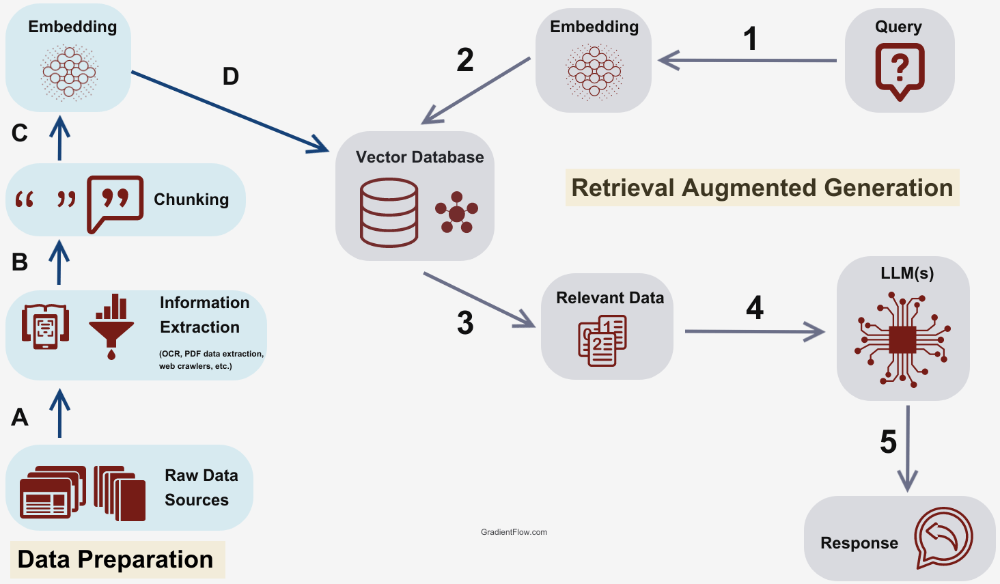
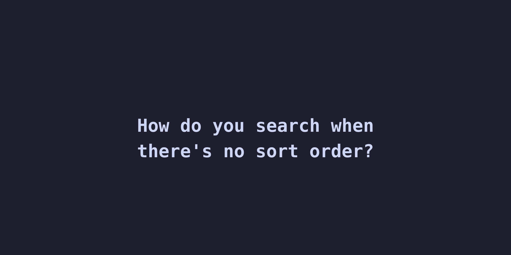
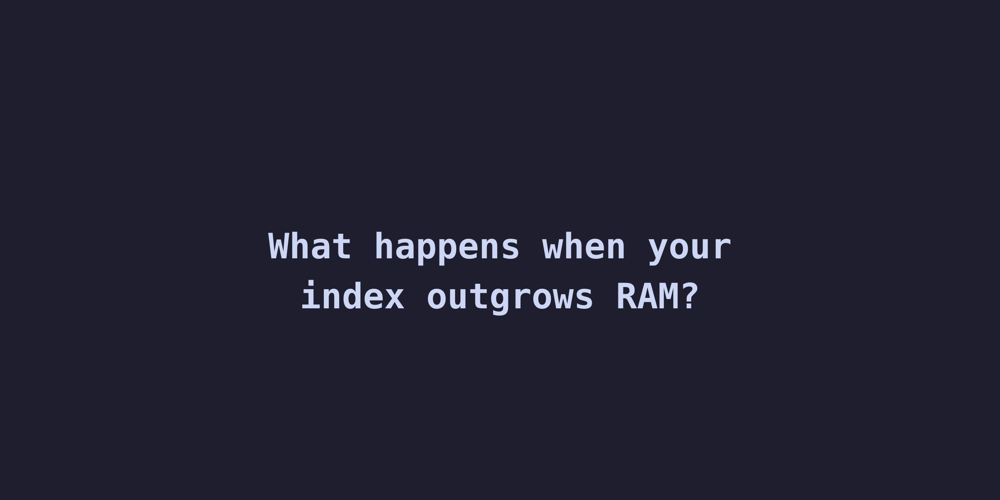
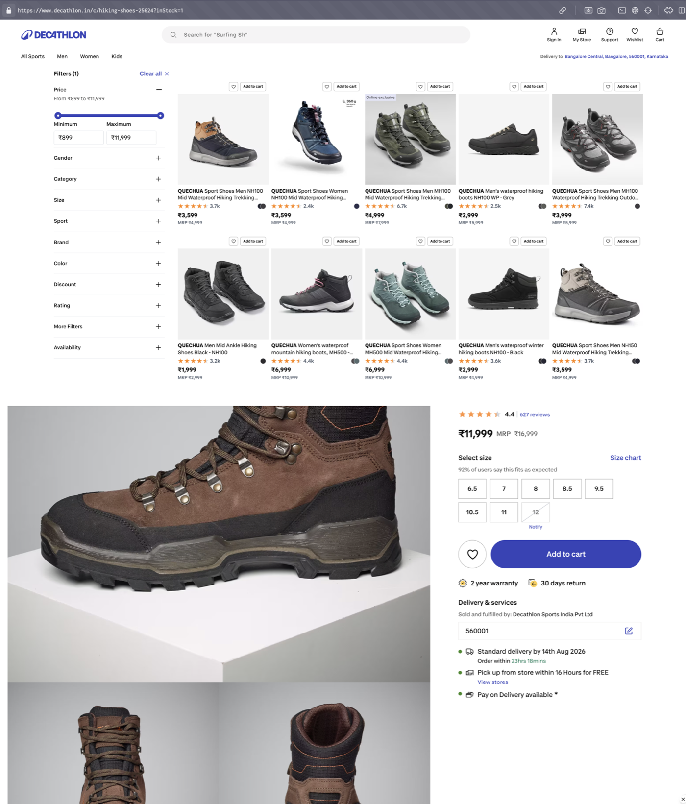
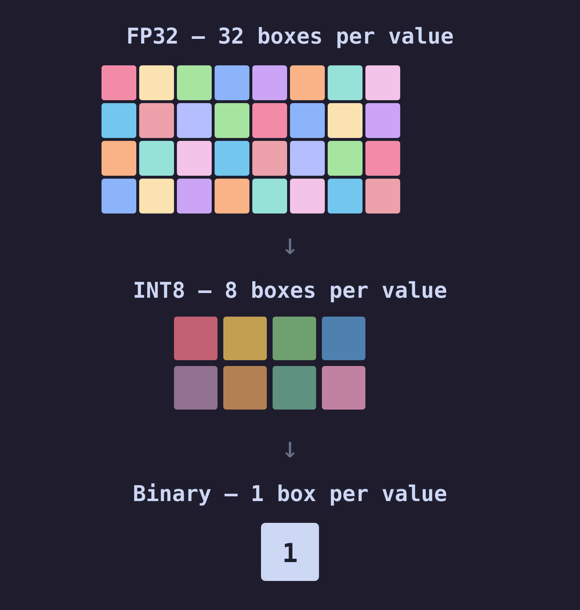
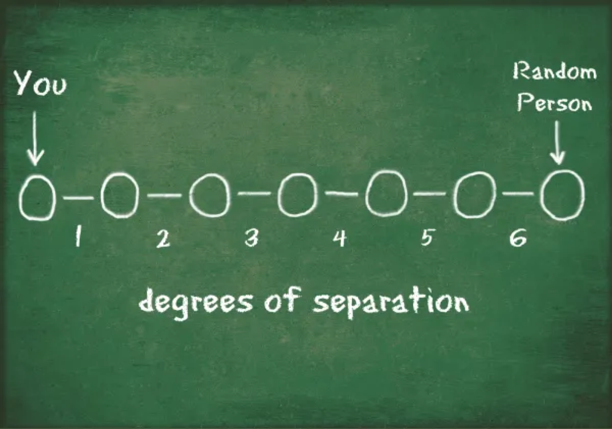
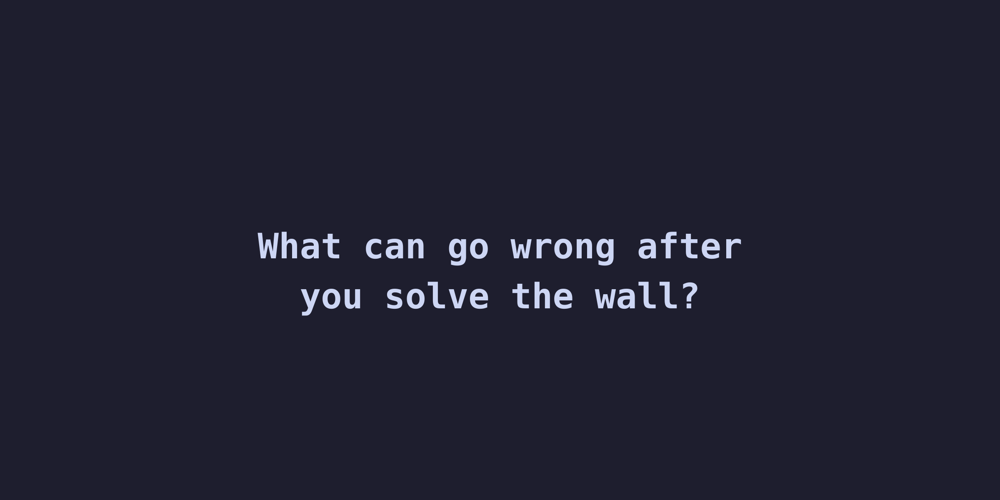

---
options:
  implicit_slide_ends: true
theme:
  override:
    footer:
      style: template
      left: "Jeevan | Entain"
      right: "{current_slide} / {total_slides}"
---


<!-- end_slide -->

# What Is RAG?



<!-- end_slide -->

# A RAG System: Every Box Is a Decision


<!-- end_slide -->

# The Scaling Path


<!-- column_layout: [1, 1, 1, 1] -->

<!-- column: 0 -->


<!-- column: 1 -->


<!-- column: 2 -->


<!-- column: 3 -->


<!-- reset_layout -->

<!-- end_slide -->

# Why This Talk, Why Now

<!-- column_layout: [2, 3] -->

<!-- column: 0 -->

```
Month 1:  "Let's add semantic search!"
          → 100K vectors, works great ✅

Month 4:  "Scale to all our docs"
          → 10M vectors, still fine ✅

Month 8:  "Enterprise rollout"
          → 100M vectors, RAM bill explodes 💸

Month 9:  "Add per-tenant filtering"
          → recall silently drops to 40% 🔇

Month 10: "Maybe we need a separate vector DB?"
          → now syncing two databases forever 🔄
```

**Same pattern. Same order. Every team.**

<span style="color: #f9e2af">This talk: the math, the tools, and the decisions — in plain English.</span>

<!-- column: 1 -->


<!-- reset_layout -->

<!-- end_slide -->

# What We'll Cover

<!-- column_layout: [1, 1] -->

<!-- column: 0 -->

## First Principles
*Embeddings, distance, why approximate works*

## The RAM Wall
*Where scale breaks and what to do*

## Three Compression Levers
*Dimensions → Bits → Disk*

<!-- column: 1 -->

## Silent Failures
*Filtered search + recall drift*

## Architecture Decisions
*Benchmarks, trade-offs, decision matrix*

<!-- end_slide -->

# Demo

<!-- column_layout: [1, 1] -->

<!-- column: 0 -->

## ✅ High Similarity

*Same meaning, no shared words*

`"cancel my subscription"`

`"I want to unsubscribe"`

<!-- pause -->

→ **~68%**

<!-- column: 1 -->

## ❌ Low Similarity

*Same word, different meaning*

`"the bank is closed for the holiday"`

`"the river bank was steep and muddy"`

<!-- pause -->

→ **~26%**

<!-- reset_layout -->

<!-- pause -->

<span style="color: #f9e2af">384 dimensions per sentence. That's what costs 920 GB at scale.</span>

<!-- end_slide -->

# How Do Computers Compare Text?

<!-- column_layout: [2, 1] -->

<!-- column: 0 -->

**Computers don't understand words.**

```
"I love fries"   vs   "Fries are great"
```

🧑 Human → instantly similar.
💻 Computer → two different strings.

<!-- column: 1 -->


<!-- reset_layout -->

<!-- pause -->

**The fix: turn text into numbers that capture meaning.**

```
"I love fries"     → [0.2, 0.8, 0.1, ...] 384 numbers
"Fries are great"  → [0.3, 0.7, 0.2, ...] 384 numbers
"The sky is blue"  → [0.9, 0.1, 0.8, ...] 384 numbers
```

<span style="color: #a6e3a1">Similar meanings → similar numbers.</span>

<!-- pause -->

**That's an embedding.** A GPS coordinate for meaning — close meanings, close numbers.

<!-- end_slide -->

# How Do We Measure "Close"?

<!-- column_layout: [3, 2] -->

<!-- column: 0 -->

**Distance between two points — already familiar:**

```
Point A = (x₁, y₁)    Point B = (x₂, y₂)

Distance = √((x₂-x₁)² + (y₂-y₁)²)
```

<!-- column: 1 -->


<!-- reset_layout -->

<!-- pause -->

**Same idea, just more dimensions:**

```
Vector A = [0.2, 0.8, 0.1, ... 384 nums]
Vector B = [0.3, 0.7, 0.2, ... 384 nums]

Distance = √((0.3-0.2)² + (0.7-0.8)² + ...)
```

That's Euclidean distance. Works, but...

<!-- end_slide -->

# &nbsp;



<!-- end_slide -->

# Why Vector Indexing Is Different

<!-- column_layout: [1, 1] -->

<!-- column: 0 -->

**B-tree:** exact ordering, binary search, O(log n)


<!-- column: 1 -->

**Vector indexes** have no natural sort order.

```
A = [0.21, 0.87, 0.14, ..., 0.53]
B = [0.93, 0.12, 0.38, ..., 0.71]
C = [0.34, 0.76, 0.22, ..., 0.48]
```


<!-- reset_layout -->

<!-- pause -->

No "less than" for 384 dimensions.

**Exact search = check every vector** — too slow at scale.

<!-- end_slide -->

# The Key Insight: <span style="color: #a6e3a1">Approximate Is Good Enough</span>

**What if we don't need the *exact* top 10?**

**What if finding 9 out of 10 true best matches is acceptable?**

<!-- pause -->

This is <span style="color: #a6e3a1">**Approximate Nearest Neighbor (ANN)**</span> search.

```
Exact search:  ████████████████████ 100% scanned → 100% accurate → 🐌 Slow
ANN search:    ███░░░░░░░░░░░░░░░░░  ~5% scanned → ~95-99% accurate → ⚡ Fast!
```

<!-- pause -->

**Analogy:** 📦 Finding a delivery address in Seoul

- **Exact search:** Check every building in every street → hours 🐌
- **With postal code:** Go to the right 구(gu), check nearby blocks → minutes ⚡
- **The catch:** <span style="color: #f38ba8">Might miss a building right on the border of two postal codes</span>

<!-- pause -->

<span style="color: #f9e2af">This trade-off — 95% accuracy at 100x speed — is what makes vector search viable.</span>

<!-- end_slide -->

# How ANN (Approximate Nearest Neighbor) Indexes Work

**Close enough — without checking every vector.**


**<span style="color: #4EC9B0">HNSW</span>** — multi-layer graph · ~95-99% recall · 1-5ms · <span style="color: #f38ba8">must stay in RAM</span>

<!-- pause -->

*Like driving Seoul → Sokcho: expressway (top layer, big hops) → regional road → local street to the door (precise).*

<!-- pause -->

<span style="color: #6c7086">*ANN = Approximate Nearest Neighbor · HNSW = Hierarchical Navigable Small World*</span>

<!-- end_slide -->

# &nbsp;



<!-- end_slide -->

# The RAM Wall

**Everyone wants to build AI on their own data.
<span style="color: #f38ba8">Leadership wants to know why the infrastructure bill just tripled.</span>**


```
Per vector:  1536 dims × 4 bytes = 6,144 bytes ≈ 6 KB
```

<span style="color: #6c7086">*Demo used 384d (MiniLM). Production models (OpenAI, Cohere) use 1536d. This is production math.*</span>

| Scale | Raw Vectors | + HNSW (50%) | Approx. RAM Cost |
|-------|------------|-------------|-----------------|
| 1M | 6 GB | ~9 GB | ~$50/mo |
| 10M | 61 GB | ~92 GB | ~$500/mo |
| 100M | 614 GB | ~920 GB | ~$5,000+/mo |
| 1B | 6.1 TB | ~9.2 TB | 💀 |

<!-- pause -->

<span style="color: #f38ba8">64 GB → 920 GB = not 15x cost, it's 30-50x operational complexity.</span>

<!-- end_slide -->

# The Cost of Getting It Wrong


<!-- pause -->

**1.** "Just use HNSW" → 750 GB RAM → $5K/mo 💸

<!-- pause -->

**2.** "Add a separate vector DB" → two systems to sync forever 🔄

<!-- pause -->

**3.** "We'll optimize later" → index rebuild = 3 days, no deploys 🧊

<!-- pause -->

<span style="color: #f9e2af">Not bad tools — premature decisions made without doing the math.</span>

<!-- end_slide -->

# Three Ways Through the Wall


<span style="color: #a6e3a1">**920 GB → 5 GB compressed index. Full vectors stay on SSD for re-rank.**</span>

<span style="color: #6c7086">*(Do them in order: dimensions first, then bits, then disk.)*</span>

<!-- pause -->

<span style="color: #6c7086">*MRL = Matryoshka Representation Learning · SQ/PQ/BQ = Scalar/Product/Binary Quantization · DiskANN = disk-based ANN index*</span>

<!-- end_slide -->

# Lever 1: Matryoshka Embeddings


**Same doll, fewer layers — still recognizable.**

Same embedding, fewer dimensions — still useful.

<!-- end_slide -->

# Lever 1: Matryoshka Embeddings (MRL)


<!-- end_slide -->

# Lever 2: Quantization

<!-- column_layout: [1, 1] -->

<!-- column: 0 -->



<!-- column: 1 -->



<!-- reset_layout -->

<!-- end_slide -->

# Lever 2: Quantization — The Details


<!-- end_slide -->

# Demo


<!-- pause -->

<!-- column_layout: [1, 3, 1] -->

<!-- column: 0 -->

<!-- column: 1 -->

| Method | Size (1M) | Recall@10 |
|--------|-----------|-----------|
| FP32 (baseline) | 6.1 GB | 100% |
| Binary (1-bit) | 192 MB | ~10% |
| Binary + rerank | 192 MB | ~92-96% |

<!-- column: 2 -->

<!-- reset_layout -->

<span style="color: #a6e3a1">**32× smaller. Still finds the right answers.**</span>

<span style="color: #6c7086">*Recall is optimistic at small scale. At 1M+ vectors, expect ~92-96% with rerank — still excellent for most use cases.*</span>

<!-- end_slide -->

# Lever 3: DiskANN

<!-- column_layout: [1, 3] -->

<!-- column: 0 -->


**8 billion people on Earth.**

**Any two connected by just 6 hops.**

<!-- column: 1 -->



<!-- reset_layout -->

<!-- pause -->

<span style="color: #a6e3a1">**DiskANN uses the same idea: build a graph where any vector is ~6 hops from any other. Keep the graph in RAM, keep the actual vectors on SSD.**</span>

<!-- end_slide -->

# DiskANN: The Architecture


<!-- end_slide -->

# &nbsp;



<!-- end_slide -->

# Silent Failure #1: Filtered Search

<!-- column_layout: [2, 3] -->

<!-- column: 0 -->

```sql
SELECT * FROM products
WHERE tenant_id = 42
ORDER BY embedding <=> query LIMIT 10;
```

<!-- pause -->

**⚠️ HNSW returns 10 nearest vectors.**
**Filter throws 9 away.**

Asked for 10. Got 0.

<span style="color: #f38ba8">**No error. No warning. No log line.**</span>

<!-- column: 1 -->


<!-- reset_layout -->

<!-- end_slide -->

# Pre-Filter vs Post-Filter: Both Fail


<!-- end_slide -->

# Silent Failure #2: Recall Drift

<!-- column_layout: [3, 2] -->

<!-- column: 0 -->

**#1 returns zero results. #2 returns the WRONG results.**

<!-- pause -->

```
Recall@10
 100% │ ●━━━●
      │       ╲
  90% │         ╲
      │           ╲
  80% │             ╲
      │               ╲
  70% │                 ╲
      │                   ╲
  60% │                     ● ← nobody noticed
      │
      └──────────────────────────
       Month 1   4     6     9
```

<!-- column: 1 -->


<!-- reset_layout -->

<!-- pause -->

No error. No alert. No log line.

<span style="color: #f38ba8">**The system doesn't crash. It just quietly becomes useless.**</span>

<!-- end_slide -->

# Detecting Drift: Two Flows


<!-- end_slide -->

# Decision Matrix


<!-- end_slide -->

# The End

<span style="color: #f9e2af">**Remember Month 10? You don't have to get there.**</span>

Do the math early. Pick compression before it's urgent. Monitor recall always.

<!-- column_layout: [2, 1] -->

<!-- column: 0 -->


<!-- column: 1 -->


<span style="color: #6c7086">Scan for the repo & slides</span>

📬 <span style="color: #89b4fa">hello@noobj.me</span>

🌐 <span style="color: #89b4fa">noobj.me</span>

<!-- reset_layout -->

<!-- end_slide -->

# Appendix: Is a Separate Vector DB Still Needed?


<!-- end_slide -->

# Appendix: Filtered Search — The Fixes


<!-- end_slide -->

# Appendix: The 2026 Answer — Often No, But It Depends


50M Cohere embeddings | 768 dimensions | 99% recall | Same AWS hardware

<span style="color: #a6e3a1">**pgvector + pgvectorscale: 28x faster, 16x more throughput, 75% less cost**</span>

Usually one Postgres wins. Dedicated engines earn their keep only at extreme scale — measure first.

<span style="color: #6c7086">Source: github.com/timescale/pgvectorscale | All open source (PostgreSQL License + Apache 2.0)</span>

<!-- end_slide -->

# Appendix: Hybrid Search — BM25 + Vectors

**Vector search misses exact terms. Keyword misses meaning.**

```text
┌──────────────────────────────────────────────────────────────┐
│ Query:  "how to handle payment refund timeout"               │
├──────────────────────────────────────────────────────────────┤
│ BM25      →  matches "refund timeout"        (precise)       │
│ Vector    →  finds "payment reversal logic"  (broader)       │
│ Combined  →  best recall                                     │
└──────────────────────────────────────────────────────────────┘
```

**Both are PostgreSQL extensions — one DB, one query.**

No separate service · no sync · same transaction.

<span style="color: #6c7086">*BM25 = keyword ranking · RRF = Reciprocal Rank Fusion*</span>

<!-- end_slide -->

# Appendix: Quantization Trade-offs

| | FP32 | FP16 (half) | Scalar INT8 | Product (PQ) | Binary (BQ) |
|---|---|---|---|---|---|
| **Compression** | 1x | <span style="color: #a6e3a1">2x</span> | <span style="color: #a6e3a1">4x</span> | <span style="color: #a6e3a1">8-64x</span> | <span style="color: #a6e3a1">32x</span> |
| **Recall (no re-rank)** | <span style="color: #a6e3a1">100%</span> | <span style="color: #a6e3a1">~99.9%</span> | <span style="color: #a6e3a1">~95-98%</span> | <span style="color: #f9e2af">~85-95%</span> | <span style="color: #f9e2af">~75-95%*</span> |
| **Recall (w/ re-rank)** | — | — | <span style="color: #a6e3a1">~98-99%</span> | <span style="color: #a6e3a1">~95-99%</span> | <span style="color: #f9e2af">~92-96%</span> |
| **Speed vs FP32** | 1x | <span style="color: #f9e2af">~1.5x</span> | <span style="color: #a6e3a1">~2-3x</span> | <span style="color: #a6e3a1">~5-10x</span> | <span style="color: #a6e3a1">~15-30x</span> |
| **Training needed?** | <span style="color: #a6e3a1">No</span> | <span style="color: #a6e3a1">No</span> | <span style="color: #a6e3a1">No</span> | <span style="color: #f38ba8">Yes</span> | <span style="color: #a6e3a1">No</span> |
| **Best for** | Small scale | Easy first win | General purpose | Massive datasets | Speed-critical |

**MRL + quantization compose:** 256d + BQ = 192x compression from 1536d FP32.

<!-- end_slide -->

# Appendix: Quantization How-To — PostgreSQL

**<span style="color: #4EC9B0">FP16 (halfvec)</span>** · 2x compression

```sql
ALTER TABLE docs ADD COLUMN embedding_half halfvec(1536);
UPDATE docs SET embedding_half = embedding::halfvec(1536);
CREATE INDEX ON docs USING hnsw (embedding_half halfvec_cosine_ops);
```

**<span style="color: #4EC9B0">Binary Quantization</span>** · 32x compression + re-rank

```sql
ALTER TABLE docs ADD COLUMN embedding_bit bit(1536);
UPDATE docs SET embedding_bit = binary_quantize(embedding)::bit(1536);
CREATE INDEX ON docs USING hnsw (embedding_bit bit_hamming_ops);

WITH candidates AS (
  SELECT id, embedding FROM docs
  ORDER BY embedding_bit <~> binary_quantize($query)::bit(1536) LIMIT 200
)
SELECT id, content FROM candidates ORDER BY embedding <=> $query LIMIT 10;
```

**<span style="color: #4EC9B0">DiskANN + SBQ (pgvectorscale)</span>** · automatic

```sql
CREATE INDEX ON docs USING diskann (embedding vector_cosine_ops)
  WITH (num_neighbors = 50, storage_layout = 'memory_optimized');
```

<!-- end_slide -->

# Appendix: DiskANN How-To

```sql
CREATE EXTENSION IF NOT EXISTS vectorscale;

CREATE INDEX ON docs
  USING diskann (embedding vector_cosine_ops)
  WITH (num_neighbors = 50, search_list_size = 100);

-- Query unchanged — planner picks diskann
SELECT id, content FROM docs
ORDER BY embedding <=> $query LIMIT 10;

-- Tune at query time
SET diskann.query_search_list_size = 150;
```

| Signal | Action |
|--------|--------|
| RAM usage > 60% of instance | Evaluate DiskANN |
| Dataset > 20-50M vectors | DiskANN likely cheaper |
| Latency budget allows 5-15ms | DiskANN is a fit |

<!-- end_slide -->

# Appendix: Hybrid Search — RRF SQL

```sql
WITH bm25 AS (
  SELECT id, ROW_NUMBER() OVER (ORDER BY paradedb.score(id) DESC) AS rank
  FROM docs
  WHERE content @@@ 'payment refund timeout'
  LIMIT 100
),
vector AS (
  SELECT id, ROW_NUMBER() OVER (ORDER BY embedding <=> $query) AS rank
  FROM docs
  ORDER BY embedding <=> $query
  LIMIT 100
)
SELECT COALESCE(b.id, v.id) AS id,
       COALESCE(1.0/(60 + b.rank), 0)
     + COALESCE(1.0/(60 + v.rank), 0) AS rrf_score
FROM bm25 b
FULL OUTER JOIN vector v ON b.id = v.id
ORDER BY rrf_score DESC
LIMIT 10;
```

*k=60 from the RRF paper — dampens high-rank dominance. Only cares about rank position, not raw scores.*

<!-- end_slide -->

# Appendix: Recall Drift — Observability Setup

**Two monitoring flows:**

| | Live Queries (canary) | Golden Eval (audit) |
|---|---|---|
| Frequency | Every query | Weekly |
| Measures | Distance distribution | Actual recall@10 |
| Ground truth? | No | Yes |
| Catches | Gross failures fast | Subtle degradation |

**Minimum viable setup:**
1. Log `mean_distance` on every search call
2. 200 labeled query→doc pairs, run weekly
3. Alert if recall drops below 95%
4. CI gate: fail deploy if recall regresses

**Open source eval tools:** RAGAS, Phoenix (Arize), Langfuse

<!-- end_slide -->

# Appendix: Long Context vs RAG

| Factor | Favors Long Context | Favors RAG |
|--------|-------------------|------------|
| Corpus size | <100K tokens | >100K tokens |
| Relevance ratio | >20% relevant | <20% relevant |
| Latency SLO | Async (45s ok) | Interactive (<2s) |
| Data freshness | Static | Frequently updated |
| Query volume | Hundreds/month | Thousands/day |
| Cost/query | $0.20–$2.00 | $0.00008 |

**1,250x cost difference at scale.** If any TWO factors favor RAG → use RAG.

<!-- end_slide -->

# References

1. **pgvector** — github.com/pgvector/pgvector (PostgreSQL License)
2. **pgvectorscale** — github.com/timescale/pgvectorscale (Apache 2.0)
3. **DiskANN** — github.com/microsoft/DiskANN (MIT)
4. **ParadeDB** — github.com/paradedb/paradedb (AGPL)
5. **Matryoshka Embeddings** — arxiv.org/abs/2205.13147
6. **pgvector 50M Benchmark** — github.com/timescale/pgvectorscale/blob/main/BENCHMARKS.md
7. **RAGAS** — github.com/explodinggradients/ragas (Apache 2.0)
8. **BGE-Reranker** — huggingface.co/BAAI/bge-reranker-v2-m3
9. **Embedding Quantization** — huggingface.co/blog/embedding-quantization
10. **Long Context vs RAG** — tianpan.co/blog/2026-04-09
11. **ANN Benchmarks** — ann-benchmarks.com
12. **LangGraph** — github.com/langchain-ai/langgraph (MIT)
