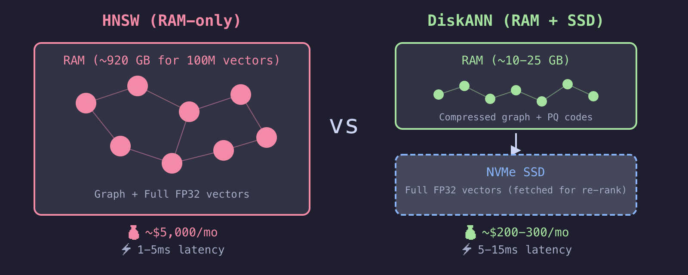

# Today's Journey

<!-- column_layout: [1, 1] -->

<!-- column: 0 -->

## Embeddings & Indexing
*You can't B-tree your way out of this*
- Primer on semantic search
- Why vector indexing is fundamentally different

## The RAM Wall
*100M vectors = 920 GB RAM. Plan ahead or pay later.*
- The math that breaks your budget
- The CFO conversation nobody wants

## Quantization
*You don't need full precision to search. Only to rank.*
- Scalar, Binary, Product — intuition
- The "coarse + re-rank" pattern
- 💻 Demo: 32x compression, high recall

<!-- column: 1 -->

## Filtered Search
*Real queries have filters. Most indexes silently fail at this.*
- Why WHERE + ORDER BY breaks
- iterative_scan — the fix
- 💻 Demo: Live SQL on 50k docs

## Architecture & Trade-offs
*Adding a vector DB means syncing two systems forever.*
- Specialized vs converged DB
- The data sync tax
- Hybrid search (BM25 + vectors)

## Decision Matrix & Takeaways
*Start with your existing DB. Migrate only if you outgrow it.*
- What to use when — in plain English
- What to do Monday morning

<!-- end_slide -->

# Embeddings & Semantic Search

**An embedding model turns text into a vector. Similar meaning → nearby vectors.**

```
"My flight got cancelled"    → [+0.055, -0.015, +0.023, +0.070, ...] (384 dims)
"The airline delayed my trip" → [+0.077, -0.013, +0.017, +0.113, ...] (384 dims)
"The stock market crashed"   → [+0.027, -0.039, +0.015, +0.071, ...] (384 dims)
```

**Zero words in common — but the model knows the first two mean the same thing.**

```bash
python scripts/embedding_intro.py
```

<!-- pause -->

**Semantic search = find nearest vectors to a query:**

```sql
SELECT content FROM docs
ORDER BY embedding <=> query_embedding   -- cosine distance
LIMIT 10;
```

Simple query. But to answer it, the database must compare your query
against *every* vector. <span style="color: #f38ba8">At 100M rows, that's a problem.</span>

<!-- end_slide -->

# Why Vector Indexing Is Different

**Traditional indexes** (B-tree) work on exact ordering: `WHERE id = 42` or `ORDER BY date`.
There's a clear sort order. Binary search. O(log n). Done.

<!-- pause -->

**Vector indexes** have no natural sort order. "Closest to this 1536-dimensional point"
isn't something a B-tree can answer. You need specialized structures:

<!-- column_layout: [1, 1] -->

<!-- column: 0 -->

**IVFFlat** — Cluster & search

Divide vectors into clusters (k-means).
At query time, search only nearest cluster(s).

*"Go to the Italian district,
then check every restaurant there."*


<!-- column: 1 -->

**HNSW** — Multi-layer graph

Build a navigable graph with layers.
Top = express highways. Bottom = local streets.

*"GPS navigation — highways first,
then local roads."*


<!-- reset_layout -->

<!-- pause -->

**Both assume vectors live in RAM.** That's fine at 1M vectors.
At 100M? Let's do the math.

<!-- end_slide -->

# The RAM Wall

<!-- column_layout: [1, 1] -->

<!-- column: 0 -->

**Everyone wants to build AI on their own data.**

Leadership wants to know why the infrastructure bill just tripled.

The #1 shift in vector storage since 2024:
Moving away from keeping everything in memory.

<!-- column: 1 -->


<!-- end_slide -->

# The Math That Breaks Your Budget

**OpenAI text-embedding-3-small: 1536 dimensions, FP32**

```
Per vector:  1536 dims × 4 bytes = 6,144 bytes ≈ 6 KB
```

<!-- pause -->

| Scale | Raw Vectors | + HNSW (50%) | Approx. RAM Cost |
|-------|------------|-------------|-----------------|
| 1M | 6 GB | ~9 GB | ~$50/mo |
| 10M | 61 GB | ~92 GB | ~$500/mo |
| 100M | 614 GB | ~920 GB | ~$5,000+/mo |
| 1B | 6.1 TB | ~9.2 TB | 💀 |

*HNSW overhead varies 30-80% depending on M parameter. Using 50% as realistic default.*

<!-- pause -->

**The cliff isn't linear.** Going from 64 GB → 920 GB RAM means jumping from
a single node to a distributed cluster. <span style="color: #f38ba8">That's not 15x cost — it's 30-50x
operational complexity.</span>

<!-- end_slide -->

# Three Ways Through the Wall

<!-- pause -->

**1. <span style="color: #4EC9B0">Quantization</span>** — Don't store full-precision floats for the search step
   - Trade tiny recall loss for 4x–32x memory savings

<!-- pause -->

**2. <span style="color: #4EC9B0">Disk-optimized indexes (DiskANN)</span>** — Compressed index in RAM, full vectors on SSD
   - Billions of vectors on a single node with NVMe

<!-- pause -->

**3. Matryoshka embeddings** — Use models that produce useful embeddings at lower dimensions
   - OpenAI's text-embedding-3-large at 256d outperforms their previous ada-002 at 1536d (MTEB)

<!-- pause -->

Let's go deep on <span style="color: #4EC9B0">quantization</span> — the biggest lever most teams aren't using.

<!-- end_slide -->

# Quantization: The Three Approaches

**Core idea:** You don't need 32-bit precision for the *search* step.
Only for the final *ranking* step.

<!-- column_layout: [1, 1] -->

<!-- column: 0 -->

<span style="color: #4EC9B0">**Scalar Quantization (SQ)**</span>
```
FP32 → FP16 or INT8
[0.2341, -0.8912, 0.4563]
       ↓
[0.2340, -0.8911, 0.4563] (FP16)
[60, -228, 117]            (INT8)
```
2x (FP16) to 4x (INT8) compression.

<span style="color: #4EC9B0">**Product Quantization (PQ)**</span>
```
Split into subvectors,
replace each with centroid ID
[v1..v128, v129..v256, ...]
       ↓
[centroid_42, centroid_7, ...]
```
8x–64x compression. Needs training data.

<!-- column: 1 -->

<span style="color: #4EC9B0">**Binary Quantization (BQ)**</span>
```
Positive → 1, Negative → 0
[0.23, -0.89, 0.45, -0.12]
       ↓
[1, 0, 1, 0]  → packed bits
```
32x compression. Hamming distance =
XOR + popcount. Hardware-accelerated.

<!-- pause -->

**The production pattern (2025+):**

```
Query → BQ index (RAM, fast)
     → top 1000 candidates (rough ordering)
     → fetch original FP32 vectors for those 1000
     → re-rank: compute exact distances, return true top 10
```

*<span style="color: #f9e2af">Re-rank = recompute distances with full precision on a small candidate set.</span>*

Used by: Elastic (BBQ), MongoDB Atlas,
Azure AI Search, Weaviate (RQ), Qdrant.

<!-- end_slide -->

# Quantization: Trading Precision for Scale


<!-- end_slide -->

# 💻 Demo: Quantization in Action

```bash
python scripts/quantization_demo.py
```

<!-- pause -->

**What we just saw:**

| Method | Index Size (1M) | Recall@10 | Notes |
|--------|----------------|-----------|-------|
| FP32 (baseline) | 6.1 GB | 100% | Exact, expensive |
| Binary (1-bit) | 192 MB | ~10%* | Fast but imprecise alone |
| Binary + re-rank | 192 MB + disk | ~99% | The production pattern |

*\*BQ recall without re-rank varies wildly by model: 2-92%. Our synthetic demo shows worst case.
With BQ-optimized models (Cohere, Jina) it's 60-92%. Re-ranking recovers to 92-96%.*

<!-- pause -->

**Why BQ + re-rank works:** The binary pass eliminates 99% of candidates
using XOR (essentially free on modern CPUs with `POPCNT`).
Then you only fetch ~200 full vectors from disk to re-rank.

**Note:** BQ recall is model-dependent. Models designed for BQ
(Cohere embed-v3, Jina v3) perform better than older models.

*Quick aside — recall means "of the true top 10, how many did we actually find?"
We'll come back to this trade-off at the end.*

<!-- end_slide -->

# DiskANN: Beyond HNSW

**We've solved the precision problem with quantization.
But what about the graph itself? HNSW's graph structure still needs RAM.**



<!-- pause -->

| Factor | HNSW | Quantized HNSW | DiskANN |
|--------|------|---------------|---------|
| Sweet spot | < 10-20M (1536d) | 10-200M | 100M – 1B+ |
| RAM at 100M (1536d) | ~920 GB | ~30-60 GB* | ~10-25 GB |
| Latency (p50) | 1-5ms | 2-8ms | 5-15ms |
| Cost at 100M | ~$5K/mo | ~$500/mo | ~$200-300/mo |

*\*Quantized index in RAM; full vectors on disk for re-ranking.*
*Costs: AWS on-demand, single-region. Reserved instances 30-50% less.*

<!-- pause -->

**Available in PostgreSQL:** `pgvectorscale` (Timescale) and `pg_diskann` (Azure — GA May 2025).

<!-- end_slide -->

# So far we've solved the *scale* problem. But there's a second problem that hits even at small scale...


<!-- end_slide -->

# The Filtered Search Problem

**In production, you almost never search the entire database.**
**This problem hits every vector database — not just PostgreSQL.**

```sql
-- PostgreSQL / pgvector
SELECT * FROM products
WHERE tenant_id = 42 AND category = 'electronics'
ORDER BY embedding <=> query_embedding
LIMIT 10;
```

```python
# Pinecone / Qdrant / Weaviate — same problem, different syntax
results = index.query(vector=query_emb, top_k=10,
    filter={"tenant_id": 42, "category": "electronics"})
```

**⚠️ The vector index only knows about distance — it's blind to your metadata.**
Whether it's HNSW, IVFFlat, or DiskANN, the index can't natively combine
"nearest vectors" with "matching metadata" in one step.


<!-- end_slide -->

# Pre-Filter vs Post-Filter: Both Fail


<!-- end_slide -->

# The Fixes: Three Approaches

**1. <span style="color: #4EC9B0">Iterative scan</span>** (pgvector 0.8+) — keep scanning until you have enough

```
HNSW returns 40 candidates → filter → only 4 match → not enough!
  → scan 40 more → filter → 3 more match → still not enough!
  → scan 40 more → filter → 3 more match → now we have 10 ✓
```

Works for any filter. But the graph is built from ALL rows —
you're walking through irrelevant vectors to find matching ones. Good enough, not perfect.

<!-- pause -->

**2. <span style="color: #4EC9B0">Partial index</span>** — build a separate HNSW graph for each filter value

```sql
-- This index ONLY contains science docs. No other docs exist in this graph.
CREATE INDEX docs_hnsw_science ON docs
  USING hnsw (embedding vector_cosine_ops)
  WHERE metadata->>'category' = 'science';

-- Query hits this smaller index directly — zero wasted traversal
SELECT * FROM docs
WHERE metadata->>'category' = 'science'
ORDER BY embedding <=> query_embedding LIMIT 10;
```

Truly efficient — but one index per value. Works when the column has few distinct values
(e.g., 5 categories, 3 statuses, 10 regions — not 100K user IDs).

<!-- pause -->

**3. <span style="color: #4EC9B0">Table partitioning</span>** — same idea, at the storage level. One partition + index per tenant.

<!-- end_slide -->

# 💻 Demo: Filtered Search

```sql
-- Setup metadata on our 50k docs
UPDATE docs SET metadata = jsonb_build_object(
  'tenant_id', (id % 100),
  'category', CASE (id % 5)
    WHEN 0 THEN 'science' WHEN 1 THEN 'sports'
    WHEN 2 THEN 'politics' WHEN 3 THEN 'tech' ELSE 'culture' END
);
```

<!-- pause -->

```sql
-- Approach 1: iterative_scan (works for any filter)
SET hnsw.iterative_scan = relaxed_order;

EXPLAIN ANALYZE
SELECT id, content,
  embedding <=> (SELECT embedding FROM docs WHERE id = 97) AS dist
FROM docs
WHERE metadata->>'category' = 'science'
ORDER BY embedding <=> (SELECT embedding FROM docs WHERE id = 97)
LIMIT 10;
```

<!-- pause -->

**Before 0.8:** ef_search=40, filter matches 10% → ~4 results instead of 10.
Now iterative_scan keeps going until LIMIT is satisfied.

<!-- end_slide -->

# Filtered Search: What to Use When

| Filter Cardinality | Strategy | True filter? |
|-------------------|----------|-------------|
| Very low (2-10) | Partial indexes | ✅ Yes — separate graph per value |
| Low (10-100) | Partial indexes | ✅ Yes — but many indexes to manage |
| Medium (100-10K) | Table partitioning | ✅ Yes — one partition per tenant |
| High (10K+) | `iterative_scan` | ❌ No — scans full graph, filters after |

<!-- pause -->

**The honest takeaway:** Partial indexes and partitioning are the only true filters.
Everything else (iterative_scan, payload-aware traversal) is "good enough, not perfect" —
the graph was built from all vectors, so traversal still touches irrelevant nodes.

<span style="color: #f38ba8">**This is an active research area.**</span> No database has fully solved it yet.

<!-- end_slide -->

# Now that pgvector handles quantization, DiskANN, and filtered search — do you still need a separate vector DB?

<!-- end_slide -->

# The Architecture Decision

**Should you add a specialized vector DB or add vectors to your existing DB?**

| Factor | Specialized Vector DB | Converged DB |
|--------|----------------------|--------------|
| | Pinecone, Qdrant, Weaviate | pgvector, Oracle 23ai, Mongo Atlas |
| Ops complexity | New stack (managed options exist) | Reuse existing infra |
| Data consistency | Eventual if syncing from primary DB | ACID, single source of truth |
| Metadata queries | Limited query language | Full SQL / native joins |
| Cutting-edge | Ahead: multi-modal, GPU indexing, native hybrid | Caught up on BQ & DiskANN |
| Scaling | Native sharding, managed scaling | Single-node; DiskANN extends to 1B+ |
| Lock-in | High (Pinecone proprietary; OSS options exist) | Low (standard SQL, portable) |

<!-- end_slide -->

# The Data Sync Tax


<!-- pause -->

**Mitigations exist** (outbox pattern, CDC via Debezium, reconciliation jobs) —
but they add engineering cost. Converged DBs avoid the problem entirely.

<!-- pause -->

**To be fair:** Managed vector DBs (Pinecone Serverless, Qdrant Cloud) reduce
the ops burden. And pgvector at scale has its own pain: multi-hour index builds,
VACUUM pressure, no built-in hybrid search.

**It's a <span style="color: #f9e2af">genuine trade-off</span>, not a clear winner.**

<!-- end_slide -->

# Don't Forget: Hybrid Search (BM25 + Vectors)

**In production RAG, the best retrieval combines keyword and semantic search.**

```
Query: "PostgreSQL VACUUM deadlock error"

BM25 (keyword):  Finds exact term "VACUUM deadlock" → precise
Vector (semantic): Finds "autovacuum lock contention" → broader

Combined: Better recall than either alone.
```

<!-- pause -->

**How to do it:**
- PostgreSQL: `pgvector` + ParadeDB `pg_search` (BM25 via Tantivy)
- Elasticsearch / MongoDB Atlas: native hybrid with RRF
- Weaviate / Qdrant: built-in hybrid search
- Any stack: application-level Reciprocal Rank Fusion (RRF)

**If you're building RAG, you <span style="color: #f9e2af">almost certainly want hybrid retrieval.</span>**

<!-- end_slide -->

# Recall vs Latency: Know Your Trade-off

*Recall = "of the true top 10 results, how many did we actually find?"*

```
Recall
100% │          ●──────────── Sequential scan (exact)
     │        ●
 98% │      ●                 HNSW ef=200
     │    ●
 95% │  ●                     HNSW ef=40
     │●
 90% │                        IVFFlat probes=1
     └──────────────────────
     1ms   5ms  10ms  50ms  500ms   Latency
```

<!-- pause -->

**The question isn't "best index?" — it's "what does my product need?"**

- Internal chatbot / RAG: 95% recall, < 100ms is fine
- Customer-facing search: 90% recall, < 20ms required
- Fraud / compliance: 99%+ recall, latency doesn't matter

<!-- end_slide -->

# Decision Matrix

| Your situation | What to do | Real-world example |
|---------------|-----------|-------------------|
| Just starting, < 1M docs | pgvector + HNSW. Done. | Internal knowledge base, support bot |
| Growing, 1-10M docs, need filters | pgvector + `iterative_scan` + partial indexes | E-commerce catalog, multi-category search |
| Hitting cost wall at 10-50M | `halfvec` (2x) or BQ + re-rank (32x) | Large document archive, legal discovery |
| Serious scale, 50M-1B | DiskANN via pgvectorscale or Azure | Telco logs, ad targeting, genomics |
| Multi-tenant SaaS | Partition by tenant, index per partition | B2B platform, per-customer search |
| Keyword + semantic search | Add BM25 (ParadeDB or app-level RRF) | Customer support RAG, code search |
| Sub-5ms at 100M+ | Evaluate Qdrant or Pinecone | Real-time recommendations, fraud detection |
| Already on Mongo or Elastic | Use their native vector support | Don't add another DB to your stack |

<!-- pause -->

**<span style="color: #f9e2af">Start with your existing database.</span> Migrate the vector layer only if you outgrow it.**

<!-- end_slide -->

# Key Takeaways

<!-- pause -->

**1. Do the math first.** 100M × 1536d = 920 GB with HNSW.
   Know your scale before choosing infrastructure.

<!-- pause -->

**2. Quantization is the biggest lever.** BQ + re-rank: 32x compression,
   92-96% recall. Plan for it from day one.

<!-- pause -->

**3. Filtered search is the hard problem.** Post-filter fails silently.
   Use `iterative_scan` (pgvector 0.8+) or integrated filtered traversal.

<!-- pause -->

**4. Converged vs specialized is a real trade-off.** Data sync tax is real.
   Evaluate honestly based on your scale and team.

<!-- pause -->

**5. Measure recall, not just latency.** <span style="color: #f38ba8">A fast wrong answer is worse than
   a slightly slower right answer.</span>

<!-- end_slide -->

# References

- **DiskANN Paper** — github.com/microsoft/DiskANN
- **DiskANN on Azure PostgreSQL** — techcommunity.microsoft.com/blog/adforpostgresql/diskann-on-azure-database-for-postgresql-now-generally-available/4414723
- **HNSW Memory Overhead** — lantern.dev/blog/calculator
- **pgvector 0.8** — github.com/pgvector/pgvector
- **pgvectorscale (StreamingDiskANN)** — github.com/timescale/pgvectorscale
- **Embedding Quantization** — huggingface.co/blog/embedding-quantization
- **Weaviate Rotational Quantization** — weaviate.io/blog/8-bit-rotational-quantization
- **Elastic BBQ** — elastic.co/search-labs/blog/bbq-implementation-into-use-case
- **Filtered HNSW** — qdrant.tech/articles/filtrable-hnsw
- **ParadeDB (BM25 + vector)** — paradedb.com
- **The Case Against pgvector** — alex-jacobs.com/posts/the-case-against-pgvector
- **Vector DB Hype is Over** — estuary.dev/blog/the-vector-database-hype-is-over
- **Matryoshka Embeddings** — platform.openai.com/docs/guides/embeddings

<!-- end_slide -->

# The End

**<span style="color: #f9e2af">Vectors are just columns. Treat them like data, not magic.</span>** 🚀

**Questions?**

📬 **Get in touch:** jeevan.dc24@alumni.iimb.ac.in
🌐 **Blog:** https://noobj.me/


<!-- end_slide -->

# Appendix: How Scalar Quantization Works

**Analogy: Measuring height with a "lazy ruler" that only has 256 notches.**


<!-- end_slide -->

# Appendix: SQ in Practice — Search Blurry, Re-rank Sharp


<!-- pause -->

**The full cycle:**
1. At index time: quantize vectors (blurry copy in RAM, sharp original on disk)
2. At search time: compare query against blurry copies — fast, cheap, finds the neighborhood
3. Fetch sharp originals from disk for top candidates only — exact distances, correct ordering

**The blurry copy finds the neighborhood. The sharp original picks the winner.**

<!-- end_slide -->

<!-- end_slide -->

# Appendix: How Product Quantization Works

**Analogy: Instead of storing the whole shape, store a Lego instruction manual.**

**What's a codebook?** A pre-trained dictionary of 256 "representative shapes" (centroids)
per slice — built by running k-means on your data. Think of it as a box of 256 Lego bricks.
Every possible slice gets matched to its closest brick.


<!-- pause -->

**The clever part — searching without decompressing:**

```
1. Query arrives
2. Measure distance from query to each of the 256 bricks → small lookup table
3. For each stored vector, just add up table entries:
   Vector A = [brick #42, #7, #198]
   Distance ≈ table[42] + table[7] + table[198]  ← just 3 additions!
```

No floating-point math. Just table lookups and additions.

**The catch:** Bricks are approximations. Distance is estimated, not exact.
That's why you re-rank the top candidates with full-precision vectors.

<!-- end_slide -->

<!-- end_slide -->

# Appendix: How Binary Quantization Works

**Analogy: Reducing a photo to pure black and white — no grays.**

```
Original:  [+0.23, -0.89, +0.45, -0.12, +0.67, -0.34, +0.91, -0.56]
                ↓      ↓      ↓      ↓      ↓      ↓      ↓      ↓
Rule:      positive=1, negative=0
                ↓      ↓      ↓      ↓      ↓      ↓      ↓      ↓
Binary:    [  1,    0,    1,    0,    1,    0,    1,    0  ]
```

<!-- pause -->

**Comparing two binary vectors — XOR + popcount:**

```
Vector A:  1 0 1 0 1 0 1 0
Vector B:  1 1 1 0 0 0 1 1
           ─ ✗ ─ ─ ✗ ─ ─ ✗  ← XOR: 1 wherever they differ

XOR result: 0 1 0 0 1 0 0 1
POPCNT:     count the 1s = 3  ← Hamming distance

Two CPU instructions. No floating-point math at all.
```

<!-- pause -->

**The catch:** A value of +0.001 and +0.999 both become 1. Massive information loss.
That's why BQ recall without re-ranking can be as low as 2% on some datasets.

**The fix:** Use BQ for the fast first pass (find ~1000 candidates),
then fetch full FP32 vectors and re-rank to get the true top 10.

<!-- end_slide -->

<!-- end_slide -->

# Appendix: Quantization Trade-offs

| | FP32 | FP16 (half) | Scalar INT8 | Product (PQ) | Binary (BQ) |
|---|---|---|---|---|---|
| **Compression** | 1x | <span style="color: #a6e3a1">2x</span> | <span style="color: #a6e3a1">4x</span> | <span style="color: #a6e3a1">8-64x</span> | <span style="color: #a6e3a1">32x</span> |
| **Recall (no re-rank)** | <span style="color: #a6e3a1">100%</span> | <span style="color: #a6e3a1">~99.9%</span> | <span style="color: #a6e3a1">~95-98%</span> | <span style="color: #f9e2af">~85-95%</span> | <span style="color: #f38ba8">~2-92%*</span> |
| **Recall (w/ re-rank)** | — | — | <span style="color: #a6e3a1">~98-99%</span> | <span style="color: #a6e3a1">~95-99%</span> | <span style="color: #f9e2af">~92-96%</span> |
| **Speed vs FP32** | 1x | <span style="color: #f9e2af">~1.5x</span> | <span style="color: #a6e3a1">~2-3x</span> | <span style="color: #a6e3a1">~5-10x</span> | <span style="color: #a6e3a1">~15-30x</span> |
| **Training needed?** | <span style="color: #a6e3a1">No</span> | <span style="color: #a6e3a1">No</span> | <span style="color: #a6e3a1">No</span> | <span style="color: #f38ba8">Yes</span> | <span style="color: #a6e3a1">No</span> |
| **Model-sensitive?** | <span style="color: #a6e3a1">No</span> | <span style="color: #a6e3a1">No</span> | <span style="color: #a6e3a1">Low</span> | <span style="color: #f9e2af">Medium</span> | <span style="color: #f38ba8">High</span> |
| **Best for** | Small scale | Easy first win | General purpose | Massive datasets | Speed-critical |

*\*BQ recall without re-rank varies wildly by model and dimensionality (2% on SIFT-128d to 92% on high-d with optimized models).*
*Speed multipliers are for distance computation, not additive on top of ANN index speedups.*
*Sources: huggingface.co/blog/embedding-quantization, weaviate.io/blog/8-bit-rotational-quantization, mongodb.com/blog/post/binary-quantization-rescoring-96-less-memory-faster-search*

<!-- end_slide -->

<!-- end_slide -->

# Appendix: Vector Index Comparison

| | Flat (brute force) | IVFFlat | HNSW | DiskANN | SPANN |
|---|---|---|---|---|---|
| **Type** | Exact scan | Cluster-based | Graph-based | Disk-optimized graph | Disk + cluster hybrid |
| **Recall** | <span style="color: #a6e3a1">100% (exact)</span> | <span style="color: #f9e2af">90-98%</span> | <span style="color: #a6e3a1">95-99.9%</span> | <span style="color: #a6e3a1">95-99%</span> | <span style="color: #a6e3a1">95-99%</span> |
| **Latency (1M)** | <span style="color: #f38ba8">50-500ms</span> | <span style="color: #a6e3a1">2-10ms</span> | <span style="color: #a6e3a1">1-5ms</span> | <span style="color: #f9e2af">5-15ms</span> | <span style="color: #a6e3a1">1-5ms</span> |
| **Build time (1M)** | <span style="color: #a6e3a1">None</span> | <span style="color: #a6e3a1">~30s</span> | <span style="color: #f9e2af">~5 min</span> | <span style="color: #a6e3a1">~2 min</span> | <span style="color: #f9e2af">~3 min</span> |
| **Build time (100M)** | <span style="color: #a6e3a1">None</span> | <span style="color: #f9e2af">~3 hrs</span> | <span style="color: #f38ba8">~1-3 days*</span> | <span style="color: #f9e2af">~4-8 hrs</span> | <span style="color: #f9e2af">~4-8 hrs</span> |
| **RAM (100M, 1536d)** | <span style="color: #f38ba8">614 GB</span> | <span style="color: #f38ba8">614 GB</span> | <span style="color: #f38ba8">~920 GB</span> | <span style="color: #a6e3a1">~10-25 GB</span> | <span style="color: #a6e3a1">~10-32 GB</span> |
| **Incremental insert** | <span style="color: #a6e3a1">N/A</span> | <span style="color: #f38ba8">Degrades</span> | <span style="color: #a6e3a1">Yes</span> | <span style="color: #f9e2af">Limited</span> | <span style="color: #f9e2af">Limited</span> |
| **Filtered search** | <span style="color: #a6e3a1">Native</span> | <span style="color: #f38ba8">Poor</span> | <span style="color: #f9e2af">Post-filter</span> | <span style="color: #f9e2af">Iterative</span> | <span style="color: #f9e2af">Cluster-based</span> |
| **When to use** | < 10K vectors | Batch/analytics | Production, < 50M | 50M-1B | Large + hybrid |

*\*HNSW 100M build time assumes parallel builds (pgvector 0.7+). Single-threaded can be 5-10x longer.*
*Sources: milvus.io/blog/diskann-explained, lantern.dev/blog/calculator, ann-benchmarks.com, github.com/microsoft/DiskANN*

<!-- end_slide -->
