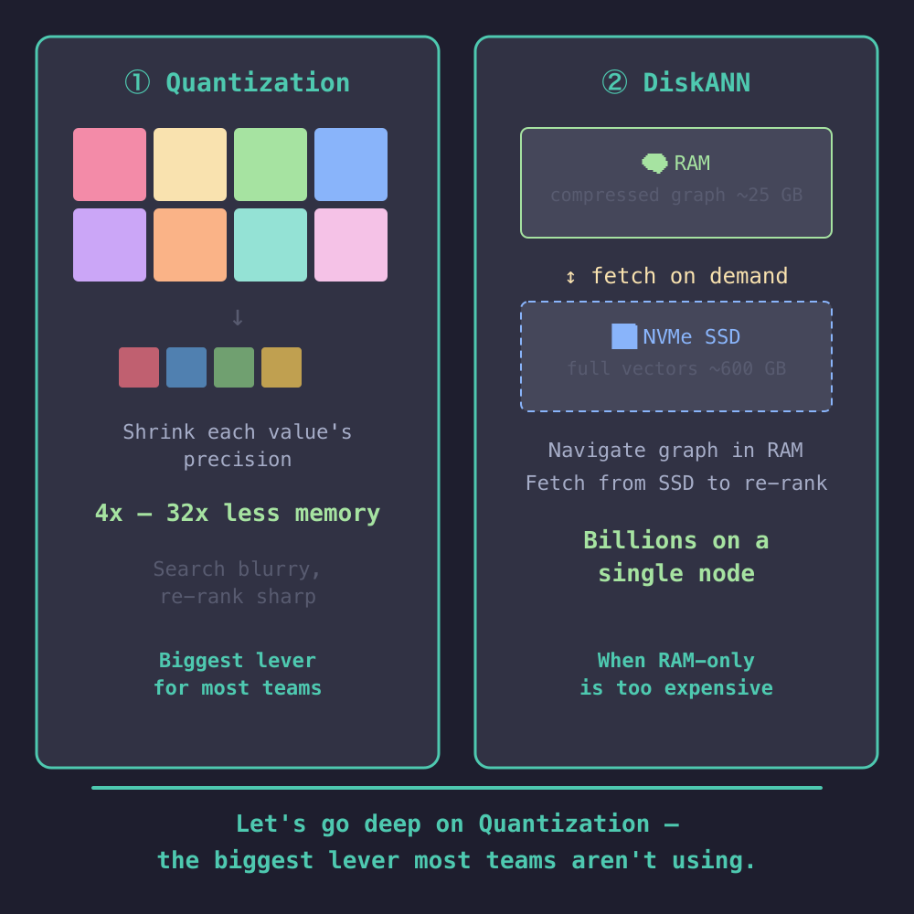
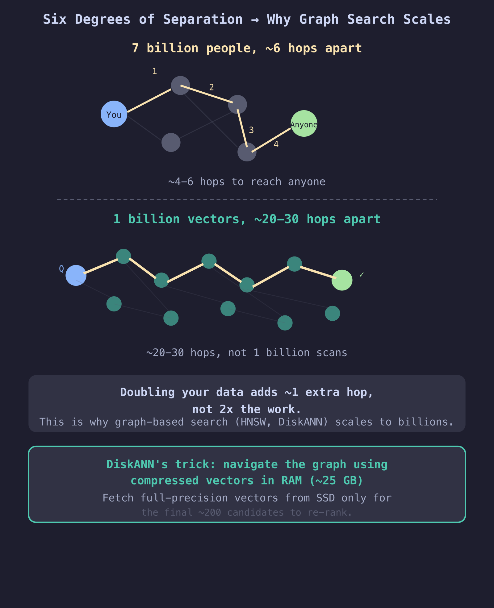
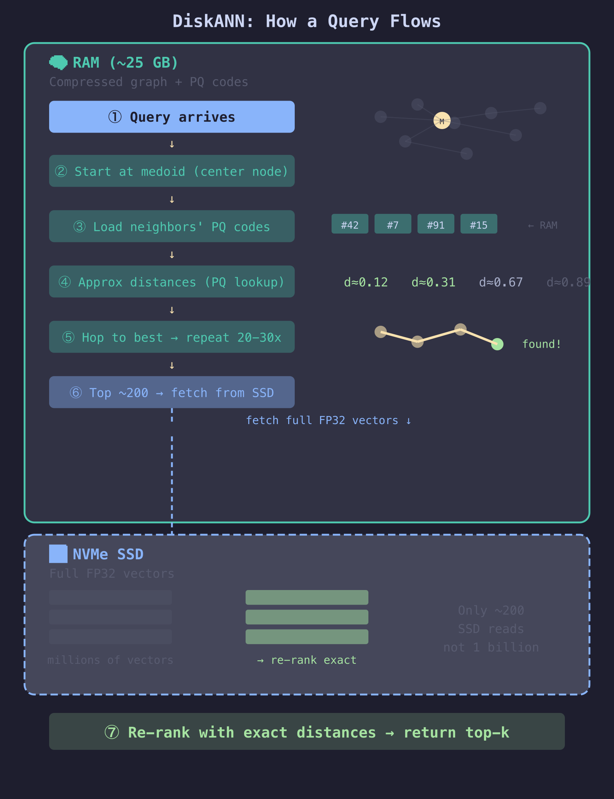
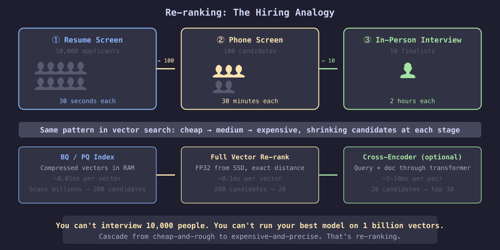
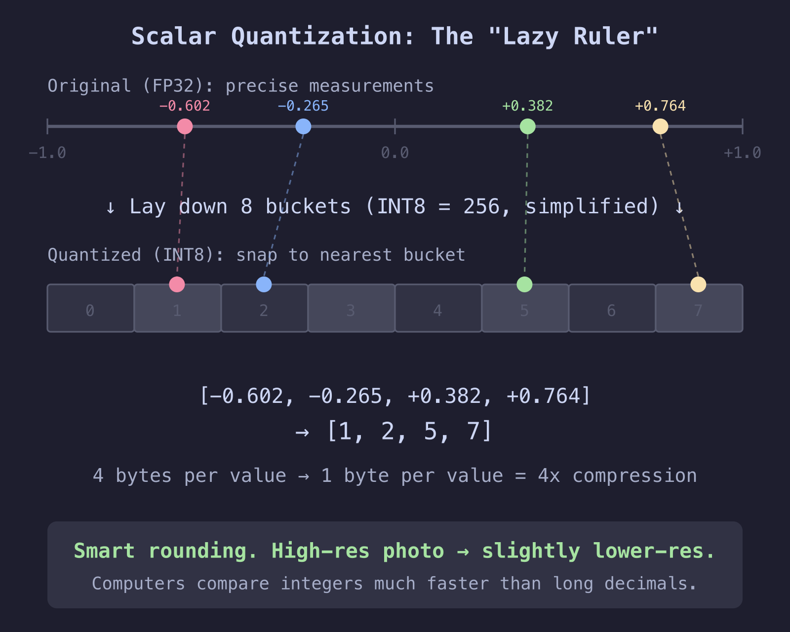
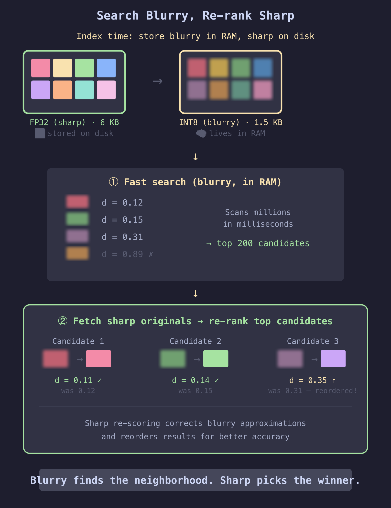
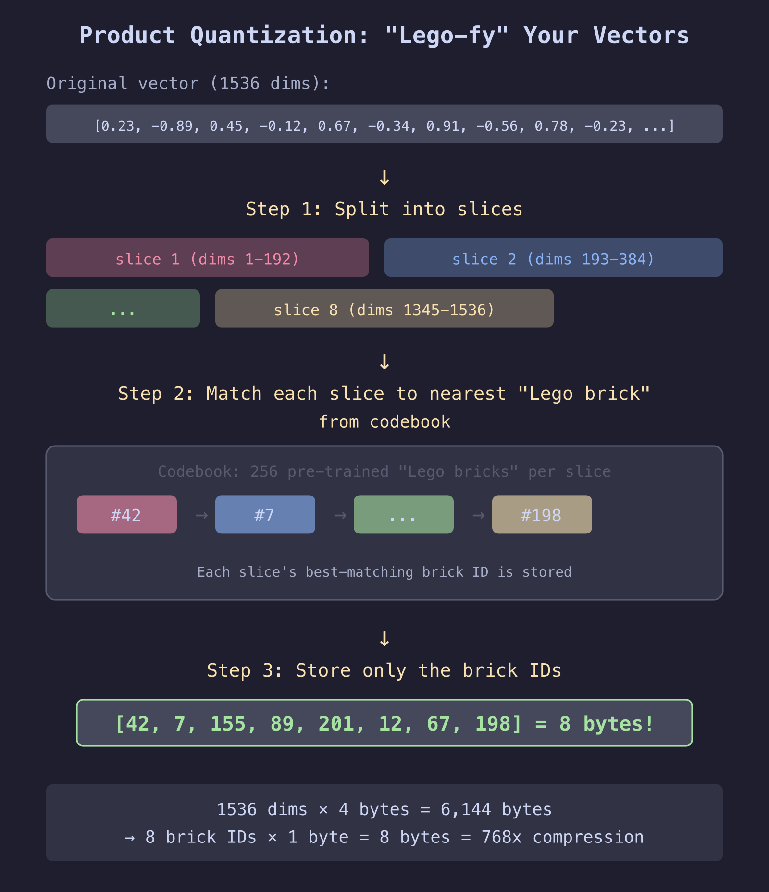

# Why This Talk, Why Now

<!-- column_layout: [2, 1] -->

<!-- column: 0 -->

Every team is adding vector search. Few are planning for what happens next.

The LLM layer is commoditising — the moat isn't the model, **it's your data.** RAG over internal knowledge (Confluence, SharePoint, Teams, emails, codebases) is where you differentiate: better tooling, better dev experience, better customer answers. Vector search isn't an experiment anymore — **it's core infrastructure.**

<!-- pause -->

**The pattern we keep seeing:**

```
Month 1:  "Let's add semantic search!"
          → pgvector, 100K vectors, works great ✅

Month 4:  "Scale to all our docs"
          → 10M vectors, still fine ✅

Month 8:  "Enterprise rollout"
          → 100M vectors, RAM bill explodes 💸

Month 9:  "Add per-tenant filtering"
          → recall silently drops to 40% 🔇

Month 10: "Maybe we need Pinecone?"
          → now you're syncing two databases forever 🔄
```

<!-- column: 1 -->


<!-- reset_layout -->

<!-- pause -->

**This talk gives you the mental model to make these decisions <span style="color: #a6e3a1">*before* month 8.</span>**

Just the <span style="color: #f9e2af">trade-offs — in plain English.</span>

<!-- end_slide -->

# Today's Journey

<!-- column_layout: [1, 1] -->

<!-- column: 0 -->

## Embeddings & Indexing
*You can't B-tree your way out of this*
- Primer on semantic search
- Why vector indexing is fundamentally different

## The RAM Wall
*100M vectors = 920 GB RAM. Plan ahead or pay later.*
- The math that breaks your budget
- The CFO conversation nobody wants

## Quantization
*You don't need full precision to search. Only to rank.*
- Scalar, Binary, Product — intuition
- The "coarse + re-rank" pattern
- 💻 Demo: 32x compression, high recall

<!-- column: 1 -->

## Filtered Search
*Real queries have filters. Most indexes silently fail at this.*
- Why WHERE + ORDER BY breaks
- iterative_scan — the fix
- 💻 Demo: Live SQL on 50k docs

## Architecture & Trade-offs
*Adding a vector DB means syncing two systems forever.*
- Specialized vs converged DB
- The data sync tax
- Hybrid search (BM25 + vectors)

## Decision Matrix & Takeaways
*Start with your existing DB. Migrate only if you outgrow it.*
- What to use when — in plain English
- What to do Monday morning

<!-- end_slide -->

# Embeddings & Semantic Search

**An embedding model turns text into a vector. Similar meaning → nearby vectors.**

```
"My flight got cancelled"    → [+0.055, -0.015, +0.023, +0.070, ...] (384 dims)
"The airline delayed my trip" → [+0.077, -0.013, +0.017, +0.113, ...] (384 dims)
"The stock market crashed"   → [+0.027, -0.039, +0.015, +0.071, ...] (384 dims)
```

**Zero words in common — but the model knows the first two mean the same thing.**

```bash
python scripts/embedding_intro.py
```

<!-- pause -->

**Semantic search = find nearest vectors to a query:**

```sql
SELECT content FROM docs
ORDER BY embedding <=> query_embedding   -- cosine distance
LIMIT 10;
```

Simple query. But to answer it, the database must compare your query
against *every* vector. <span style="color: #f38ba8">At 100M rows, that's a problem.</span>

<!-- end_slide -->

# Why Vector Indexing Is Different

<!-- column_layout: [1, 1] -->

<!-- column: 0 -->

**Traditional indexes** (B-tree) work on exact ordering: `WHERE id = 42` or `ORDER BY date`.
There's a clear sort order. Binary search. O(log n). Done.


<!-- column: 1 -->

**Vector indexes** have no natural sort order.

```
A = [0.21, 0.87, 0.14, ..., 0.53]
B = [0.93, 0.12, 0.38, ..., 0.71]
C = [0.34, 0.76, 0.22, ..., 0.48]
```
Which comes first — A or B? There's no "less than" for 1536 dimensions.

**Exact search = check every vector.** That's too slow at scale.

**But what if we don't need the *exact* closest — just <span style="color: #a6e3a1">*close enough*</span>?**


<!-- reset_layout -->

<!-- end_slide -->

# How ANN (Approximate Nearest Neighbor) Indexes Work

**You need specialized structures to search without checking everything:**

<!-- column_layout: [1, 1] -->

<!-- column: 0 -->

**<span style="color: #4EC9B0">IVFFlat (Inverted File with Flat Compression)</span>** — <span style="color: #f9e2af">Cluster & search</span>

Divide vectors into clusters (k-means).
At query time, search only nearest cluster(s).

*"Go to the Italian district,
then check every restaurant there."*


<!-- column: 1 -->

**<span style="color: #4EC9B0">HNSW (Hierarchical Navigable Small World)</span>** — <span style="color: #f9e2af">Multi-layer graph</span>

Build a navigable graph with layers.
Top = express highways. Bottom = local streets.

*"GPS navigation — highways first,
then local roads."*


<!-- reset_layout -->

<!-- pause -->

<span style="color: #a6e3a1">**We're running this in production today.**</span>

<!-- pause -->

<span style="color: #f38ba8">**Both assume vectors live in RAM.**</span> <span style="color: #f9e2af">That's fine at 1M vectors.
At 100M? Let's do the math.</span>

<!-- end_slide -->

# The RAM Wall

**Everyone wants to build AI on their own data.
<span style="color: #f38ba8">Leadership wants to know why the infrastructure bill just tripled.</span>**


```
Per vector:  1536 dims × 4 bytes = 6,144 bytes ≈ 6 KB
```

| Scale | Raw Vectors | + HNSW (50%) | Approx. RAM Cost |
|-------|------------|-------------|-----------------|
| 1M | 6 GB | ~9 GB | ~$50/mo |
| 10M | 61 GB | ~92 GB | ~$500/mo |
| 100M | 614 GB | ~920 GB | ~$5,000+/mo |
| 1B | 6.1 TB | ~9.2 TB | 💀 |

*HNSW overhead varies 30-80% depending on M parameter (max edges per node — higher M = more connections per layer = better recall but more RAM). Using 50% as realistic default.*

<!-- pause -->

**The cliff isn't linear.** Going from 64 GB → 920 GB RAM means jumping from
a single node to a distributed cluster.

<span style="color: #f38ba8">That's not 15x cost — it's 30-50x operational complexity.</span>

<!-- end_slide -->

# The Cost of Getting It Wrong


**Three real patterns we see teams fall into:**

<!-- pause -->

**1. <span style="color: #f38ba8">"Just use HNSW, it's the best"</span>**
Works at 5M. At 80M, you need 750 GB RAM across a cluster.
→ ~$5K/mo infra + 2 engineers firefighting OOMs

<!-- pause -->

**2. <span style="color: #f38ba8">"Let's add Pinecone alongside Postgres"</span>**
Now you sync two systems. Every schema change = two deploys.
Stale vectors cause silent recall drops.
→ +$2K/mo Pinecone + ongoing sync bugs

<!-- pause -->

**3. <span style="color: #f38ba8">"We'll optimize later"</span>**
No quantization planned. Index rebuild at 50M takes 3 days.
Can't ship features while rebuilding.
→ 1-2 week migration project, production freeze

<!-- pause -->

**The common thread:** these aren't bad tools — they're <span style="color: #f9e2af">premature decisions
made without doing the math first.</span>

The next few sections give you the levers to avoid all three.

<!-- end_slide -->

# Two Ways Through the Wall



<!-- end_slide -->

# Quantization: The Three Approaches

**Core idea:** You don't need 32-bit precision for the *search* step.
Only for the final *ranking* step.

<!-- column_layout: [1, 1] -->

<!-- column: 0 -->

<span style="color: #4EC9B0">**Scalar Quantization (SQ)**</span>
```
FP32 → FP16 or INT8
[0.2341, -0.8912, 0.4563]
       ↓
[0.2340, -0.8911, 0.4563] (FP16)
[60, -228, 117]            (INT8)
```
2x (FP16) to 4x (INT8) compression.

<span style="color: #4EC9B0">**Product Quantization (PQ)**</span>
```
Split into subvectors,
replace each with centroid ID
[v1..v128, v129..v256, ...]
       ↓
[centroid_42, centroid_7, ...]
```
8x–64x compression. Needs training data.

<!-- column: 1 -->

<span style="color: #4EC9B0">**Binary Quantization (BQ)**</span>
```
Positive → 1, Negative → 0
[0.23, -0.89, 0.45, -0.12]
       ↓
[1, 0, 1, 0]  → packed bits
```
32x compression. Hamming distance =
XOR + popcount. Hardware-accelerated.

<!-- pause -->

**<span style="color: #f9e2af">The production pattern (for now):</span>**

```
Query → BQ index (RAM, fast)
     → top 1000 candidates (rough ordering)
     → fetch original FP32 vectors for those 1000
     → re-rank: compute exact distances, return true top 10
```

*<span style="color: #f9e2af">Re-rank = recompute distances with full precision on a small candidate set.</span>*

<!-- end_slide -->

# Quantization: Trading Precision for Scale


<!-- end_slide -->

# 💻 Demo: Quantization in Action

```bash
python scripts/quantization_demo.py
```

<!-- pause -->

**What we just saw:**

| Method | Index Size (1M) | Recall@10 | Notes |
|--------|----------------|-----------|-------|
| FP32 (baseline) | 6.1 GB | 100% | Exact, expensive |
| Binary (1-bit) | 192 MB | ~10%* | Fast but imprecise alone |
| Binary + re-rank | 192 MB + disk | ~99% | The production pattern |

*\*BQ recall without re-rank is model-dependent (45-95%). Re-ranking recovers to 92-96%.*

<!-- pause -->

**Why BQ + re-rank works:** The binary pass eliminates 99% of candidates
using XOR. Then you only fetch ~200 full vectors from disk to re-rank.

<span style="color: #f9e2af">*Recall = "of the true top 10, how many did we actually find?" We'll come back to this.*</span>

<!-- end_slide -->

# DiskANN (Disk-based Approximate Nearest Neighbor): Beyond HNSW

**Quantization shrinks the vectors. But at hundreds of millions of vectors, the graph structure itself still needs significant RAM.**



<!-- end_slide -->

# DiskANN: The Architecture

<!-- column_layout: [1, 1] -->

<!-- column: 0 -->



<!-- column: 1 -->

| Factor | HNSW | Q-HNSW | DiskANN |
|--------|------|--------|---------|
| Sweet spot | < 10-20M | 10-200M | 100M–1B+ |
| RAM (100M) | ~920 GB | ~30-60 GB | ~10-25 GB |
| Latency | 1-5ms | 2-8ms | 5-15ms |
| Cost (100M) | ~$5K/mo | ~$500/mo | ~$200/mo |

*Q-HNSW: quantized index in RAM, full vectors on disk.*
*Costs: AWS on-demand.*

<!-- pause -->

**What makes this possible:**
- **Vamana graph** — single-layer, disk-optimized
- **Medoid start node** — search starts from the most central point
- **Beam search with PQ** — navigate in RAM, fetch from SSD
- **Low graph degree** — ~64-128 neighbors, compact on disk

**<span style="color: #f9e2af">How?</span>** Vamana builds edges with two rules:
- *Short-range* neighbors — nearby points for precision
- *Long-range* neighbors — distant points for shortcuts
- Every node gets both → any node reachable in ~10-20 hops
- 🚗 → ✈️ → 🚆 → 🛺

<!-- reset_layout -->

<!-- end_slide -->

# The Filtered Search Problem

**So far we've solved the *scale* problem.
But there's a second problem that hits even at small scale.**

<!-- pause -->

<span style="color: #f9e2af">**In production, you almost never search the entire database.**</span>

```sql
SELECT * FROM products
WHERE tenant_id = 42 AND category = 'electronics'
ORDER BY embedding <=> query_embedding
LIMIT 10;
```

<!-- pause -->

**⚠️ The vector index only knows about distance —
it's blind to your metadata.**

- HNSW, IVFFlat, DiskANN — none can combine "nearest vectors" + "matching metadata" in one step
- 2% of rows match your filter → most ANN candidates get thrown away
- Asked for 10 results → might get 0

<!-- end_slide -->

# Pre-Filter vs Post-Filter: Both Fail


<!-- end_slide -->

# The Fixes: Three Approaches

**1. <span style="color: #4EC9B0">Iterative scan</span>** — keep scanning until you have enough

```
HNSW returns 40 candidates → filter → only 4 match → not enough!
  → scan 40 more → filter → 3 more match → still not enough!
  → scan 40 more → filter → 3 more match → now we have 10 ✓
```

Works for any filter. But the graph is built from ALL rows —
you're walking through irrelevant vectors to find matching ones. Good enough, not perfect.

<!-- pause -->

**2. <span style="color: #4EC9B0">Partial index</span>** — build a separate HNSW graph for each filter value

```sql
-- This index ONLY contains science docs. No other docs exist in this graph.
CREATE INDEX docs_hnsw_science ON docs
  USING hnsw (embedding vector_cosine_ops)
  WHERE metadata->>'category' = 'science';

-- Query hits this smaller index directly — zero wasted traversal
SELECT * FROM docs
WHERE metadata->>'category' = 'science'
ORDER BY embedding <=> query_embedding LIMIT 10;
```

Truly efficient — but one index per value. Works when the column has few distinct values
(e.g., 5 categories, 3 statuses, 10 regions — not 100K user IDs).

<!-- pause -->

**3. <span style="color: #4EC9B0">Table partitioning</span>** — same idea, at the storage level. One partition + index per tenant.

<!-- end_slide -->

# 💻 Demo: Filtered Search

```sql
-- Setup metadata on our 50k docs
UPDATE docs SET metadata = jsonb_build_object(
  'tenant_id', (id % 100),
  'category', CASE (id % 5)
    WHEN 0 THEN 'science' WHEN 1 THEN 'sports'
    WHEN 2 THEN 'politics' WHEN 3 THEN 'tech' ELSE 'culture' END
);
```

<!-- pause -->

```sql
-- Approach 1: iterative_scan (works for any filter)
SET hnsw.iterative_scan = relaxed_order;

EXPLAIN ANALYZE
SELECT id, content,
  embedding <=> (SELECT embedding FROM docs WHERE id = 97) AS dist
FROM docs
WHERE metadata->>'category' = 'science'
ORDER BY embedding <=> (SELECT embedding FROM docs WHERE id = 97)
LIMIT 10;
```

<!-- pause -->

**Key:** Ensure your database keeps scanning until LIMIT is satisfied, not just one pass.

<!-- end_slide -->

# Filtered Search: What to Use When

| Filter Cardinality | Strategy | True filter? |
|-------------------|----------|-------------|
| Very low (2-10) | Partial indexes | ✅ Yes — separate graph per value |
| Low (10-100) | Partial indexes | ✅ Yes — but many indexes to manage |
| Medium (100-10K) | Table partitioning | ✅ Yes — one partition per tenant |
| High (10K+) | `iterative_scan` | ❌ No — scans full graph, filters after |

<!-- pause -->

**The honest takeaway:**
- Partial indexes & partitioning = only true filters (separate graph per value)
- iterative_scan, payload-aware traversal = good enough, not perfect
- Graph was built from all vectors — traversal still touches irrelevant nodes

<span style="color: #f38ba8">**This is an active research area.**</span> No database has fully solved it yet.

<!-- end_slide -->

# Now that pgvector handles quantization, DiskANN, and filtered search — do you still need a separate vector DB?


<!-- end_slide -->

# The Data Sync Tax


<!-- end_slide -->

# Hybrid Search: BM25 + Vectors

**In production RAG, the best retrieval combines keyword and semantic search.**

```
Query: "PostgreSQL VACUUM deadlock error"

BM25 (keyword):  Finds exact term "VACUUM deadlock" → precise
Vector (semantic): Finds "autovacuum lock contention" → broader

Combined: Better recall than either alone.
```

<!-- pause -->

**How:** Run both searches, merge results with Reciprocal Rank Fusion (RRF).
Most databases and frameworks support this natively or at the application level.

**If you're building RAG, you <span style="color: #f9e2af">almost certainly want hybrid retrieval.</span>**

<!-- end_slide -->

# Recall vs Latency: Know Your Trade-off

*Recall = "of the true top 10 results, how many did we actually find?"*

```
Recall
100% │          ●──────────── Sequential scan (exact)
     │        ●
 98% │      ●                 HNSW ef=200
     │    ●
 95% │  ●                     HNSW ef=40
     │●
 90% │                        IVFFlat probes=1
     └──────────────────────
     1ms   5ms  10ms  50ms  500ms   Latency
```

<!-- pause -->

**The question isn't "best index?" — it's "what does my product need?"**

- Internal chatbot / RAG: 95% recall, < 100ms is fine
- Customer-facing search: 90% recall, < 20ms required
- Fraud / compliance: 99%+ recall, latency doesn't matter

<!-- end_slide -->

# Decision Matrix

| Your situation | What to do | Real-world example |
|---------------|-----------|-------------------|
| Just starting, < 1M docs | pgvector + HNSW. Done. | Internal knowledge base, support bot |
| Growing, 1-10M docs, need filters | pgvector + `iterative_scan` + partial indexes | E-commerce catalog, multi-category search |
| Hitting cost wall at 10-50M | `halfvec` (2x) or BQ + re-rank (32x) | Large document archive, legal discovery |
| Serious scale, 50M-1B | DiskANN via pgvectorscale or Azure | Telco logs, ad targeting, genomics |
| Multi-tenant SaaS | Partition by tenant, index per partition | B2B platform, per-customer search |
| Keyword + semantic search | Add BM25 (ParadeDB or app-level RRF) | Customer support RAG, code search |
| Sub-5ms at 100M+ | Evaluate Qdrant or Pinecone | Real-time recommendations, fraud detection |
| Already on Mongo or Elastic | Use their native vector support | Don't add another DB to your stack |

<!-- pause -->

**<span style="color: #f9e2af">Start with your existing database.</span> Migrate the vector layer only if you outgrow it.**

<!-- end_slide -->

# Key Takeaways

<!-- pause -->

**1. Do the math before you architect.** Run `vectors × dims × 4 (bytes per FP32) × 1.5 (HNSW overhead)`
   — if it's over 64 GB, you need quantization or DiskANN. Not later. Now.

<!-- pause -->

**2. Quantization is the biggest lever.** BQ + re-rank: 32x compression,
   92-96% recall. FP16 gets you 2x with near-zero recall loss. Plan for it from day one.

<!-- pause -->

**3. Filtered search fails silently.** Post-filter on a vector index can return
   0 results with no error. Use partial indexes, partitioning, or `iterative_scan`.

<!-- pause -->

**4. The cost of the wrong choice is months, not days.** Adding a second database
   means syncing forever. Skipping quantization means a rebuild at scale.
   <span style="color: #f9e2af">Make the architecture decision once, with the math in hand.</span>

<!-- pause -->

**5. Measure recall, not just latency.** <span style="color: #f38ba8">A fast wrong answer is worse than
   a slightly slower right answer.</span> Add a recall benchmark before you ship.

<!-- end_slide -->

# The End

<!-- column_layout: [2, 1] -->

<!-- column: 0 -->

**<span style="color: #f9e2af">Vectors aren't special. Architecture decisions are.</span>** 🚀

**Questions?**

📬 **Get in touch:**
<span style="color: #89b4fa">jeevan.dc24@alumni.iimb.ac.in</span>

🌐 **I write at** <span style="color: #89b4fa">noobj.me</span> *(a place where others cannot comment)*

<!-- column: 1 -->


<!-- reset_layout -->

<!-- column_layout: [1, 2, 1] -->

<!-- column: 0 -->

<!-- column: 1 -->

**Slides & Code:**

```
█████████████████████████████████████████
██ ▄▄▄▄▄ █  ▄▄ ▄▀   ▀ ▄▀ █▀▄▀█▀█ ▄▄▄▄▄ ██
██ █   █ █▄▀█▀▄ ██▀▀▄▄█ ██▀ ▄ ▀█ █   █ ██
██ █▄▄▄█ █▄▄█▀  ▀▀███▄▀▄▀▀█▀▄█ █ █▄▄▄█ ██
██▄▄▄▄▄▄▄█▄▀▄█▄█ █ ▀ █▄█ ▀▄▀▄▀ █▄▄▄▄▄▄▄██
██ ▀█▄  ▄▄ ▄▄▄█▀ █▀█▀███▀ █▀▄▀ ▄█▀ ▀  ▄██
████  ▀█▄ ▄ ▄▀█▄▄▄ ▀▄  █▀ █▄▀▄ █▄▄▄▀▀▀ ██
███▀ ▀██▄▀▀ ▀ ▄▀▄  █ █▄▀█▀▄▀▀ ▄█▄▄▀ ██▄██
███▄ ▄▄ ▄▄█▀▄██ █▄██▄▄█▄▀▀▄▄   ▄▀▀▄    ██
██ ██ ▄▀▄█ ▄▀▄  ███▄▄██▀ █  █ █ ▄▀█▀▄████
██ ▀▀▄▀▄▄ ▄ ▄█ ▀█▀ ▄█ ▀█▄▄█ █▄  ▀▄█ ██ ██
██ ▀▄▄█ ▄▀▄█▀ ▄█ ▀  ▀ ▄▀ ▀▄▀▀ ▄ ▄▄ █▀████
████▄▄▀▀▄▀  ▀▀▄ ▄▄▀█▀▀███▄▀▄▀▄▄█▀ ▀ ▀█ ██
██ █▀█▄█▄█▀ ▄▀ █▀██ ▀ ▄ ▄ ▄██ ▀█▄▄▀██▄███
██ ▄▄▀▀▀▄█▄ ▀▀▄▄▀▄▀█ ▀███▀██▄▄▀▄ ▀▄▀▀▄▄██
██▄█▄██▄▄█  ▄█▀▀▄ █▀▀  ▀▄▄█▄█  ▄▄▄ ▄ ▀▄██
██ ▄▄▄▄▄ █ ▀█▄ ▄▀ ▀▄▄ █▀█▄▄▀ ▀ █▄█ ███ ██
██ █   █ █   ▀▄██▄▄▀▄▄ ▄▀▀▄▀ ▄   ▄▄██▄ ██
██ █▄▄▄█ ██ ▀█▀█▄▀█ ▄███  ▀█ ▄▄▄▀█ ▀▀▀ ██
██▄▄▄▄▄▄▄█▄▄▄▄████▄██▄▄██▄████▄▄▄▄█▄██▄██
```

<!-- column: 2 -->

<!-- end_slide -->

# Appendix: How Re-ranking Works



<!-- end_slide -->

# Appendix: Re-ranking in Action

**A real query flowing through the cascade:**

```
Query: "How does photosynthesis work in deep ocean vents?"

Stage 1 — BM25 keyword search (milliseconds):
  → 1000 docs matching "photosynthesis", "ocean", "vents"
  → includes junk: "ocean pollution", "air vents in buildings"

Stage 2 — Vector ANN with compressed index (milliseconds):
  → narrows to 100 by semantic similarity
  → still includes docs about regular plant photosynthesis

Stage 3 — Cross-encoder re-ranker (tens of milliseconds):
  → reads query + each doc together through a transformer
  → understands "deep ocean" + "vents" = hydrothermal context
  → ranks "chemosynthesis at hydrothermal vents" highest
  → pushes generic photosynthesis docs down

Return top 10.
```

<!-- pause -->

**Why the cross-encoder is smarter:**

A bi-encoder (stage 2) encodes query and doc *separately* — it can't see the relationship.
A cross-encoder reads them *together* — every query word attends to every doc word.

*Bi-encoder thinks "python snake" and "python programming" are similar.*
*Cross-encoder reads the context and knows they're different.*

**The cost:** Cross-encoder runs inference per (query, doc) pair. Can't precompute.
That's why you only run it on ~100 candidates, not millions.

<!-- end_slide -->

# Appendix: How Scalar Quantization Works

**Analogy: Measuring height with a "lazy ruler" that only has 256 notches.**



<!-- end_slide -->

# Appendix: SQ in Practice — Search Blurry, Re-rank Sharp



<!-- pause -->

**The full cycle:**
1. At index time: quantize vectors (blurry copy in RAM, sharp original on disk)
2. At search time: compare query against blurry copies — fast, cheap, finds the neighborhood
3. Fetch sharp originals from disk for top candidates only — exact distances, correct ordering

**The blurry copy finds the neighborhood. The sharp original picks the winner.**

<!-- end_slide -->

# Appendix: How Product Quantization Works

**Analogy: Instead of storing the whole shape, store a Lego instruction manual.**

**What's a codebook?** A pre-trained dictionary of 256 "representative shapes" (centroids)
per slice — built by running k-means on your data. Think of it as a box of 256 Lego bricks.
Every possible slice gets matched to its closest brick.



<!-- pause -->

**The clever part — searching without decompressing:**

```
1. Query arrives
2. Measure distance from query to each of the 256 bricks → small lookup table
3. For each stored vector, just add up table entries:
   Vector A = [brick #42, #7, #198]
   Distance ≈ table[42] + table[7] + table[198]  ← just 3 additions!
```

No floating-point math. Just table lookups and additions.

**The catch:** Bricks are approximations. Distance is estimated, not exact.
That's why you re-rank the top candidates with full-precision vectors.

<!-- end_slide -->

# Appendix: How Binary Quantization Works

**Analogy: Reducing a photo to pure black and white — no grays.**

```
Original:  [+0.23, -0.89, +0.45, -0.12, +0.67, -0.34, +0.91, -0.56]
                ↓      ↓      ↓      ↓      ↓      ↓      ↓      ↓
Rule:      positive=1, negative=0
                ↓      ↓      ↓      ↓      ↓      ↓      ↓      ↓
Binary:    [  1,    0,    1,    0,    1,    0,    1,    0  ]
```

<!-- pause -->

**Comparing two binary vectors — XOR + popcount:**

```
Vector A:  1 0 1 0 1 0 1 0
Vector B:  1 1 1 0 0 0 1 1
           ─ ✗ ─ ─ ✗ ─ ─ ✗  ← XOR: 1 wherever they differ

XOR result: 0 1 0 0 1 0 0 1
POPCNT:     count the 1s = 3  ← Hamming distance

Two CPU instructions. No floating-point math at all.
```

<!-- pause -->

**The catch:** A value of +0.001 and +0.999 both become 1. Massive information loss.
That's why BQ recall without re-ranking can be as low as 2% on some datasets.

**The fix:** Use BQ for the fast first pass (find ~1000 candidates),
then fetch full FP32 vectors and re-rank to get the true top 10.

<!-- end_slide -->

# Appendix: Quantization Trade-offs

| | FP32 | FP16 (half) | Scalar INT8 | Product (PQ) | Binary (BQ) |
|---|---|---|---|---|---|
| **Compression** | 1x | <span style="color: #a6e3a1">2x</span> | <span style="color: #a6e3a1">4x</span> | <span style="color: #a6e3a1">8-64x</span> | <span style="color: #a6e3a1">32x</span> |
| **Recall (no re-rank)** | <span style="color: #a6e3a1">100%</span> | <span style="color: #a6e3a1">~99.9%</span> | <span style="color: #a6e3a1">~95-98%</span> | <span style="color: #f9e2af">~85-95%</span> | <span style="color: #f9e2af">~75-95%*</span> |
| **Recall (w/ re-rank)** | — | — | <span style="color: #a6e3a1">~98-99%</span> | <span style="color: #a6e3a1">~95-99%</span> | <span style="color: #f9e2af">~92-96%</span> |
| **Speed vs FP32** | 1x | <span style="color: #f9e2af">~1.5x</span> | <span style="color: #a6e3a1">~2-3x</span> | <span style="color: #a6e3a1">~5-10x</span> | <span style="color: #a6e3a1">~15-30x</span> |
| **Training needed?** | <span style="color: #a6e3a1">No</span> | <span style="color: #a6e3a1">No</span> | <span style="color: #a6e3a1">No</span> | <span style="color: #f38ba8">Yes</span> | <span style="color: #a6e3a1">No</span> |
| **Model-sensitive?** | <span style="color: #a6e3a1">No</span> | <span style="color: #a6e3a1">No</span> | <span style="color: #a6e3a1">Low</span> | <span style="color: #f9e2af">Medium</span> | <span style="color: #f38ba8">High</span> |
| **Best for** | Small scale | Easy first win | General purpose | Massive datasets | Speed-critical |

*\*BQ recall without re-rank varies by model (45% for e5-base-v2 to 95% for Cohere-v3, per HuggingFace MTEB benchmarks).*
*Speed multipliers are for distance computation, not additive on top of ANN index speedups.*
*Sources: [6], [7], [14]*

<!-- end_slide -->

# Appendix: Vector Index Comparison

| | Flat (brute force) | IVFFlat | HNSW | DiskANN | SPANN |
|---|---|---|---|---|---|
| **Type** | Exact scan | Cluster-based | Graph-based | Disk-optimized graph | Disk + cluster hybrid |
| **Recall** | <span style="color: #a6e3a1">100% (exact)</span> | <span style="color: #f9e2af">90-98%</span> | <span style="color: #a6e3a1">95-99.9%</span> | <span style="color: #a6e3a1">95-99%</span> | <span style="color: #a6e3a1">95-99%</span> |
| **Latency (1M)** | <span style="color: #f38ba8">50-500ms</span> | <span style="color: #a6e3a1">2-10ms</span> | <span style="color: #a6e3a1">1-5ms</span> | <span style="color: #f9e2af">5-15ms</span> | <span style="color: #a6e3a1">1-5ms</span> |
| **Build time (1M)** | <span style="color: #a6e3a1">None</span> | <span style="color: #a6e3a1">~30s</span> | <span style="color: #f9e2af">~5 min</span> | <span style="color: #a6e3a1">~2 min</span> | <span style="color: #f9e2af">~3 min</span> |
| **Build time (100M)** | <span style="color: #a6e3a1">None</span> | <span style="color: #f9e2af">~3 hrs</span> | <span style="color: #f38ba8">~1-3 days*</span> | <span style="color: #f9e2af">~4-8 hrs</span> | <span style="color: #f9e2af">~4-8 hrs</span> |
| **RAM (100M, 1536d)** | <span style="color: #f38ba8">614 GB</span> | <span style="color: #f38ba8">614 GB</span> | <span style="color: #f38ba8">~920 GB</span> | <span style="color: #a6e3a1">~10-25 GB</span> | <span style="color: #a6e3a1">~10-32 GB</span> |
| **Incremental insert** | <span style="color: #a6e3a1">N/A</span> | <span style="color: #f38ba8">Degrades</span> | <span style="color: #a6e3a1">Yes</span> | <span style="color: #f9e2af">Limited</span> | <span style="color: #f9e2af">Limited</span> |
| **Filtered search** | <span style="color: #a6e3a1">Native</span> | <span style="color: #f38ba8">Poor</span> | <span style="color: #f9e2af">Post-filter</span> | <span style="color: #f9e2af">Iterative</span> | <span style="color: #f9e2af">Cluster-based</span> |
| **When to use** | < 10K vectors | Batch/analytics | Production, < 50M | 50M-1B | Large + hybrid |

*\*HNSW 100M build time assumes parallel builds. Single-threaded can be 5-10x longer.*
*Sources: [16], [3], [15], [1]*

<!-- end_slide -->

# Appendix: Quantization How-To — PostgreSQL

**<span style="color: #4EC9B0">Scalar Quantization — FP16 (halfvec)</span>** · 2x compression · pgvector native

```sql
ALTER TABLE docs ADD COLUMN embedding_half halfvec(1536);
UPDATE docs SET embedding_half = embedding::halfvec(1536);
CREATE INDEX ON docs USING hnsw (embedding_half halfvec_cosine_ops);

SELECT id, content FROM docs
ORDER BY embedding_half <=> $query::halfvec(1536) LIMIT 10;
```

<!-- pause -->

**<span style="color: #4EC9B0">Scalar Quantization — INT8 (SQ)</span>** · 4x compression · pgvectorscale

```sql
-- pgvectorscale's StreamingDiskANN uses SQ internally
CREATE INDEX ON docs
  USING diskann (embedding vector_cosine_ops)
  WITH (num_neighbors = 50);
-- SQ applied automatically — INT8 in index, FP32 on disk for re-ranking
```

*pgvector has no native INT8 type. pgvectorscale handles SQ + re-rank transparently.*

<!-- end_slide -->

# Appendix: Quantization How-To — PostgreSQL (cont.)

**<span style="color: #4EC9B0">Binary Quantization (BQ)</span>** · 32x compression · pgvector native

```sql
ALTER TABLE docs ADD COLUMN embedding_bit bit(1536);
UPDATE docs SET embedding_bit = binary_quantize(embedding)::bit(1536);
CREATE INDEX ON docs USING hnsw (embedding_bit bit_hamming_ops);

-- BQ coarse pass + FP32 re-rank
WITH candidates AS (
  SELECT id, content, embedding FROM docs
  ORDER BY embedding_bit <~> binary_quantize($query)::bit(1536)
  LIMIT 200
)
SELECT id, content FROM candidates
ORDER BY embedding <=> $query LIMIT 10;
```

<!-- pause -->

**<span style="color: #4EC9B0">Product Quantization (PQ)</span>** · 8-64x compression · <span style="color: #f38ba8">not in pgvector</span>, <span style="color: #a6e3a1">available via pgvectorscale</span>

PQ splits vectors into subvectors and replaces each with a trained centroid ID.
pgvector has no native PQ, but pgvectorscale's DiskANN uses SBQ (a PQ variant) internally:

```sql
-- pgvectorscale — DiskANN with SBQ (sub-vector binary quantization)
CREATE EXTENSION IF NOT EXISTS vectorscale;

CREATE INDEX ON docs
  USING diskann (embedding vector_cosine_ops)
  WITH (
    num_neighbors = 50,
    storage_layout = 'memory_optimized'  -- enables SBQ compression
    -- vectors are split into sub-vectors and binary-quantized
    -- full vectors kept on disk for automatic re-ranking
  );

-- Query unchanged — SBQ + re-rank happens transparently
SELECT id, content FROM docs
ORDER BY embedding <=> $query LIMIT 10;
```

```python
# Alternative: FAISS — full PQ control, outside Postgres
import faiss
pq = faiss.IndexPQ(1536, 48, 8)  # 48 subvectors × 8 bits = 48 bytes/vector
pq.train(vectors)                 # needs 10K-100K training samples
pq.add(vectors)
# Search via FAISS, join results back to Postgres by ID
```

<!-- pause -->

| Method | Tool | Compression | Re-rank | Setup |
|---|---|---|---|---|
| FP16 | pgvector `halfvec` | 2x | Not needed | One ALTER + INDEX |
| INT8 (SQ) | pgvectorscale DiskANN | 4x | Automatic | One CREATE INDEX |
| BQ | pgvector `bit` type | 32x | Manual CTE | One ALTER + INDEX |
| SBQ (PQ-like) | pgvectorscale `memory_optimized` | 8-16x | Automatic | One CREATE INDEX |
| PQ (full) | FAISS (external) | 8-64x | Built-in | Separate service |

<!-- end_slide -->

# Appendix: DiskANN How-To in PostgreSQL

**<span style="color: #4EC9B0">pgvectorscale (Timescale)</span>**

```sql
-- Install the extension
CREATE EXTENSION IF NOT EXISTS vectorscale;

-- Create a DiskANN index
CREATE INDEX ON docs
  USING diskann (embedding vector_cosine_ops)
  WITH (
    num_neighbors = 50,    -- graph connectivity (like HNSW M)
    search_list_size = 100 -- candidates during build
  );

-- Query — same SQL as HNSW, planner picks diskann
SELECT id, content FROM docs
ORDER BY embedding <=> $query
LIMIT 10;

-- Tune search at query time
SET diskann.query_search_list_size = 150;
-- Higher = better recall, slower
-- Lower  = faster, lower recall
```

<!-- pause -->

**When to switch from HNSW to DiskANN:**

| Signal | Action |
|---|---|
| RAM usage > 60% of instance memory | Time to evaluate DiskANN |
| Dataset > 20-50M vectors | DiskANN likely cheaper |
| Latency budget allows 5-15ms (vs 1-5ms HNSW) | DiskANN is a fit |
| Frequent inserts on large dataset | pgvectorscale handles streaming inserts |

*Key: DiskANN trades ~5-10ms extra latency for 10-30x less RAM. The query SQL doesn't change — only the index type.*

<!-- end_slide -->

<!-- end_slide -->

# Appendix: BM25 in PostgreSQL (ParadeDB)

```sql
-- Install the extension
CREATE EXTENSION pg_search;

-- Create a BM25 index
CREATE INDEX ON docs USING bm25 (content);

-- Search with real BM25 scoring
SELECT *, paradedb.score(id) AS bm25_score
FROM docs
WHERE content @@@ 'VACUUM deadlock'
ORDER BY bm25_score DESC LIMIT 10;
```

*ParadeDB wraps Tantivy (Rust search engine) inside Postgres — proper BM25 with IDF, term frequency saturation, and document length normalization.*

<!-- end_slide -->

# Appendix: Hybrid Search — BM25 + Vector with RRF

**Reciprocal Rank Fusion** — combine rankings without normalizing scores.

```sql
WITH bm25 AS (
  SELECT id, ROW_NUMBER() OVER (ORDER BY paradedb.score(id) DESC) AS rank
  FROM docs
  WHERE content @@@ 'VACUUM deadlock'
  LIMIT 100
),
vector AS (
  SELECT id, ROW_NUMBER() OVER (ORDER BY embedding <=> $query) AS rank
  FROM docs
  ORDER BY embedding <=> $query
  LIMIT 100
)
SELECT COALESCE(b.id, v.id) AS id,
       COALESCE(1.0/(60 + b.rank), 0)
     + COALESCE(1.0/(60 + v.rank), 0) AS rrf_score
FROM bm25 b
FULL OUTER JOIN vector v ON b.id = v.id
ORDER BY rrf_score DESC
LIMIT 10;
```

*`k=60` is the standard constant from the RRF paper — dampens high-rank dominance. RRF only cares about rank position, not raw scores, so it works across any two retrieval methods.*

<!-- end_slide -->

# References

1. **DiskANN Paper** — github.com/microsoft/DiskANN
2. **DiskANN on Azure PostgreSQL** — techcommunity.microsoft.com/blog/adforpostgresql/diskann-on-azure-database-for-postgresql-now-generally-available/4414723
3. **HNSW Memory Overhead** — lantern.dev/blog/calculator
4. **pgvector** — github.com/pgvector/pgvector
5. **pgvectorscale (StreamingDiskANN)** — github.com/timescale/pgvectorscale
6. **Embedding Quantization** — huggingface.co/blog/embedding-quantization
7. **Weaviate Rotational Quantization** — weaviate.io/blog/8-bit-rotational-quantization
8. **Elastic BBQ** — elastic.co/search-labs/blog/bbq-implementation-into-use-case
9. **Filtered HNSW** — qdrant.tech/articles/filtrable-hnsw
10. **ParadeDB (BM25 + vector)** — paradedb.com
11. **The Case Against pgvector** — alex-jacobs.com/posts/the-case-against-pgvector
12. **Vector DB Hype is Over** — estuary.dev/blog/the-vector-database-hype-is-over
13. **Matryoshka Embeddings** — platform.openai.com/docs/guides/embeddings
14. **MongoDB Binary Quantization** — mongodb.com/blog/post/binary-quantization-rescoring-96-less-memory-faster-search
15. **ANN Benchmarks** — ann-benchmarks.com
16. **DiskANN Explained** — milvus.io/blog/diskann-explained