---
options:
  implicit_slide_ends: true
---

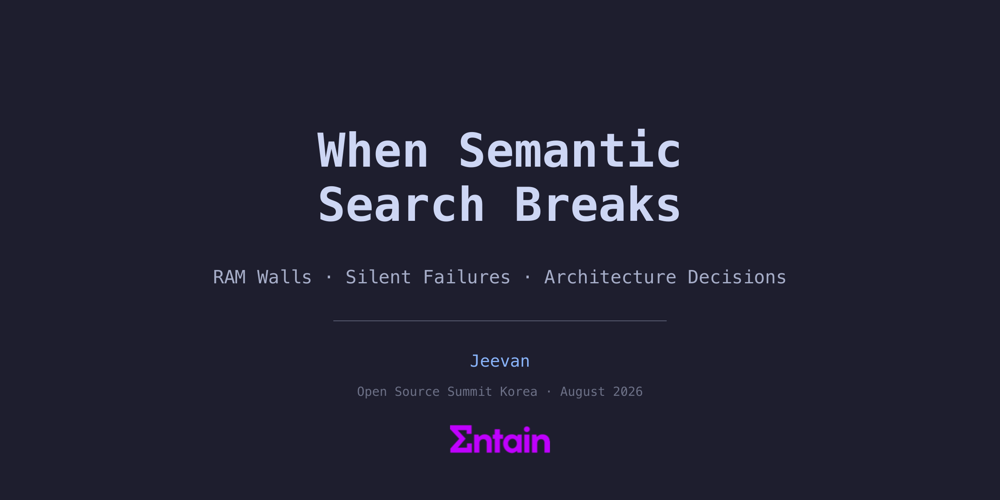

<!-- end_slide -->

# A RAG System: Every Box Is a Decision

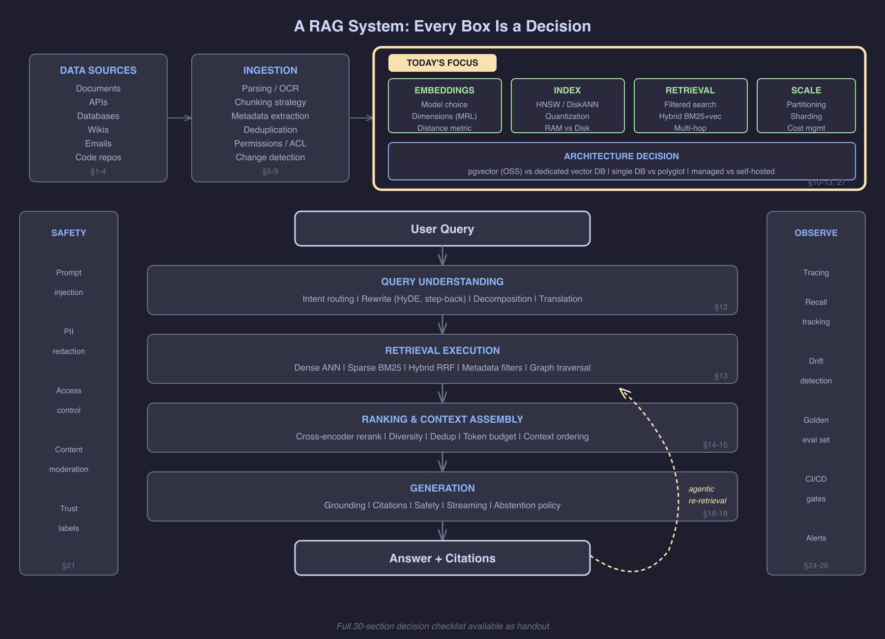

<!-- end_slide -->

# The Scaling Path

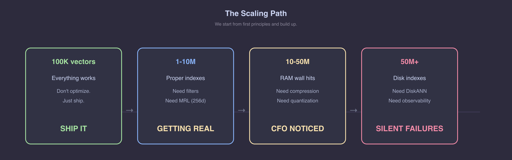

<!-- pause -->

<!-- column_layout: [1, 1, 1, 1] -->

<!-- column: 0 -->


<!-- column: 1 -->


<!-- column: 2 -->


<!-- column: 3 -->


<!-- reset_layout -->

<!-- end_slide -->

# Why This Talk, Why Now

<!-- column_layout: [3, 2] -->

<!-- column: 0 -->

```
Month 1:  "Let's add semantic search!"
          → pgvector, 100K vectors, works great ✅

Month 4:  "Scale to all our docs"
          → 10M vectors, still fine ✅

Month 8:  "Enterprise rollout"
          → 100M vectors, RAM bill explodes 💸

Month 9:  "Add per-tenant filtering"
          → recall silently drops to 40% 🔇

Month 10: "Maybe we need Pinecone?"
          → now syncing two databases forever 🔄
```

**Same pattern. Same order. Every team.**

<span style="color: #f9e2af">This talk: the math, the tools, and the decisions — in plain English.</span>

<!-- column: 1 -->


<!-- reset_layout -->

<!-- end_slide -->

# Today's Journey

<!-- column_layout: [1, 1] -->

<!-- column: 0 -->

## First Principles
*Embeddings, HNSW, the RAM wall*

## Three Compression Levers
*Dimensions → Bits → Disk*

<!-- column: 1 -->

## Silent Failures
*Filtered search + recall drift*

## Architecture Decisions
*Benchmarks, trade-offs, decision matrix*

<!-- end_slide -->

# How Do Computers Compare Text?

<!-- column_layout: [2, 1] -->

<!-- column: 0 -->

**The fundamental problem: computers don't understand words.**

```
"I love fries"   vs   "Fries are great"
```

<!-- pause -->

**The fix: turn text into numbers that capture meaning.**

```
"I love fries"     → [0.2, 0.8, 0.1, ...] 384 numbers
"Fries are great"  → [0.3, 0.7, 0.2, ...] 384 numbers
"The sky is blue"  → [0.9, 0.1, 0.8, ...] 384 numbers
```

<span style="color: #a6e3a1">Similar meanings → similar numbers.</span>

<!-- column: 1 -->


<!-- reset_layout -->

<!-- pause -->

🧑 Human: instantly knows these are similar.
💻 Computer: two completely different strings.
**That's an embedding.** A coordinate in "meaning space."

<!-- end_slide -->

# Why Vector Indexing Is Different

<!-- column_layout: [1, 1] -->

<!-- column: 0 -->

**B-tree:** exact ordering, binary search, O(log n)

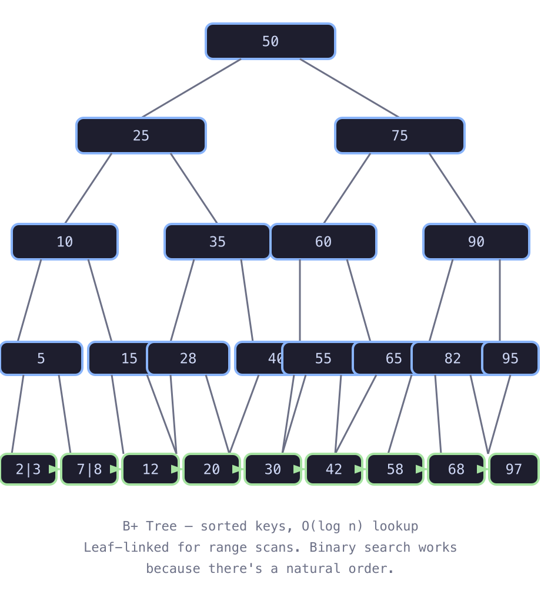

<!-- column: 1 -->

**Vector indexes** have no natural sort order.

```
A = [0.21, 0.87, 0.14, ..., 0.53]
B = [0.93, 0.12, 0.38, ..., 0.71]
C = [0.34, 0.76, 0.22, ..., 0.48]
```


<!-- reset_layout -->

<!-- pause -->

Which comes first — A or B? There's no "less than" for 1536 dimensions.

**Exact search = check every vector.** That's too slow at scale.

**But what if we don't need the *exact* closest — just <span style="color: #a6e3a1">*close enough*</span>?**

<!-- end_slide -->

# How ANN (Approximate Nearest Neighbor) Indexes Work

**We need "close enough" without checking everything.**

<!-- column_layout: [1, 2] -->

<!-- column: 0 -->

**<span style="color: #4EC9B0">HNSW</span>**

Multi-layer navigable graph.

*"GPS: highways first,
then local roads."*

~95-99% recall, 1-5ms latency.

<span style="color: #f38ba8">Index persisted to disk, but
needs full buffer cache residency
for fast lookups.</span>

<!-- column: 1 -->

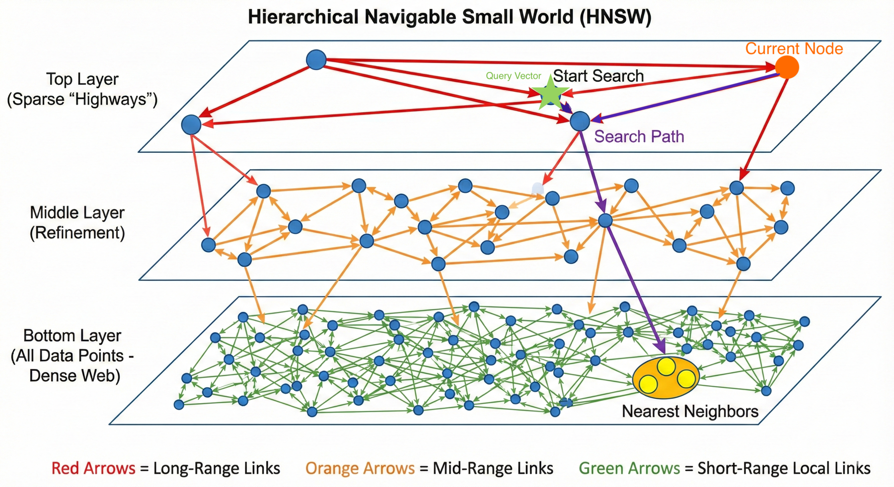

<!-- reset_layout -->

<!-- pause -->

<span style="color: #6c7086">*ANN = Approximate Nearest Neighbor · HNSW = Hierarchical Navigable Small World · Recall@K = % of true top-K found*</span>

<!-- end_slide -->

# The RAM Wall

**Everyone wants to build AI on their own data.
<span style="color: #f38ba8">Leadership wants to know why the infrastructure bill just tripled.</span>**


```
Per vector:  1536 dims × 4 bytes = 6,144 bytes ≈ 6 KB
```

| Scale | Raw Vectors | + HNSW (50%) | Approx. RAM Cost |
|-------|------------|-------------|-----------------|
| 1M | 6 GB | ~9 GB | ~$50/mo |
| 10M | 61 GB | ~92 GB | ~$500/mo |
| 100M | 614 GB | ~920 GB | ~$5,000+/mo |
| 1B | 6.1 TB | ~9.2 TB | 💀 |

<!-- pause -->

<span style="color: #f38ba8">64 GB → 920 GB = not 15x cost, it's 30-50x operational complexity.</span>

<!-- end_slide -->

# The Cost of Getting It Wrong


**Three real patterns we see teams fall into:**

<!-- pause -->

**1. <span style="color: #f38ba8">"Just use HNSW, it's the best"</span>**
80M vectors = 750 GB RAM → ~$5K/mo + OOM firefighting

<!-- pause -->

**2. <span style="color: #f38ba8">"Let's add Pinecone alongside Postgres"</span>**
Two systems to sync, stale vectors, silent recall drops → +$2K/mo + sync bugs

<!-- pause -->

**3. <span style="color: #f38ba8">"We'll optimize later"</span>**
Index rebuild at 50M = 3 days, no deploys → 1-2 week production freeze

<!-- pause -->

**The common thread:** these aren't bad tools — they're <span style="color: #f9e2af">premature decisions
made without doing the math first.</span>

<!-- end_slide -->

# Three Ways Through the Wall

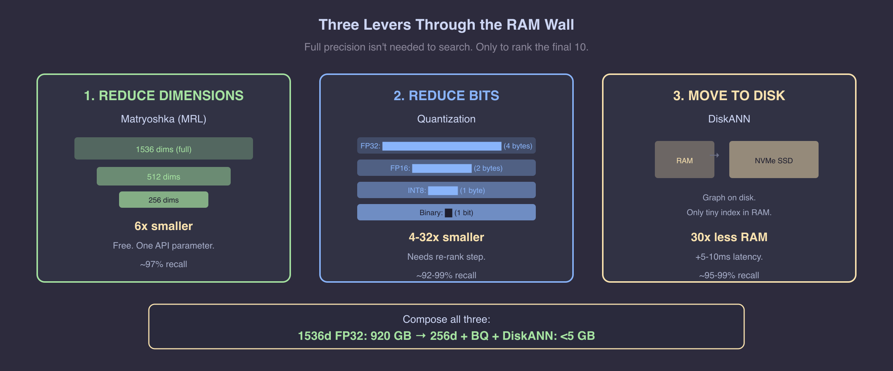

<span style="color: #a6e3a1">**920 GB → 5 GB compressed index. Full vectors stay on SSD for re-rank.**</span>

<span style="color: #6c7086">*(Do them in order: dimensions first, then bits, then disk.)*</span>

<!-- pause -->

<span style="color: #6c7086">*MRL = Matryoshka Representation Learning · SQ/PQ/BQ = Scalar/Product/Binary Quantization · DiskANN = disk-based ANN index*</span>

<!-- end_slide -->

# Lever 1: Matryoshka Embeddings (MRL)

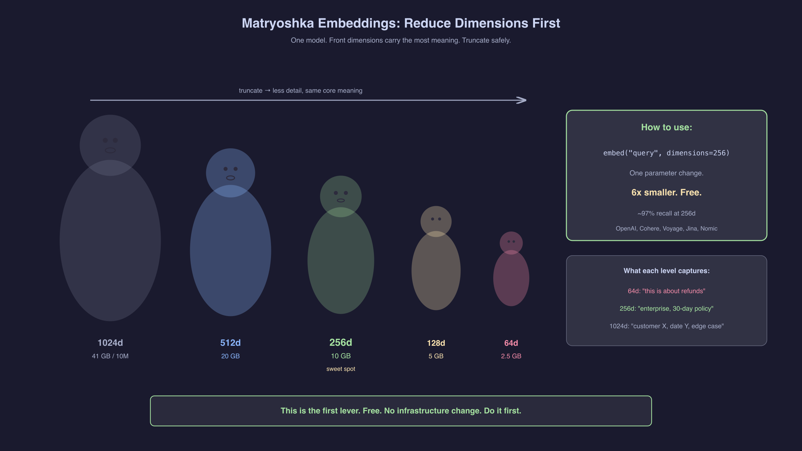

<!-- end_slide -->

# Lever 2: Quantization

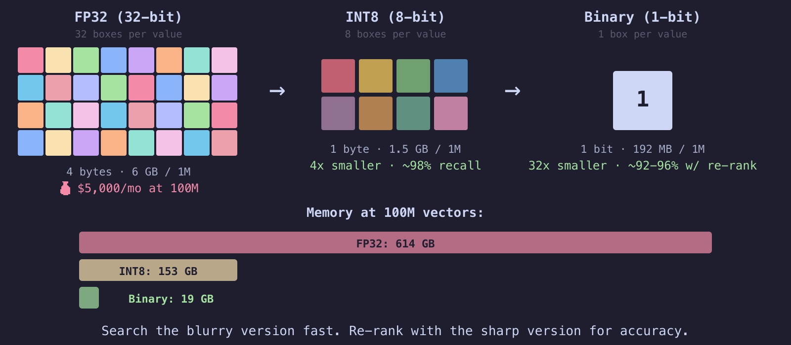

<!-- end_slide -->

# 💻 Demo: Quantization in Action

```bash
python scripts/quantization_demo.py
```

<!-- pause -->

**What we just saw:**

| Method | Index Size (1M) | Recall@10 | Notes |
|--------|----------------|-----------|-------|
| FP32 (baseline) | 6.1 GB | 100% | Exact, expensive |
| Binary (1-bit, no rerank) | 192 MB | ~10% | Hamming alone loses too much |
| Binary + rerank top 200 | 192 MB + disk | ~92-96% | **The production pattern** |

<!-- pause -->

**Why BQ + re-rank works:** XOR eliminates 99% of candidates → fetch ~200 full vectors to re-rank.

<span style="color: #f9e2af">*Recall = "of the true top 10, how many did we actually find?"*</span>

<!-- pause -->

<span style="color: #6c7086">*BQ = Binary Quantization · FP32 = 32-bit float · XOR = bitwise comparison · Re-rank = verify top candidates with full precision*</span>

<!-- end_slide -->

# Lever 3: DiskANN

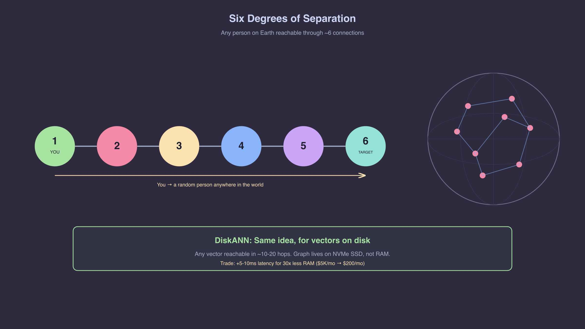

<!-- end_slide -->

# DiskANN: The Architecture

<!-- column_layout: [1, 1] -->

<!-- column: 0 -->

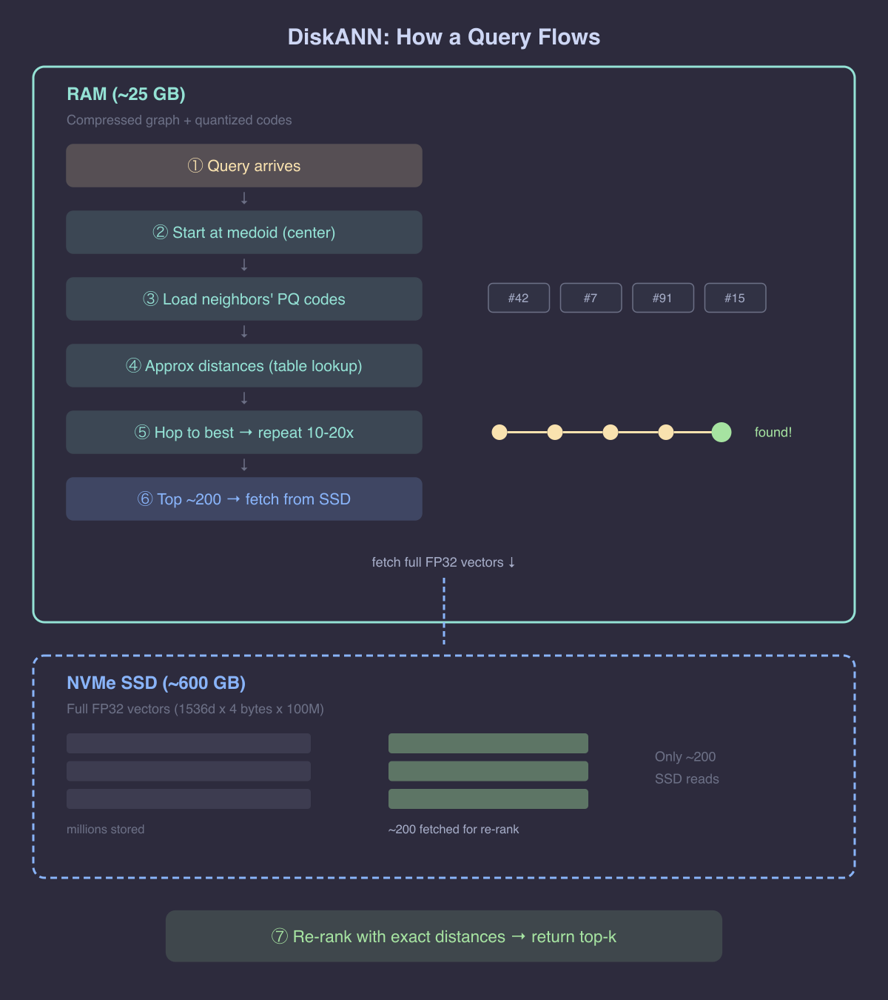

<!-- column: 1 -->

**RAM:** Compressed graph + quantized vectors (~25 GB)

**SSD:** Full vectors for re-rank (~600 GB)

**100M vectors cost:**
- HNSW: 920 GB RAM → <span style="color: #f38ba8">~$5,000/mo</span>
- DiskANN: 25 GB RAM + SSD → <span style="color: #a6e3a1">~$200/mo</span>

<span style="color: #a6e3a1">**25x cheaper. Same recall. +5-10ms latency.**</span>

<!-- reset_layout -->

<!-- end_slide -->

# Silent Failure #1: Filtered Search

```sql
SELECT * FROM products
WHERE tenant_id = 42
ORDER BY embedding <=> query LIMIT 10;
```

<!-- pause -->

<!-- column_layout: [1, 1] -->

<!-- column: 0 -->

**⚠️ The vector index only knows distance.**

It's blind to `tenant_id`. Blind to `category`.

HNSW returns the 10 nearest vectors.
Then the filter throws 9 of them away.

<!-- column: 1 -->


**Result:**

Asked for 10 results.
Got 1. Or got 0.

<span style="color: #f38ba8">No error.
No warning.
No log line.</span>

Just an empty page for the user.

<!-- reset_layout -->

<!-- end_slide -->

# Pre-Filter vs Post-Filter: Both Fail

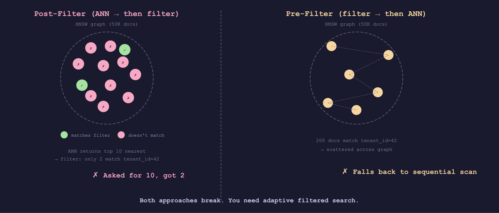

<!-- end_slide -->

# The Fixes: Three Approaches

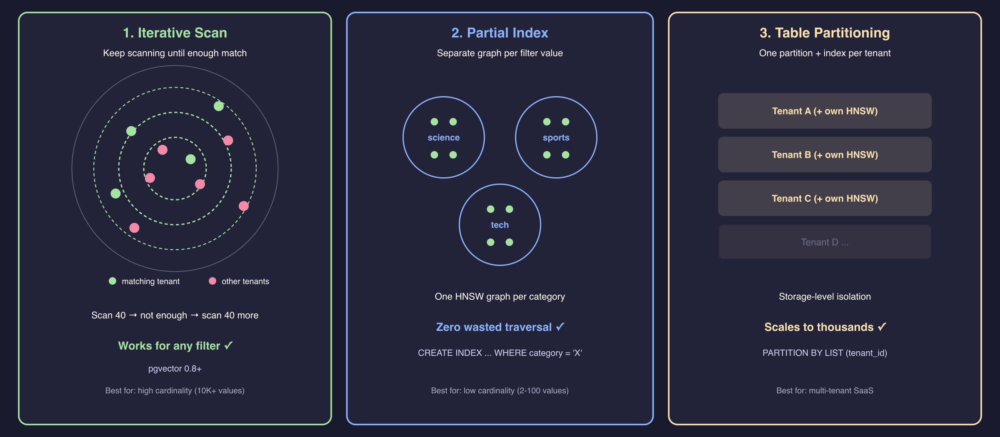

<!-- end_slide -->

# Filtered Search: What to Use When

| Filter Cardinality | Strategy | True filter? |
|-------------------|----------|-------------|
| Very low (2-10) | Partial indexes | ✅ Yes — separate graph per value |
| Low (10-100) | Partial indexes | ✅ Yes — but many indexes to manage |
| Medium (100-10K) | Table partitioning | ✅ Yes — one partition per tenant |
| High (10K+) | `iterative_scan` | ⚠️ Expands ANN scan, post-filters. Tune `scan_limit`. |

<!-- pause -->

<span style="color: #f38ba8">**This is an active research area.**</span>

<!-- end_slide -->

# Silent Failure #2: Recall Drift

**#1 returns zero results. #2 returns the WRONG results.**

```
Month 1:  recall@10 = 96%  ✅
Month 6:  recall@10 = 84%  📉
Month 9:  "Search is bad" — leadership
```

<!-- pause -->

No error. No alert. No log line.

<span style="color: #f38ba8">The system doesn't crash. It just quietly becomes useless.</span>

<!-- end_slide -->

# Detecting Drift: Two Flows

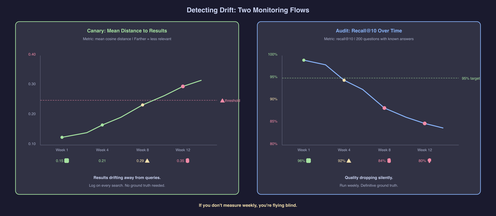

<!-- end_slide -->

# Is a separate vector DB still needed?

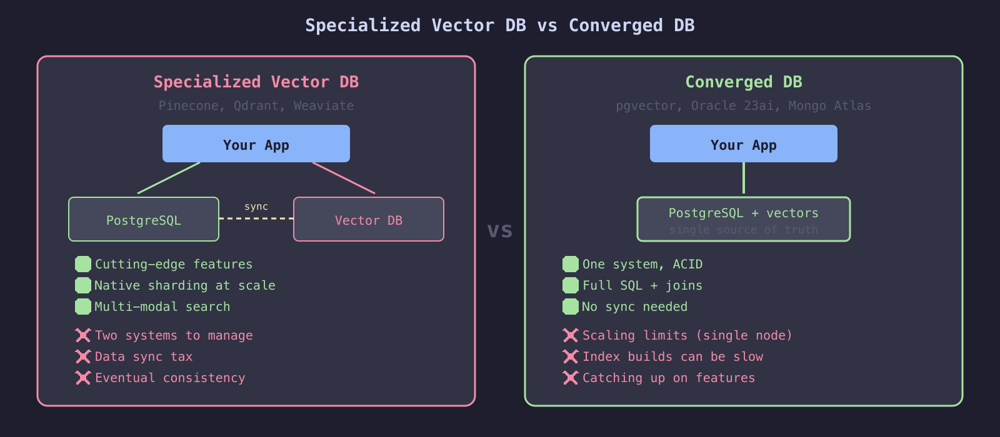

<!-- end_slide -->

# The 2026 Answer: Probably Not

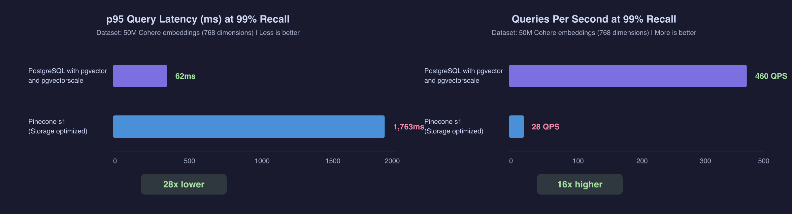

50M Cohere embeddings | 768 dimensions | 99% recall | Same AWS hardware

<span style="color: #a6e3a1">**pgvector + pgvectorscale: 28x faster, 16x more throughput, 75% less cost**</span>

<span style="color: #6c7086">Source: github.com/timescale/pgvectorscale | All open source (PostgreSQL License + Apache 2.0)</span>

<!-- end_slide -->

# The Data Sync Tax

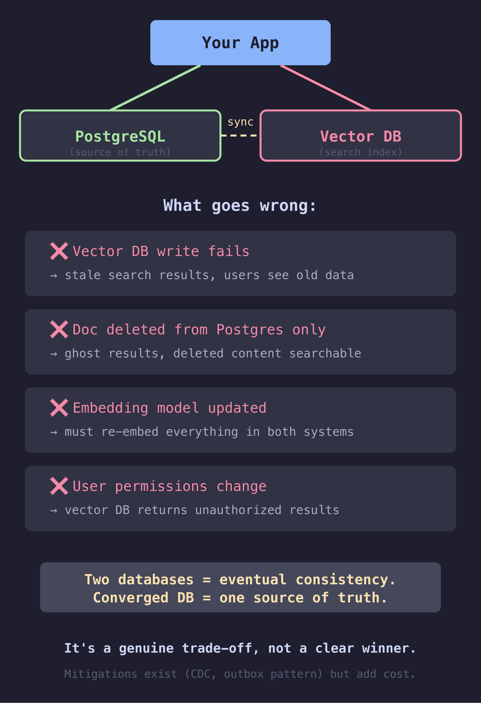

<!-- end_slide -->

# Hybrid Search: BM25 + Vectors

**Vector search misses exact terms. Keyword search misses meaning.**

```
Query: "how to handle payment refund timeout"

BM25 (keyword):  Finds exact "refund timeout"       → precise
Vector (semantic): Finds "payment reversal logic"    → broader

Combined: Better recall than either alone.
```

<!-- pause -->

**pgvector + ParadeDB — both PostgreSQL extensions, same DB.**

```sql
CREATE EXTENSION pg_search;
CREATE INDEX ON docs USING bm25 (content);

SELECT *, paradedb.score(id) FROM docs
WHERE content @@@ 'payment refund timeout';
```

No separate service. No sync. Same transaction.

<!-- pause -->

<span style="color: #6c7086">*BM25 = keyword ranking algorithm · RRF = Reciprocal Rank Fusion (merge two result lists by rank)*</span>

<!-- end_slide -->

# The Retrieval Pipeline Has Changed (2026)

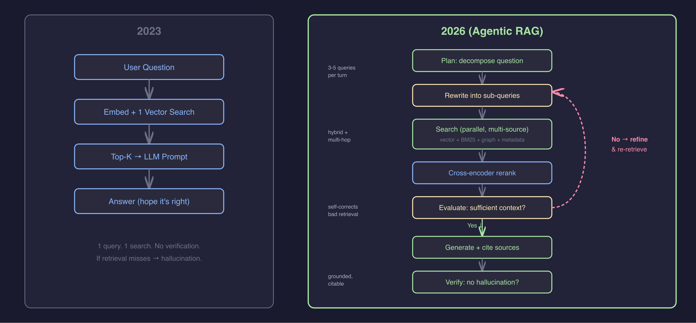

<!-- end_slide -->

# The Trade-off Mental Model

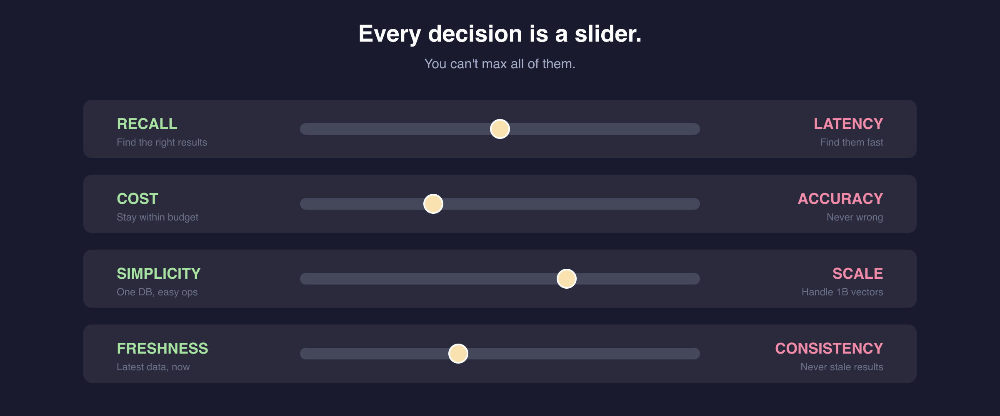

<!-- end_slide -->

# Decision Matrix

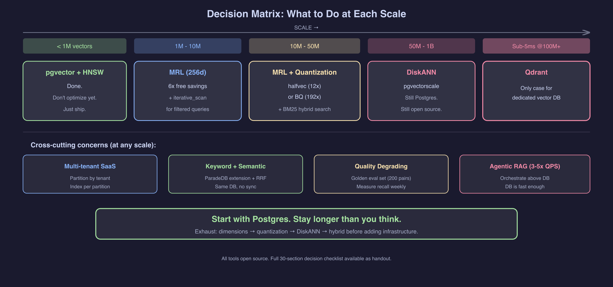

<!-- end_slide -->

# The End

<!-- column_layout: [2, 1] -->

<!-- column: 0 -->

**Remember Month 10?** *"Maybe we need Pinecone?"*

<span style="color: #a6e3a1">**The rewrite:**</span>

```
✅ Compressed index: RAM bill cut 25x
✅ Partition by tenant: recall stays 96%+
✅ Weekly eval: drift caught before users notice
✅ One database: no sync, no stale vectors
```

<!-- pause -->

<span style="color: #f9e2af">**One rule: measure recall under real filters before buying another database.**</span>

📬 <span style="color: #89b4fa">jeevan.dc24@alumni.iimb.ac.in</span> · 🌐 <span style="color: #89b4fa">noobj.me</span>


<!-- column: 1 -->


<!-- reset_layout -->

<!-- end_slide -->

# Appendix: Matryoshka — How to Implement

```sql
-- Store truncated prefix (normalize AFTER truncation)
ALTER TABLE docs ADD COLUMN embedding_256 vector(256);
UPDATE docs SET embedding_256 =
  l2_normalize((embedding::real[])[1:256]::vector(256));
CREATE INDEX ON docs USING hnsw (embedding_256 vector_cosine_ops);

-- Cascade: coarse search → fine re-rank
WITH candidates AS (
  SELECT id, embedding FROM docs
  ORDER BY embedding_256 <=> $query_256 LIMIT 200
)
SELECT id, content FROM candidates
ORDER BY embedding <=> $query_full LIMIT 10;
```

**Choosing prefix size:** Sweep {64, 128, 256, 512} on labeled eval set.
Pick smallest holding 95%+ coarse recall@200.

<!-- end_slide -->

# Appendix: How Re-ranking Works

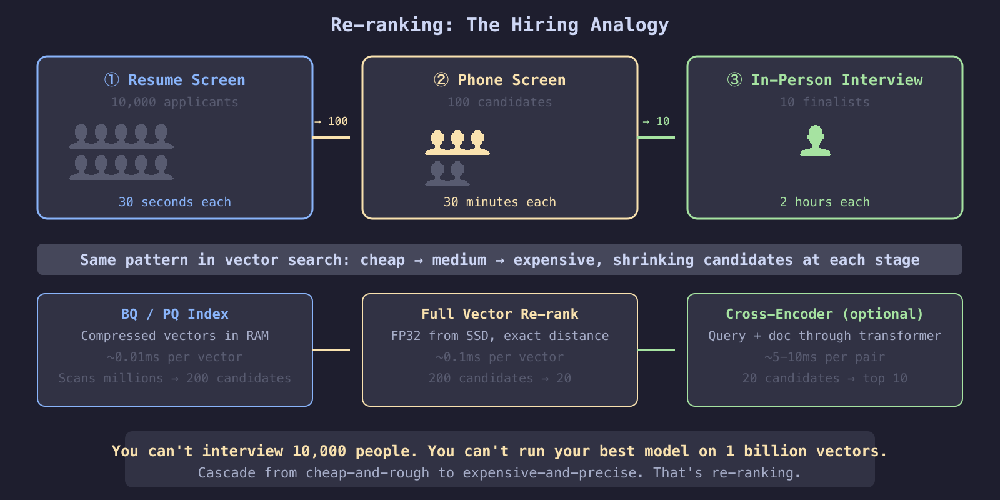

<!-- end_slide -->

# Appendix: Re-ranking in Action

**A real query flowing through the cascade:**

```
Query: "How does photosynthesis work in deep ocean vents?"

Stage 1 — BM25 keyword search (milliseconds):
  → 1000 docs matching "photosynthesis", "ocean", "vents"
  → includes junk: "ocean pollution", "air vents in buildings"

Stage 2 — Vector ANN with compressed index (milliseconds):
  → narrows to 100 by semantic similarity
  → still includes docs about regular plant photosynthesis

Stage 3 — Cross-encoder re-ranker (tens of milliseconds):
  → reads query + each doc together through a transformer
  → understands "deep ocean" + "vents" = hydrothermal context
  → ranks "chemosynthesis at hydrothermal vents" highest

Return top 10.
```

<!-- pause -->

**Bi-encoder** encodes query and doc *separately* — can't see the relationship.
**Cross-encoder** reads them *together* — every word attends to every word.
Cost: per (query, doc) pair → only on ~100 candidates, not millions.

<!-- end_slide -->

# Appendix: How Scalar Quantization Works

**Analogy: Measuring height with a "lazy ruler" that only has 256 notches.**

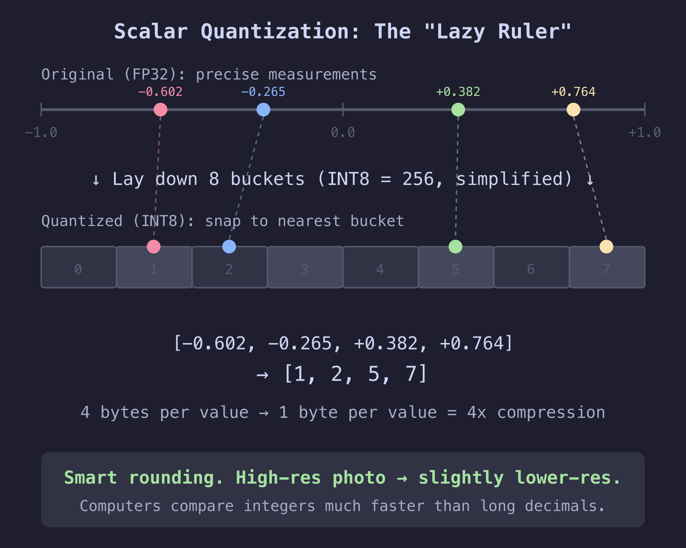

<!-- end_slide -->

# Appendix: SQ in Practice — Search Blurry, Re-rank Sharp

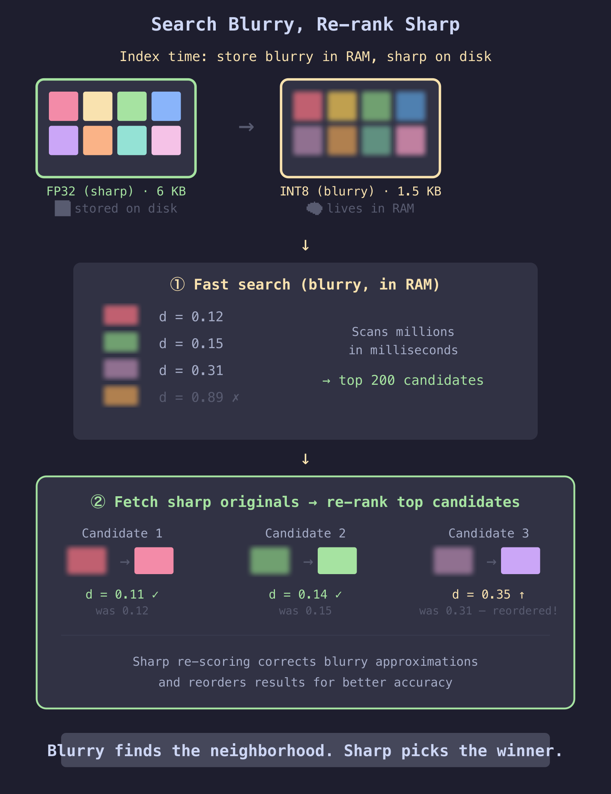

<!-- pause -->

**The full cycle:**
1. At index time: quantize vectors (blurry copy in RAM, sharp original on disk)
2. At search time: compare query against blurry copies — fast, cheap, finds the neighborhood
3. Fetch sharp originals from disk for top candidates only — exact distances, correct ordering

**The blurry copy finds the neighborhood. The sharp original picks the winner.**

<!-- end_slide -->

# Appendix: How Product Quantization Works

**Analogy: Instead of storing the whole shape, store a Lego instruction manual.**

**What's a codebook?** A pre-trained dictionary of 256 "representative shapes" (centroids)
per slice — built by running k-means on the data. Think of it as a box of 256 Lego bricks.

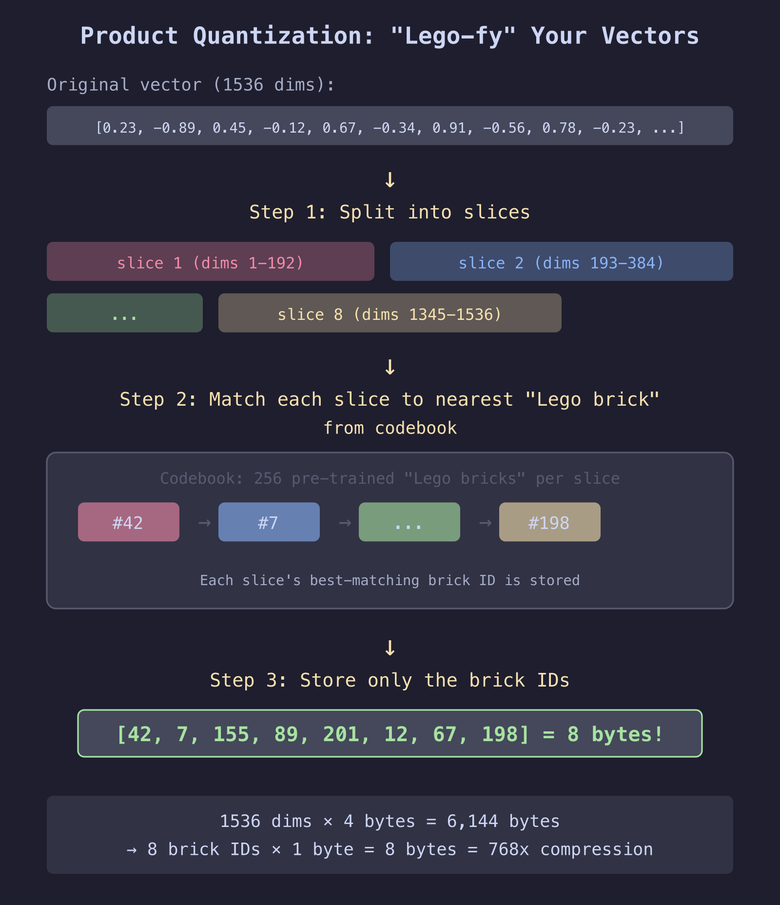

<!-- pause -->

**The clever part — searching without decompressing:**

```
1. Query arrives
2. Measure distance from query to each of the 256 bricks → small lookup table
3. For each stored vector, just add up table entries:
   Vector A = [brick #42, #7, #198]
   Distance ≈ table[42] + table[7] + table[198]  ← just 3 additions!
```

No floating-point math. Just table lookups and additions.

<!-- end_slide -->

# Appendix: How Binary Quantization Works

**Analogy: Reducing a photo to pure black and white — no grays.**

```
Original:  [+0.23, -0.89, +0.45, -0.12, +0.67, -0.34, +0.91, -0.56]
                ↓      ↓      ↓      ↓      ↓      ↓      ↓      ↓
Rule:      positive=1, negative=0
                ↓      ↓      ↓      ↓      ↓      ↓      ↓      ↓
Binary:    [  1,    0,    1,    0,    1,    0,    1,    0  ]
```

<!-- pause -->

**Comparing two binary vectors — XOR + popcount:**

```
Vector A:  1 0 1 0 1 0 1 0
Vector B:  1 1 1 0 0 0 1 1
           ─ ✗ ─ ─ ✗ ─ ─ ✗  ← XOR: 1 wherever they differ

XOR result: 0 1 0 0 1 0 0 1
POPCNT:     count the 1s = 3  ← Hamming distance

Two CPU instructions. No floating-point math at all.
```

<!-- pause -->

**Catch:** +0.001 and +0.999 both become 1. Massive information loss.
**Fix:** BQ for first pass (top 200), FP32 re-rank (top 10).

<!-- end_slide -->

# Appendix: Quantization Trade-offs

| | FP32 | FP16 (half) | Scalar INT8 | Product (PQ) | Binary (BQ) |
|---|---|---|---|---|---|
| **Compression** | 1x | <span style="color: #a6e3a1">2x</span> | <span style="color: #a6e3a1">4x</span> | <span style="color: #a6e3a1">8-64x</span> | <span style="color: #a6e3a1">32x</span> |
| **Recall (no re-rank)** | <span style="color: #a6e3a1">100%</span> | <span style="color: #a6e3a1">~99.9%</span> | <span style="color: #a6e3a1">~95-98%</span> | <span style="color: #f9e2af">~85-95%</span> | <span style="color: #f9e2af">~75-95%*</span> |
| **Recall (w/ re-rank)** | — | — | <span style="color: #a6e3a1">~98-99%</span> | <span style="color: #a6e3a1">~95-99%</span> | <span style="color: #f9e2af">~92-96%</span> |
| **Speed vs FP32** | 1x | <span style="color: #f9e2af">~1.5x</span> | <span style="color: #a6e3a1">~2-3x</span> | <span style="color: #a6e3a1">~5-10x</span> | <span style="color: #a6e3a1">~15-30x</span> |
| **Training needed?** | <span style="color: #a6e3a1">No</span> | <span style="color: #a6e3a1">No</span> | <span style="color: #a6e3a1">No</span> | <span style="color: #f38ba8">Yes</span> | <span style="color: #a6e3a1">No</span> |
| **Best for** | Small scale | Easy first win | General purpose | Massive datasets | Speed-critical |

**MRL + quantization compose:** 256d + BQ = 192x compression from 1536d FP32.

<!-- end_slide -->

# Appendix: Quantization How-To — PostgreSQL

**<span style="color: #4EC9B0">FP16 (halfvec)</span>** · 2x compression

```sql
ALTER TABLE docs ADD COLUMN embedding_half halfvec(1536);
UPDATE docs SET embedding_half = embedding::halfvec(1536);
CREATE INDEX ON docs USING hnsw (embedding_half halfvec_cosine_ops);
```

**<span style="color: #4EC9B0">Binary Quantization</span>** · 32x compression + re-rank

```sql
ALTER TABLE docs ADD COLUMN embedding_bit bit(1536);
UPDATE docs SET embedding_bit = binary_quantize(embedding)::bit(1536);
CREATE INDEX ON docs USING hnsw (embedding_bit bit_hamming_ops);

WITH candidates AS (
  SELECT id, embedding FROM docs
  ORDER BY embedding_bit <~> binary_quantize($query)::bit(1536) LIMIT 200
)
SELECT id, content FROM candidates ORDER BY embedding <=> $query LIMIT 10;
```

**<span style="color: #4EC9B0">DiskANN + SBQ (pgvectorscale)</span>** · automatic

```sql
CREATE INDEX ON docs USING diskann (embedding vector_cosine_ops)
  WITH (num_neighbors = 50, storage_layout = 'memory_optimized');
```

<!-- end_slide -->

# Appendix: DiskANN How-To

```sql
CREATE EXTENSION IF NOT EXISTS vectorscale;

CREATE INDEX ON docs
  USING diskann (embedding vector_cosine_ops)
  WITH (num_neighbors = 50, search_list_size = 100);

-- Query unchanged — planner picks diskann
SELECT id, content FROM docs
ORDER BY embedding <=> $query LIMIT 10;

-- Tune at query time
SET diskann.query_search_list_size = 150;
```

| Signal | Action |
|--------|--------|
| RAM usage > 60% of instance | Evaluate DiskANN |
| Dataset > 20-50M vectors | DiskANN likely cheaper |
| Latency budget allows 5-15ms | DiskANN is a fit |

<!-- end_slide -->

# Appendix: Hybrid Search — RRF SQL

```sql
WITH bm25 AS (
  SELECT id, ROW_NUMBER() OVER (ORDER BY paradedb.score(id) DESC) AS rank
  FROM docs
  WHERE content @@@ 'payment refund timeout'
  LIMIT 100
),
vector AS (
  SELECT id, ROW_NUMBER() OVER (ORDER BY embedding <=> $query) AS rank
  FROM docs
  ORDER BY embedding <=> $query
  LIMIT 100
)
SELECT COALESCE(b.id, v.id) AS id,
       COALESCE(1.0/(60 + b.rank), 0)
     + COALESCE(1.0/(60 + v.rank), 0) AS rrf_score
FROM bm25 b
FULL OUTER JOIN vector v ON b.id = v.id
ORDER BY rrf_score DESC
LIMIT 10;
```

*k=60 from the RRF paper — dampens high-rank dominance. Only cares about rank position, not raw scores.*

<!-- end_slide -->

# Appendix: Recall Drift — Observability Setup

**Two monitoring flows:**

| | Live Queries (canary) | Golden Eval (audit) |
|---|---|---|
| Frequency | Every query | Weekly |
| Measures | Distance distribution | Actual recall@10 |
| Ground truth? | No | Yes |
| Catches | Gross failures fast | Subtle degradation |

**Minimum viable setup:**
1. Log `mean_distance` on every search call
2. 200 labeled query→doc pairs, run weekly
3. Alert if recall drops below 95%
4. CI gate: fail deploy if recall regresses

**Open source eval tools:** RAGAS, Phoenix (Arize), Langfuse

<!-- end_slide -->

# Appendix: Long Context vs RAG

| Factor | Favors Long Context | Favors RAG |
|--------|-------------------|------------|
| Corpus size | <100K tokens | >100K tokens |
| Relevance ratio | >20% relevant | <20% relevant |
| Latency SLO | Async (45s ok) | Interactive (<2s) |
| Data freshness | Static | Frequently updated |
| Query volume | Hundreds/month | Thousands/day |
| Cost/query | $0.20–$2.00 | $0.00008 |

**1,250x cost difference at scale.** If any TWO factors favor RAG → use RAG.

<!-- end_slide -->

# References

1. **pgvector** — github.com/pgvector/pgvector (PostgreSQL License)
2. **pgvectorscale** — github.com/timescale/pgvectorscale (Apache 2.0)
3. **DiskANN** — github.com/microsoft/DiskANN (MIT)
4. **ParadeDB** — github.com/paradedb/paradedb (AGPL)
5. **Matryoshka Embeddings** — arxiv.org/abs/2205.13147
6. **pgvector 50M Benchmark** — github.com/timescale/pgvectorscale/blob/main/BENCHMARKS.md
7. **RAGAS** — github.com/explodinggradients/ragas (Apache 2.0)
8. **BGE-Reranker** — huggingface.co/BAAI/bge-reranker-v2-m3
9. **Embedding Quantization** — huggingface.co/blog/embedding-quantization
10. **Long Context vs RAG** — tianpan.co/blog/2026-04-09
11. **ANN Benchmarks** — ann-benchmarks.com
12. **LangGraph** — github.com/langchain-ai/langgraph (MIT)
